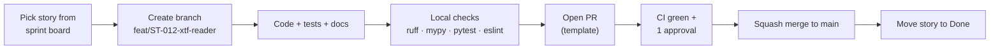

# Contributing to SonarSentinel

This guide covers how the team works: branching, commits, reviews, coding standards, testing, ML experiment hygiene and the Definition of Done.

**Related:** [Developer Setup](docs/guides/DEVELOPER_SETUP.md) · [Project Plan](docs/planning/PROJECT_PLAN.md) · [Product Backlog](docs/planning/PRODUCT_BACKLOG.md) · [Test Plan](docs/testing/TEST_PLAN.md)

---

## 1. Workflow



### 1.1 Branches
- `main` is always releasable and protected: no direct pushes, CI must pass, 1 approving review.
- Short-lived branches off `main`, merged within a few days:

| Prefix | Use | Example |
|---|---|---|
| `feat/` | New feature / story | `feat/ST-012-xtf-reader` |
| `fix/` | Bug fix | `fix/ST-045-heading-wraparound` |
| `ml/` | Training / dataset / model work | `ml/ST-031-synthetic-nets-v2` |
| `docs/` | Documentation only | `docs/user-manual-review-queue` |
| `chore/` | Tooling, CI, dependencies | `chore/pin-anomalib` |

### 1.2 Commits — Conventional Commits

```text
<type>(<scope>): <summary in imperative, ≤ 72 chars>

<optional body: what and why>

Refs: ST-012
```

| Type | Meaning |
|---|---|
| `feat` | New functionality |
| `fix` | Bug fix |
| `perf` | Performance improvement |
| `refactor` | Code change without behaviour change |
| `test` | Tests only |
| `docs` | Documentation only |
| `ml` | Model/dataset/training changes |
| `build` / `ci` / `chore` | Build, CI, maintenance |

**Scopes:** `ingest`, `preprocess`, `detect`, `scoring`, `geo`, `report`, `api`, `jobs`, `storage`, `cli`, `ui`, `edge`, `ml`, `docs`.

Example: `feat(geo): add layback correction from cable-out and fish depth`

### 1.3 Pull requests
- Use the [PR template](.github/PULL_REQUEST_TEMPLATE.md); link the story (`ST-NNN`) and requirement IDs (`FR-…`).
- Keep PRs small (aim for < 400 changed lines, excluding generated files).
- Include screenshots/GIFs for UI changes and sample output for pipeline changes.
- A reviewer checks correctness, tests, readability, docs, and **geospatial/units correctness** where relevant.
- Resolve all review conversations before merging; squash-merge with a Conventional Commit title.

### 1.4 Issues and labels

| Label | Meaning |
|---|---|
| `type:bug` · `type:story` · `type:task` · `type:data` · `type:spike` | Issue kind |
| `area:ingest` … `area:ui` | Module |
| `P0` · `P1` · `P2` | Priority (matches PRD) |
| `blocked` | Waiting on something external |
| `good-first-issue` | Suitable for onboarding |

---

## 2. Python standards (backend, ml, edge)

### 2.1 Tooling
| Tool | Purpose | Command |
|---|---|---|
| `ruff` | Lint + format (replaces black/isort/flake8) | `ruff check . && ruff format .` |
| `mypy` | Type checking (strict for `geo/`, `scoring/`, `ingest/`, `report/`) | `mypy backend/sonarsentinel` |
| `pytest` | Tests + coverage | `pytest -q --cov=sonarsentinel` |
| `pre-commit` | Runs the above on commit | `pre-commit install` |

### 2.2 Conventions
1. **Python 3.11**; type hints on all public functions; `from __future__ import annotations` not needed.
2. **Docstrings:** Google style for public functions and classes; say what the units are.
3. **Units in names:** `altitude_m`, `heading_deg`, `ground_res_m`, `bbox_px`, `time_utc`. Never an unlabeled `range` or `angle`.
4. **Coordinate order:**
   - Public data structures and JSON: explicit `lat` / `lon` fields.
   - Arrays of pairs in our JSON: `[lat, lon]`; **GeoJSON only:** `[lon, lat]` (RFC 7946).
   - pyproj: always `Transformer.from_crs(..., always_xy=True)` → `(lon, lat)` / `(x, y)`.
5. **Angles:** degrees in data structures, radians only inside maths helpers; headings normalised to `[0, 360)`; use circular maths for averaging.
6. **Image axes:** arrays are `(rows, cols)` = `(along-track, across-track)`; boxes are `(x1, y1, x2, y2)` in pixels.
7. **No magic numbers:** thresholds come from `pipeline.yaml` via the typed config (`sonarsentinel.config`).
8. **Errors:** raise typed exceptions from `sonarsentinel.errors` (e.g. `CorruptHeaderError`, `CrsRequiredError`) with an error `code` matching the [API error model](docs/architecture/05-api-specification.md#4-error-model). Never swallow exceptions silently.
9. **Logging:** standard `logging` with the JSON formatter; include `job_id`, `stage`, `chunk`. No `print()` in library code.
10. **Pure stages:** pipeline stage functions take inputs and return outputs; no hidden global state; I/O at the edges.
11. **Performance:** vectorise with NumPy; avoid per-pixel Python loops; keep memory bounded (memory-mapped arrays for large logs).
12. **Dependencies:** add them to `backend/pyproject.toml` with a pinned lower bound, and justify new heavy dependencies in the PR.

```python
def pixel_to_latlon(row: int, col: int, chunk: ProcessedChunk) -> tuple[float, float]:
    """Convert a processed-chunk pixel to WGS84 coordinates.

    Args:
        row: Row index in the resampled chunk image (along-track).
        col: Column index (across-track); ``chunk.nadir_col`` is nadir.
        chunk: Processed chunk with navigation and ``row_to_ping`` mapping.

    Returns:
        ``(lat, lon)`` in decimal degrees (WGS84).
    """
```

---

## 3. TypeScript / React standards (frontend)

| Topic | Standard |
|---|---|
| Language | TypeScript `strict: true`; no `any` without a comment explaining why |
| Lint/format | ESLint (react, react-hooks, jsx-a11y) + Prettier |
| Components | Function components + hooks; one component per file; `PascalCase.tsx` |
| Server state | TanStack Query for REST; a single WebSocket hook (`useJobEvents`) for job events |
| Client state | Zustand store for filters, selection, map view |
| API types | Generated from the FastAPI OpenAPI schema (`openapi-typescript`), never hand-copied |
| Styling | **CSS Modules + CSS custom-property design tokens** ([ADR-014](docs/architecture/08-architecture-decisions.md#adr-014--frontend-styling-css-modules--css-custom-property-design-tokens)); class colours from the [wireframes](docs/wireframes/README.md#4-visual-language) |
| Accessibility | jsx-a11y clean; keyboard support per wireframes; markers have ARIA labels |
| Tests | Vitest + React Testing Library; Playwright for end-to-end flows |

---

## 4. Testing requirements

- Every PR that changes behaviour includes tests. See the [Test Plan](docs/testing/TEST_PLAN.md) for levels and targets.
- **Coverage:** ≥ 70% line coverage for `geo/`, `scoring/`, `ingest/`, `report/`; CI fails below that.
- **Geo changes** must pass the golden tests (`tests/golden/georef_*.json`), with tolerance < 0.05 m.
- **Report changes** must keep JSON Schema validation passing; bump `report_version` for breaking changes.
- **Bug fixes** start with a failing test that reproduces the bug.
- Large test fixtures (sample `.xtf`) are downloaded by `scripts/fetch_test_data.py`, not committed.

---

## 5. ML experiment hygiene

1. Every training run gets an entry based on the [Experiment Log Template](docs/ml/EXPERIMENT_LOG_TEMPLATE.md).
2. Fix and record seeds; record the dataset manifest hash and git commit.
3. **Never commit weights or datasets to git.** Use the model registry folder layout and DVC/release assets ([Data Management Plan](docs/data/DATA_MANAGEMENT_PLAN.md)).
4. Evaluate on the **fixed test set** only when proposing a release candidate; tune on validation.
5. A model is promoted only if its metrics are ≥ the current model on the fixed test set and a [Model Card](docs/ml/MODEL_CARD_TEMPLATE.md) is complete.
6. Follow the [Annotation Guidelines](docs/data/ANNOTATION_GUIDELINES.md) for any new labels.

---

## 6. Documentation

- Update the relevant doc in the same PR as the change (API → `05-api-specification.md`, schema → `06-data-models.md`, UI → wireframes/User Manual).
- Significant technical decisions get a new ADR in [08-architecture-decisions.md](docs/architecture/08-architecture-decisions.md).
- Add user-visible changes to [CHANGELOG.md](CHANGELOG.md) under *Unreleased*.

---

## 7. Definition of Done (stories)

A story is **Done** when:

- [ ] Acceptance criteria in the backlog item are met and demonstrated
- [ ] Code follows these standards; lint and type checks pass
- [ ] Unit/integration tests added and passing in CI; coverage thresholds met
- [ ] Relevant test cases in [TEST_CASES.md](docs/testing/TEST_CASES.md) updated and passing
- [ ] Documentation and CHANGELOG updated
- [ ] PR reviewed and merged to `main`
- [ ] No new P0/P1 bugs introduced
- [ ] For ML stories: experiment logged; metrics recorded; model card updated if promoted
- [ ] For UI stories: matches wireframe behaviour; keyboard and screen-reader basics checked

---

## 8. Licensing of contributions

SonarSentinel is licensed under **AGPL-3.0** ([LICENSE](LICENSE), [ADR-013](docs/architecture/08-architecture-decisions.md#adr-013--project-licence-agpl-30)). By submitting a pull request you agree that your contribution is licensed under the same terms. Don't copy code from sources with incompatible licences, and record any third-party code or data you add in [Licences & Compliance](docs/legal/LICENSES_AND_COMPLIANCE.md).

---

## 9. Code of conduct

Be respectful, give constructive reviews, credit others' work and data sources, and raise concerns early. Disagreements on technical direction are settled with data where possible and recorded as an ADR.
