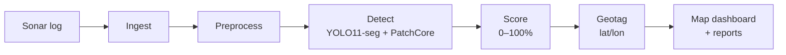

# SonarSentinel

**AI-powered detection of marine debris and ghost nets in side-scan sonar imagery, with GPS geotagging.**

Smart India Hackathon · Problem Statement **26057** · Ministry of Earth Sciences (MoES) — National Institute of Ocean Technology (NIOT) · Software · Disaster Management

> **Status:** Design & documentation phase (v0.1.0). Code modules are built milestone by milestone. See the [Project Plan](docs/planning/PROJECT_PLAN.md).

---

## What it does

1. **Upload** a raw side-scan sonar log (`.xtf`, GeoTIFF mosaic, or image + navigation CSV).
2. **Clean** the sonar data: speckle, slant range, gain, dropouts, heave/pitch/roll.
3. **Detect** shipwrecks, pipes, cylinders, ghost nets, other debris and unknown anomalies.
4. **Score** every detection with a calibrated **0–100% confidence** after physics-aware false-positive filtering.
5. **Geotag** each object: latitude/longitude, footprint, size, depth.
6. **See it live** on a map dashboard and **download** JSON / CSV / GeoJSON / KML reports.



## Example output

```json
{
  "detection_id": "SRV-20260913-001-D0003",
  "class": "ghost_net",
  "confidence": 87.4,
  "alert_tier": "hazard",
  "position": { "lat": 13.084120, "lon": 80.312750, "depth_m": 18.5, "uncertainty_m": 4.2 },
  "dimensions": { "length_m": 6.2, "width_m": 3.1, "area_m2": 14.8 }
}
```

## Repository structure

```text
marine-debris/
├── docs/          # All project documentation (start at docs/README.md)
├── backend/       # sonarsentinel Python package: pipeline, API, CLI      (M1–M5)
├── ml/            # Dataset tools, synthetic generator, training, evaluation (M2–M4)
├── frontend/      # React + Leaflet dashboard                               (M5)
├── edge/          # ONNX/TensorRT/OpenVINO export and edge runner           (M6)
├── models/        # Versioned model weights (not in git)
├── data/          # Local datasets and uploads (not in git)
└── docker/        # Dockerfiles and compose files                           (M6)
```

## Quick start

> Available once milestones M1 (CLI) and M5 (dashboard) are complete. Full instructions: [Developer Setup](docs/guides/DEVELOPER_SETUP.md).

```bash
# Backend + CLI
conda env create -f backend/environment.yml
conda activate sonarsentinel
pip install -e backend
sonarsentinel detect data/samples/line_07.xtf --out results/ --formats json,csv

# Dashboard (full stack)
docker compose -f docker/docker-compose.yml up -d
# open http://localhost:8080
```

## Documentation

| Area | Start here |
|---|---|
| Overview | [Project Idea](docs/PROJECT_IDEA.md) · [PRD](docs/PRD.md) |
| Design | [Architecture](docs/architecture/README.md) · [Wireframes](docs/wireframes/README.md) |
| Planning | **[TODO checklist](TODO.md)** · [Project Plan](docs/planning/PROJECT_PLAN.md) · [Product Backlog](docs/planning/PRODUCT_BACKLOG.md) |
| Data & ML | [Datasets](docs/data/DATASETS.md) · [Annotation Guidelines](docs/data/ANNOTATION_GUIDELINES.md) · [Model Card Template](docs/ml/MODEL_CARD_TEMPLATE.md) |
| Quality | [Test Plan](docs/testing/TEST_PLAN.md) · [Test Cases](docs/testing/TEST_CASES.md) |
| How-to | [Developer Setup](docs/guides/DEVELOPER_SETUP.md) · [User Manual](docs/guides/USER_MANUAL.md) · [Operations Runbook](docs/guides/OPERATIONS_RUNBOOK.md) |
| Hackathon | [SIH Presentation](docs/hackathon/SIH_PRESENTATION.md) · [Demo Script](docs/hackathon/DEMO_SCRIPT.md) |
| Everything | [Documentation index](docs/README.md) |

## Tech stack

Python 3.11 · PyTorch · Ultralytics YOLO11-seg · SAHI · anomalib (PatchCore) · LightGBM · OpenCV · pyxtf · GDAL / rasterio · pyproj · FastAPI · React + TypeScript · Leaflet · ONNX / TensorRT / OpenVINO · Docker

## Contributing

See [CONTRIBUTING.md](CONTRIBUTING.md) for the workflow, coding standards and Definition of Done. Report security issues as described in [SECURITY.md](SECURITY.md).

## License

SonarSentinel is licensed under the **GNU Affero General Public License v3.0**. See [LICENSE](LICENSE). This matches the AGPL-3.0 licence of Ultralytics YOLO, which the detector uses. If you distribute SonarSentinel, or let others use a modified version over a network, you must make the corresponding source available under the same licence. Decision record: [ADR-013](docs/architecture/08-architecture-decisions.md#adr-013--project-licence-agpl-30). Third-party and dataset terms: [Licences & Compliance](docs/legal/LICENSES_AND_COMPLIANCE.md).

## Acknowledgements

Public datasets and tools from the University of Michigan Field Robotics Group (AI4Shipwrecks), the Portuguese Navy Research Center (CINAV), the SeabedObjects-KLSG authors, NOAA NCEI / Office of Coast Survey, USGS, and the open-source projects listed in the licences document.
