# SonarSentinel — Master TODO

The single checklist for the whole project, from documentation to hackathon finale and handover. Each item links to its detailed definition:

- **Stories** `ST-NNN` → [Product Backlog](docs/planning/PRODUCT_BACKLOG.md) (acceptance criteria, refs)
- **Milestones / gates** → [Project Plan](docs/planning/PROJECT_PLAN.md#3-milestones) · [Quality gates](docs/planning/PROJECT_PLAN.md#10-quality-gates)
- **Tests** `TC-…` → [Test Cases](docs/testing/TEST_CASES.md)
- **Definition of Done** → [CONTRIBUTING §7](CONTRIBUTING.md#7-definition-of-done-stories)

**Legend:** `[ ]` open · `[x]` done · **P0/P1/P2** priority · **R1–R6** owner role ([roles](docs/planning/PROJECT_PLAN.md#6-team-roles-and-responsibilities)) · `n pts` estimate · ⭐ stretch (drop first if behind)

> **How to use:** tick items in pull requests and mirror them on the GitHub Projects board. At every Friday review, update the progress table and move unfinished items into the next phase (write *"moved from Phase N"*). Sprint dates are the team's plan. SIH dates were checked on 2026-09-13: idea deadline **30 Sept 2026** (confirm with the SPOC), finale proposed for Dec 2026.

---

## Phases at a glance

```mermaid
flowchart LR
    P0["Phase 0<br/>Docs & design<br/>✅ complete"] --> P1["Phase 1<br/>Sprint 0 · Setup<br/>M0 · IS idea PDF"]
    P1 --> P2["Phase 2<br/>Sprint 1 · Ingest & Geo<br/>M1 · G1"]
    P2 --> P3["Phase 3<br/>Sprint 2 · Preprocess & Data<br/>M2"]
    P3 --> P4["Phase 4<br/>Sprint 3 · Models & thin slice<br/>M3 · G2"]
    P4 --> P5["Phase 5<br/>Sprint 4 · Scoring, reports, API<br/>M4 · G3"]
    P5 --> P6["Phase 6<br/>Sprint 5 · Dashboard<br/>M5 · G4 · P0 freeze"]
    P6 --> P7["Phase 7<br/>Sprint 6 · Hardening & demo<br/>M6 · G5"]
    P7 --> P8["Phase 8<br/>SIH finale & handover"]
```

| Phase | Sprint | Dates (illustrative) | Milestone / gate | Goal | Items | Done |
|---|---|---|---|---|---|---|
| [0](#phase-0--documentation--design) | — | → 2026-09-13 | Docs baseline | Complete, verified documentation | 20 | 20 |
| [1](#phase-1--sprint-0--project-setup) | S0 | 09-14 → 09-18 | M0 · IS (idea PDF due 09-30) | Team can build, test, collaborate; SIH idea submitted | 28 | 0 |
| [2](#phase-2--sprint-1--ingest--geotagging) | S1 | 09-21 → 09-25 | M1 · G1 | Read sonar logs and place them correctly on a map | 20 | 0 |
| [3](#phase-3--sprint-2--preprocessing--training-data) | S2 | 09-28 → 10-02 | M2 | Clean, tiled sonar data; training data ready | 19 | 0 |
| [4](#phase-4--sprint-3--models--thin-slice) | S3 | 10-05 → 10-09 | M3 · G2 | Trained models; CLI report end to end | 20 | 0 |
| [5](#phase-5--sprint-4--scoring-reports--api) | S4 | 10-12 → 10-16 | M4 · G3 | Trustworthy confidence; reports; upload + jobs API | 22 | 0 |
| [6](#phase-6--sprint-5--dashboard-p0-freeze) | S5 | 10-19 → 10-23 | M5 · G4 | Live dashboard end to end; P0 freeze | 19 | 0 |
| [7](#phase-7--sprint-6--hardening-validation-edge--demo) | S6 | 10-26 → 10-30 | M6 · G5 | Validated, benchmarked, demo-ready release candidate | 24 | 0 |
| [8](#phase-8--sih-finale--handover) | — | Proposed Dec 2026 | Finale | Win the demo; hand over cleanly | 11 | 0 |
| [Continuous](#continuous-tasks-every-sprint) | all | weekly | — | Keep the project healthy | 10 recurring | — |
| [Future](#future--backlog-p2) | — | after finale | — | Post-hackathon roadmap | 7 | 0 |

---

## Phase 0 · Documentation & design

**Goal:** complete, consistent documentation before building. **Status:** ✅ **Complete (2026-09-13)**. Documents written, verified and approved by the team lead; follow-ups moved to Phase 1.

### Done
- [x] Project Idea — [docs/PROJECT_IDEA.md](docs/PROJECT_IDEA.md)
- [x] Product Requirements Document — [docs/PRD.md](docs/PRD.md)
- [x] Architecture: index + 8 documents — [docs/architecture](docs/architecture/README.md)
- [x] Wireframes: index + 8 screens — [docs/wireframes](docs/wireframes/README.md)
- [x] Project Plan and Product Backlog — [docs/planning](docs/planning/PROJECT_PLAN.md)
- [x] Datasets guide, Annotation Guidelines, Data Management Plan — [docs/data](docs/data/DATASETS.md)
- [x] Test Plan and Test Cases with traceability — [docs/testing](docs/testing/TEST_PLAN.md)
- [x] Developer Setup, User Manual, Operations Runbook — [docs/guides](docs/guides/DEVELOPER_SETUP.md)
- [x] Model Card and Experiment Log templates — [docs/ml](docs/ml/MODEL_CARD_TEMPLATE.md)
- [x] Literature & Technology Review — [docs/research](docs/research/LITERATURE_REVIEW.md)
- [x] SIH Presentation content and Demo Script — [docs/hackathon](docs/hackathon/SIH_PRESENTATION.md)
- [x] Final Project Report template — [docs/reports](docs/reports/FINAL_PROJECT_REPORT_TEMPLATE.md)
- [x] Licences & Compliance, Security, Contributing, Changelog, GitHub templates
- [x] Documentation verification (links, anchors, IDs, consistency) + `scripts/docs/verify_docs.ps1` — [report](docs/reports/DOCUMENTATION_VERIFICATION_REPORT.md)

### Closing items
- [x] Decide the project licence → **AGPL-3.0**; [ADR-013](docs/architecture/08-architecture-decisions.md#adr-013--project-licence-agpl-30) recorded; official [`LICENSE`](LICENSE) added — R6 + team
- [x] Check the official SIH 2026 template and schedule; plan updated (milestone IS: idea PDF by 30 Sept 2026; finale proposed Dec 2026) — R6
- [x] Verify references: all 11 project-specific references checked and corrected (authors, venues, pages, DOIs); no † entries remain — R1
- [x] Prepare the team review package and sign-off record ([PHASE0_REVIEW_SIGNOFF.md](docs/planning/PHASE0_REVIEW_SIGNOFF.md)) — R6
- [x] Confirm licences marked **verify** from primary sources ([Licences v1.1](docs/legal/LICENSES_AND_COMPLIANCE.md#2-third-party-software)). Outcomes: react-leaflet dropped (Hippocratic License); SAM 2 approved, SAM 3 excluded; S3Simulator and KLSG-II excluded; AI4Shipwrecks moved to Phase 1 (manual check) — R6
- [x] **Team review and sign-off** of PRD v1.0 and architecture: approved by the team lead (R6) on 2026-09-13 in [the record](docs/planning/PHASE0_REVIEW_SIGNOFF.md#7-sign-off); R1–R5 confirm in Phase 1 — R6

*Team name, ID and member names were moved to Phase 1 (placeholders kept, by decision).*

---

## Phase 1 · Sprint 0 — Project setup

**Dates:** 2026-09-14 → 09-18 · **Milestone:** M0 · **Sprint goal:** everyone can build, test and collaborate; datasets are downloading.

### SIH 2026 idea submission (deadline-critical)
- [ ] **Today:** confirm the idea-submission deadline with the college SPOC (official guidelines say **30 Sept 2026**; an older PDF says 15 Sept) — R6
- [ ] Check team composition: exactly 6 members, ≥ 1 female member, same college; unique team name without the institute's name — R6
- [ ] Take part in the college internal hackathon; SPOC nominates the team on the portal — all
- [ ] Fill in team name, team ID and member names (deck title slide + private contact sheet, **not** in the repo) *(moved from Phase 0)* — R6
- [ ] Build the idea deck on the [official 2026 template](docs/hackathon/SIH_PRESENTATION.md#part-a--idea-submission-deck-6-slides): ≤ 6 slides, headings unchanged, required footer — R6, R5
- [ ] Export to **PDF** and upload through the team leader's portal login: target 25 Sept, deadline 30 Sept — R6

### Environment & repository
- [ ] Move the working copy to a local, non-OneDrive path (e.g. `C:\dev\sonarsentinel`) — R6 ([why](docs/guides/DEVELOPER_SETUP.md#-windows-notes))
- [ ] Install Git, Miniforge, Node LTS, Docker on every laptop ([Developer Setup §1](docs/guides/DEVELOPER_SETUP.md#1-prerequisites)) — all
- [ ] Create the private GitHub repository and push the documentation — R6
- [ ] Tag the approved documentation baseline `docs-baseline-1.0` *(moved from Phase 0; needs the repository)* — R6
- [ ] **ST-001** Scaffold repository and `sonarsentinel` package skeleton — P0 · R6 · 3 pts
- [ ] **ST-002** CI: ruff, mypy, pytest, eslint, tsc, build on every PR — P0 · R6 · 3 pts
- [ ] **ST-003** Reproducible environments verified on Windows and Ubuntu — P0 · R6 · 3 pts
- [ ] **ST-004** `scripts/fetch_test_data.py` with checksums — P0 · R2 · 2 pts
- [ ] **ST-006** pre-commit hooks, PR/issue templates, branch protection — P0 · R6 · 1 pt
- [ ] Create the GitHub Projects board; import EP-01…EP-12 and all stories — R6

### Data & external requests
- [ ] Start downloads: AI4Shipwrecks, mine-detection SSS, KLSG, NOAA/USGS candidates ([Datasets §5](docs/data/DATASETS.md#5-choosing-noaausgs-surveys)) — R1, R3
- [ ] Set up shared storage + DVC remote; create `ml/datasets/LICENSES.md` ([DMP §3](docs/data/DATA_MANAGEMENT_PLAN.md#3-storage-structure-and-versioning)) — R6, R1
- [ ] Send data request to NIOT: sample logs, sonar models, edge hardware (PRD Q1, Q2, Q4) — R6
- [ ] Contact WWF / GhostNetZero for ghost-net sample access (PRD Q6) — R6
- [ ] Open the AI4Shipwrecks Deep Blue record in a browser and record its licence in `ml/datasets/LICENSES.md` and [Licences §3](docs/legal/LICENSES_AND_COMPLIANCE.md#3-datasets-and-data-sources) (automated check blocked) *(moved from Phase 0)* — R1
- [ ] *(Optional)* Ask the S3Simulator authors for written permission to use the dataset (no licence published) — R1

### Team
- [ ] Assign roles R1–R6 to people; schedule ceremonies and mentor sync ([Plan §7](docs/planning/PROJECT_PLAN.md#7-ceremonies-and-communication)) — R6
- [ ] R1–R5 review the baseline and sign [the Phase 0 record](docs/planning/PHASE0_REVIEW_SIGNOFF.md#7-sign-off); raise any *Changes required* as change requests *(moved from Phase 0)* — R1–R5
- [ ] Decide frontend styling approach (Tailwind or CSS modules) — R5
- [ ] Sprint 1 planning: confirm stories, owners, sprint goal — R6

### Exit criteria (M0)
- [ ] Repo, CI and environments work on all laptops
- [ ] Datasets downloading; roles assigned

---

## Phase 2 · Sprint 1 — Ingest & geotagging

**Dates:** 2026-09-21 → 09-25 · **Milestone:** M1 · **Gate:** G1 (contracts) · **Sprint goal:** read sonar logs and put them on the map with correct GPS.

### Data
- [ ] **ST-010** Download AI4Shipwrecks; convert masks to YOLO-seg — P0 · R1 · 3 pts
- [ ] **ST-011** Mine SSS dataset; MILCO → `cylinder`; review NOMBO — P0 · R1 · 3 pts
- [ ] **ST-012** SeabedObjects-KLSG; build normal seafloor pool (exclude victim images) — P0 · R1 · 2 pts
- [ ] **ST-013** ≥ 3 NOAA/USGS XTF surveys incl. ≥ 1 charted wreck, with provenance — P0 · R3 · 3 pts

### Ingestion
- [ ] **ST-020** `SonarLog` data contract, validators, error types — P0 · R2 · 3 pts
- [ ] **ST-021** XTF reader: channels, per-ping navigation, units — P0 · R2 · 5 pts
- [ ] **ST-022** GeoTIFF reader with CRS/transform — P0 · R3 · 2 pts
- [ ] **ST-023** Image + navigation CSV reader — P0 · R2 · 3 pts
- [ ] **ST-024** Image-only path with `NOT_GEOTAGGED` — P0 · R2 · 1 pt
- [ ] **ST-026** Memory-mapped chunked reading of large XTF — P0 · R4 · 3 pts

### Geotagging
- [ ] **ST-030** Units/CRS detection; UTM ↔ WGS84; EPSG override — P0 · R3 · 2 pts
- [ ] **ST-031** `pixel_to_latlon` + golden tests — P0 · R3 · 3 pts

### Other tasks
- [ ] Freeze API spec and report schema v1.0; agree mock server approach (**Gate G1**) — R4, R3
- [ ] Record which `pyxtf` implementation is used and confirm its licence — R2
- [ ] Answer PRD Q7: datum/CRS for official reports — R3
- [ ] Replace *(planned)* commands in Developer Setup with the real ones — R6
- [ ] Automate TC-ING-001…012 and TC-GEO-001…008 in CI — R2, R3

### Exit criteria (M1)
- [ ] A NOAA XTF track plots correctly on a map
- [ ] Georef golden tests pass (< 0.05 m)
- [ ] G1 passed: contracts approved

---

## Phase 3 · Sprint 2 — Preprocessing & training data

**Dates:** 2026-09-28 → 10-02 · **Milestone:** M2 · **Sprint goal:** clean, normalised, tiled sonar data; training data ready.

### Data & labelling
- [ ] **ST-014** CVAT/Label Studio + SAM 2 (not SAM 3); label ≥ 100 real tiles (10% double-labelled) — P0 · R2 · 5 pts
- [ ] **ST-015** Site-grouped splits, dataset manifest, stats report — P0 · R1 · 3 pts
- [ ] **ST-016** Synthetic ghost-net generator v1 — P0 · R2 · 8 pts

### Navigation
- [ ] **ST-032** Navigation cleaning: invalid fixes, smoothing, circular heading — P0 · R3 · 3 pts

### Preprocessing
- [ ] **ST-040** Bottom tracking + water-column mask — P0 · R2 · 3 pts
- [ ] **ST-041** Gain normalisation (across/along-track, per side) — P0 · R2 · 3 pts
- [ ] **ST-042** Slant-range correction + along-track resampling — P0 · R2 · 5 pts
- [ ] **ST-043** Dropout detection, inpainting, masks — P0 · R2 · 3 pts
- [ ] **ST-044** Motion flags (roll, pitch, yaw rate) — P0 · R2 · 2 pts
- [ ] **ST-045** 3-channel input (raw, Lee, local std) — P0 · R2 · 2 pts
- [ ] **ST-046** Tiling + chunking with overlap — P0 · R4 · 3 pts
- [ ] **ST-048** Preprocessing QA notebook — P0 · R2 · 2 pts

### Other tasks
- [ ] Annotation calibration session (20 shared tiles) and agreement metrics ([Guidelines §9](docs/data/ANNOTATION_GUIDELINES.md#9-quality-control)) — R2
- [ ] Publish dataset manifest `sonar-seg@0.1.0` — R1
- [ ] Automate TC-PRE-001…011 — R2
- [ ] Sprint review: M2 demo with before/after preprocessing visuals — R2

### Exit criteria (M2)
- [ ] Preprocessing visually verified (QA notebook reviewed)
- [ ] Datasets converted; splits pass the leakage check
- [ ] Synthetic ghost-net generator produces tiles + masks

---

## Phase 4 · Sprint 3 — Models & thin slice

**Dates:** 2026-10-05 → 10-09 · **Milestone:** M3 · **Gate:** G2 (thin slice) · **Sprint goal:** trained models and an end-to-end CLI report.

### Machine learning
- [ ] **ST-017** Synthetic pipe and cylinder generators — P1 · R2 · 5 pts
- [ ] **ST-018** Synthetic realism review (100 tiles) — P1 · R2 · 2 pts
- [ ] **ST-050** Baseline YOLO11s-seg on real data — P0 · R1 · 5 pts
- [ ] **ST-051** Synthetic data + sonar augmentations; ablation — P0 · R1 · 5 pts
- [ ] **ST-052** SAHI sliced inference — P0 · R1 · 3 pts
- [ ] **ST-053** PatchCore + `unknown_anomaly` extraction — P0 · R1 · 5 pts
- [ ] **ST-057** `ml/evaluate.py` (metrics, PR curves, confusion) — P0 · R1 · 3 pts

### Pipeline & geo
- [ ] **ST-033** Measurements: footprint, size, orientation, depth — P0 · R3 · 3 pts
- [ ] **ST-054** Merge/dedupe across tiles and chunks — P0 · R4 · 3 pts
- [ ] **ST-074** CLI `detect`, `validate`, `serve` — P0 · R4 · 3 pts
- [ ] **ST-075** `pipeline.py` orchestrator — P0 · R4 · 5 pts

### Backend & frontend foundations
- [ ] **ST-080** FastAPI skeleton, `/health`, `/models` — P0 · R4 · 2 pts
- [ ] **ST-087** Mock API server for the frontend — P0 · R4 · 2 pts
- [ ] **ST-090** App shell, routing, design tokens, API types — P0 · R5 · 3 pts

### Quality
- [ ] **ST-110** Integration test: sample XTF → schema-valid report in CI — P0 · R6 · 3 pts

### Other tasks
- [ ] Experiment logs for the baseline and synthetic runs ([template](docs/ml/EXPERIMENT_LOG_TEMPLATE.md)) — R1
- [ ] Baseline model card draft ([template](docs/ml/MODEL_CARD_TEMPLATE.md)) — R1
- [ ] Check risk R1 trigger: synthetic ghost-net recall < 0.60 → schedule ST-055 — R1

### Exit criteria (M3 / G2)
- [ ] YOLO11-seg and PatchCore trained; baseline metrics recorded
- [ ] `sonarsentinel detect sample.xtf` gives a schema-valid JSON/CSV; integration test green in CI

---

## Phase 5 · Sprint 4 — Scoring, reports & API

**Dates:** 2026-10-12 → 10-16 · **Milestone:** M4 · **Gate:** G3 (model quality) · **Sprint goal:** trustworthy confidence, reports, upload + jobs API.

### Scoring & calibration
- [ ] **ST-055** Small-object variant (imgsz 1024 / P2) if ghost-net recall is low — P1 · R1 · 5 pts
- [ ] **ST-060** Shadow consistency score + height estimate — P0 · R1 · 5 pts
- [ ] **ST-061** Shape/texture feature extraction — P1 · R1 · 3 pts
- [ ] **ST-062** LightGBM false-positive filter — P1 · R1 · 3 pts
- [ ] **ST-063** Fusion + weight tuning — P0 · R1 · 3 pts
- [ ] **ST-064** Isotonic calibration, reliability diagram, ECE — P0 · R1 · 3 pts
- [ ] **ST-065** Alert tiers, quality penalties, flags — P0 · R1 · 2 pts

### Geotagging
- [ ] **ST-034** Layback correction — P1 · R3 · 3 pts
- [ ] **ST-038** Cross-line DBSCAN clustering + persistence — P1 · R3 · 3 pts

### Reports
- [ ] **ST-070** JSON Schema `report-1.0` + JSON export — P0 · R4 · 3 pts
- [ ] **ST-071** CSV export — P0 · R4 · 1 pt
- [ ] **ST-073** Detection chips with overlays — P0 · R4 · 2 pts

### Backend
- [ ] **ST-081** `POST /surveys/validate` and `POST /surveys` — P0 · R4 · 3 pts
- [ ] **ST-082** Job manager, worker, cancel, status — P0 · R4 · 5 pts
- [ ] **ST-085** SQLite storage layer — P0 · R4 · 3 pts

### Frontend
- [ ] **ST-091** Upload screen (S-01) — P0 · R5 · 5 pts

### Other tasks
- [ ] Execute TC-CONF-001…010, TC-REP-001…009, TC-API-001…009 — R1, R4
- [ ] Test Summary Report `TSR-M4` ([template](docs/testing/TEST_PLAN.md#9-test-summary-report-template)) — R6
- [ ] Update ADRs if model or scoring choices changed — R1

### Exit criteria (M4 / G3)
- [ ] ECE ≤ 0.10; AC-04 passes; JSON/CSV parts of AC-07 pass
- [ ] Model metrics ≥ 80% of PRD targets
- [ ] Upload API and jobs run the real pipeline

---

## Phase 6 · Sprint 5 — Dashboard (P0 freeze)

**Dates:** 2026-10-19 → 10-23 · **Milestone:** M5 · **Gate:** G4 (P0 complete) · **Sprint goal:** live dashboard end to end.

### Backend
- [ ] **ST-083** WebSocket events with `seq` and replay — P0 · R4 · 5 pts
- [ ] **ST-084** Surveys, detections, track, report endpoints — P0 · R4 · 3 pts
- [ ] **ST-086** Review `PATCH` (incl. reject reason) + label store — P1 · R4 · 3 pts

### Frontend
- [ ] **ST-092** Live map: streaming markers, track, quality segments (S-02) — P0 · R5 · 8 pts
- [ ] **ST-093** Filters + detection list — P0 · R5 · 5 pts
- [ ] **ST-094** Detection detail drawer (S-03) — P0 · R5 · 5 pts
- [ ] **ST-095** Reports & export screen (S-06) — P0 · R5 · 3 pts

### Geo & reports
- [ ] **ST-035** Position uncertainty budget — P1 · R3 · 2 pts
- [ ] **ST-036** GCP-based georeferenced mosaic — P1 · R3 · 5 pts
- [ ] **ST-047** Surface-return band mask — P1 · R2 · 2 pts
- [ ] **ST-072** GeoJSON + KML export — P1 · R3 · 3 pts

### ML & edge
- [ ] **ST-056** ⭐ U-Net mask refiner — P1 · R1 · 5 pts
- [ ] **ST-100** ONNX export + ONNX Runtime CPU path — P1 · R6 · 3 pts

### Other tasks
- [ ] Automate TC-E2E-001…003, TC-WS-001…006, TC-UI-001…010 — R5, R4
- [ ] Prepare demo assets A1–A3 ([Demo Script §1](docs/hackathon/DEMO_SCRIPT.md#1-demo-assets)) — R6
- [ ] Add real screenshots to the User Manual — R5
- [ ] Declare **P0 freeze**; only fixes, validation, docs, approved stretch after this — R6

### Exit criteria (M5 / G4)
- [ ] All P0 stories Done
- [ ] AC-01…AC-05 and AC-07 pass end to end

---

## Phase 7 · Sprint 6 — Hardening, validation, edge & demo

**Dates:** 2026-10-26 → 10-30 · **Milestone:** M6 · **Gate:** G5 (release candidate) · **Sprint goal:** validated, benchmarked, demo-ready.

### Validation & quality
- [ ] **ST-037** Charted-wreck geolocation validation report — P0 · R3 · 3 pts
- [ ] **ST-111** Robustness suite (dropouts, noise, truncation) — P0 · R6 · 3 pts
- [ ] **ST-112** Performance benchmarks (NFR-01…07) — P0 · R6 · 3 pts
- [ ] **ST-113** Usability test with ≥ 3 new users — P1 · R5 · 2 pts

### Edge & deployment
- [ ] **ST-005** Docker images + compose — P1 · R6 · 5 pts
- [ ] **ST-101** TensorRT FP16/INT8 on Jetson + benchmark — P1 · R6 · 5 pts
- [ ] **ST-103** ⭐ Edge `watch` mode — P1 · R6 · 5 pts

### Frontend (P1)
- [ ] **ST-096** Review queue (S-05) — P1 · R5 · 5 pts
- [ ] **ST-097** ⭐ Waterfall viewer (S-04) — P1 · R5 · 8 pts
- [ ] **ST-098** Survey history + settings (S-07) — P1 · R5 · 5 pts
- [ ] **ST-099** Offline basemap support — P1 · R5 · 3 pts

### Ingestion (P1)
- [ ] **ST-025** ⭐ EdgeTech `.jsf` and Lowrance `.sl2/.sl3` readers — P1 · R2 · 5 pts

### Documentation & demo
- [ ] **ST-114** Verify User Manual and Runbook against the implementation — P0 · R6 · 2 pts
- [ ] **ST-115** SIH deck + demo script; 3 rehearsals — P0 · R6 · 3 pts
- [ ] **ST-116** Final project report — P0 · R6 · 5 pts

### Other tasks
- [ ] Execute TC-SEC-001…006 and dependency/image scans — R6
- [ ] Replace every `<placeholder>` metric in deck, demo script and report with measured values — R6, R1
- [ ] Complete the licence compliance checklist ([Licences §5](docs/legal/LICENSES_AND_COMPLIANCE.md#5-compliance-checklist-each-release)) — R6
- [ ] Record backup demo video (A6); set up the second laptop — R5, R6
- [ ] Test Summary Report `TSR-M6` with go/no-go — R6
- [ ] Tag `v1.0.0-rc1`; update CHANGELOG — R6
- [ ] Run `scripts/docs/verify_docs.ps1`: zero problems — R6

### Exit criteria (M6 / G5)
- [ ] [Test Plan §8.2](docs/testing/TEST_PLAN.md#82-release-candidate-m6-exit-criteria) release-candidate criteria met
- [ ] Demo rehearsed 3× (including one simulated failure)

---

## Phase 8 · SIH finale & handover

**Dates:** grand finale proposed for **December 2026** (exact dates not yet published; re-check sih.gov.in) · **Sprint goal:** a confident demo and a clean handover.

### Before the finale
- [ ] [Project Plan §13](docs/planning/PROJECT_PLAN.md#13-hackathon-finale-readiness) checklist complete — R6
- [ ] Offline tiles for the demo region; Docker images and models pre-loaded (no downloads on site) — R6
- [ ] Deck mapped onto the official SIH template; PDF backup exported — R6

### During the finale
- [ ] Environment check and full demo run at the start — all
- [ ] Log judge and mentor feedback; implement the top items — all
- [ ] Final presentation and all required submissions — R6

### After the finale
- [ ] Team retrospective and lessons learned — R6
- [ ] Submit the final project report and the code/documentation package — R6
- [ ] Handover to NIOT/mentor: code, docs, model cards, Docker images, runbook — R6
- [ ] Archive data; delete or return restricted data per agreements ([DMP §9](docs/data/DATA_MANAGEMENT_PLAN.md#9-backup-and-retention)) — R1, R6
- [ ] Agree on the post-hackathon roadmap ([Project Idea §13](docs/PROJECT_IDEA.md#13-future-roadmap)) — team

---

## Continuous tasks (every sprint)

- [ ] Daily stand-up (15 min): yesterday / today / blockers
- [ ] Monday sprint planning; Friday review + retrospective
- [ ] Friday weekly status report ([format](docs/planning/PROJECT_PLAN.md#weekly-status-report-posted-every-friday))
- [ ] Weekly mentor / NIOT sync
- [ ] Risk review at planning ([PRD §14](docs/PRD.md#14-risks-and-mitigations), [Plan §9](docs/planning/PROJECT_PLAN.md#9-risk-management))
- [ ] Backlog grooming for the next sprint
- [ ] Experiment log for every training run
- [ ] Docs + CHANGELOG updated in the same PR as each change
- [ ] Weekly backup: database, labels, manifests, label store
- [ ] Run `scripts/docs/verify_docs.ps1` before merging documentation changes

---

## Future / backlog (P2)

- [ ] **ST-102** OpenVINO INT8 export — P2 · R6 · 3 pts
- [ ] **ST-104** Edge console (S-08) — P2 · R5 · 5 pts
- [ ] **ST-105** Compact alert messages — P2 · R6 · 2 pts
- [ ] Validate and fine-tune on NIOT survey data from Indian waters
- [ ] Change detection between repeat surveys ("new debris since last survey")
- [ ] Adaptive AUV missions: automatic re-survey of anomalies
- [ ] Fusion with multibeam bathymetry/backscatter; Humminbird ingestion via PINGMapper
