# SonarSentinel — Master TODO

The single checklist for the whole project, from documentation to hackathon finale and handover. Each item links to its detailed definition:

- **Stories** `ST-NNN` → [Product Backlog](docs/planning/PRODUCT_BACKLOG.md) (acceptance criteria, refs)
- **Milestones / gates** → [Project Plan](docs/planning/PROJECT_PLAN.md#3-milestones) · [Quality gates](docs/planning/PROJECT_PLAN.md#10-quality-gates)
- **Tests** `TC-…` → [Test Cases](docs/testing/TEST_CASES.md)
- **Definition of Done** → [CONTRIBUTING §7](CONTRIBUTING.md#7-definition-of-done-stories)

**Legend:** `[ ]` open · `[x]` done · **P0/P1/P2** priority · **R1–R6** owner role ([roles](docs/planning/PROJECT_PLAN.md#6-team-roles-and-responsibilities)) · `n pts` estimate · ⭐ stretch (drop first if behind)

> **How to use:** tick items in pull requests and mirror them on the GitHub Projects board. At every Friday review, update the progress table and move unfinished items into the next phase (write *"moved from Phase N"*). Sprint dates are the team's plan. SIH dates were checked on 2026-09-13: idea deadline **30 Sept 2026** (confirm with the SPOC), finale proposed for Dec 2026.

---

## Phases at a glance

```mermaid
flowchart LR
    P0["Phase 0<br/>Docs & design<br/>✅ complete"] --> P1["Phase 1<br/>Sprint 0 · Setup<br/>✅ complete"]
    P1 --> P2["Phase 2<br/>Sprint 1 · Ingest & Geo<br/>✅ complete"]
    P2 --> P3["Phase 3<br/>Sprint 2 · Preprocess & Data<br/>✅ complete"]
    P3 --> P4["Phase 4<br/>Sprint 3 · Models & thin slice<br/>✅ complete"]
    P4 --> P5["Phase 5<br/>Sprint 4 · Scoring, reports, API<br/>M4 · G3 · 🟡 in progress"]
    P5 --> P6["Phase 6<br/>Sprint 5 · Dashboard<br/>M5 · G4 · P0 freeze"]
    P6 --> P7["Phase 7<br/>Sprint 6 · Hardening & demo<br/>M6 · G5"]
    P7 --> P8["Phase 8<br/>SIH finale & handover"]
```

| Phase | Sprint | Dates (illustrative) | Milestone / gate | Goal | Items | Done |
|---|---|---|---|---|---|---|
| [0](#phase-0--documentation--design) | — | → 2026-09-13 | Docs baseline | Complete, verified documentation | 20 | 20 |
| [1](#phase-1--sprint-0--project-setup) | S0 | 09-14 → 09-18 | M0 · IS (idea PDF due 09-30) | Team can build, test, collaborate; SIH idea submitted | 25 | 25 |
| [2](#phase-2--sprint-1--ingest--geotagging) | S1 | 09-21 → 09-25 | M1 · G1 | Read sonar logs and place them correctly on a map | 14 | 14 |
| [3](#phase-3--sprint-2--preprocessing--training-data) | S2 | 09-28 → 10-02 | M2 | Clean, tiled sonar data; training data ready | 12 | 12 |
| [4](#phase-4--sprint-3--models--thin-slice) | S3 | 10-05 → 10-09 | M3 · G2 | Trained models; CLI report end to end | 16 | 16 |
| [5](#phase-5--sprint-4--scoring-reports--api) | S4 | 10-12 → 10-16 | M4 · G3 | Trustworthy confidence; reports; upload + jobs API | 42 | 17 |
| [6](#phase-6--sprint-5--dashboard-p0-freeze) | S5 | 10-19 → 10-23 | M5 · G4 | Live dashboard end to end; P0 freeze | 19 | 0 |
| [7](#phase-7--sprint-6--hardening-validation-edge--demo) | S6 | 10-26 → 10-30 | M6 · G5 | Validated, benchmarked, demo-ready release candidate | 24 | 0 |
| [8](#phase-8--sih-finale--handover) | — | Proposed Dec 2026 | Finale | Win the demo; hand over cleanly | 11 | 0 |
| [Continuous](#continuous-tasks-every-sprint) | all | weekly | — | Keep the project healthy | 10 recurring | — |
| [Future](#future--backlog-p2) | — | after finale | — | Post-hackathon roadmap | 7 | 0 |

---

## Phase 0 · Documentation & design

**Goal:** complete, consistent documentation before building. **Status:** ✅ **Complete (2026-09-13)**. Documents written, verified and approved by the team lead; follow-ups moved to Phase 1.

### Done
- [x] Project Idea — [docs/PROJECT_IDEA.md](docs/PROJECT_IDEA.md)
- [x] Product Requirements Document — [docs/PRD.md](docs/PRD.md)
- [x] Architecture: index + 8 documents — [docs/architecture](docs/architecture/README.md)
- [x] Wireframes: index + 8 screens — [docs/wireframes](docs/wireframes/README.md)
- [x] Project Plan and Product Backlog — [docs/planning](docs/planning/PROJECT_PLAN.md)
- [x] Datasets guide, Annotation Guidelines, Data Management Plan — [docs/data](docs/data/DATASETS.md)
- [x] Test Plan and Test Cases with traceability — [docs/testing](docs/testing/TEST_PLAN.md)
- [x] Developer Setup, User Manual, Operations Runbook — [docs/guides](docs/guides/DEVELOPER_SETUP.md)
- [x] Model Card and Experiment Log templates — [docs/ml](docs/ml/MODEL_CARD_TEMPLATE.md)
- [x] Literature & Technology Review — [docs/research](docs/research/LITERATURE_REVIEW.md)
- [x] SIH Presentation content and Demo Script — [docs/hackathon](docs/hackathon/SIH_PRESENTATION.md)
- [x] Final Project Report template — [docs/reports](docs/reports/FINAL_PROJECT_REPORT_TEMPLATE.md)
- [x] Licences & Compliance, Security, Contributing, Changelog, GitHub templates
- [x] Documentation verification (links, anchors, IDs, consistency) + `scripts/docs/verify_docs.ps1` — [report](docs/reports/DOCUMENTATION_VERIFICATION_REPORT.md)

### Closing items
- [x] Decide the project licence → **AGPL-3.0**; [ADR-013](docs/architecture/08-architecture-decisions.md#adr-013--project-licence-agpl-30) recorded; official [`LICENSE`](LICENSE) added — R6 + team
- [x] Check the official SIH 2026 template and schedule; plan updated (milestone IS: idea PDF by 30 Sept 2026; finale proposed Dec 2026) — R6
- [x] Verify references: all 11 project-specific references checked and corrected (authors, venues, pages, DOIs); no † entries remain — R1
- [x] Prepare the team review package and sign-off record ([PHASE0_REVIEW_SIGNOFF.md](docs/planning/PHASE0_REVIEW_SIGNOFF.md)) — R6
- [x] Confirm licences marked **verify** from primary sources ([Licences v1.1](docs/legal/LICENSES_AND_COMPLIANCE.md#2-third-party-software)). Outcomes: react-leaflet dropped (Hippocratic License); SAM 2 approved, SAM 3 excluded; S3Simulator and KLSG-II excluded; AI4Shipwrecks moved to Phase 1 (manual check) — R6
- [x] **Team review and sign-off** of PRD v1.0 and architecture: approved by the team lead (R6) on 2026-09-13 in [the record](docs/planning/PHASE0_REVIEW_SIGNOFF.md#7-sign-off); R1–R5 confirm in Phase 1 — R6

*Team name, ID and member names were moved to Phase 1 (placeholders kept, by decision).*

---

## Phase 1 · Sprint 0 — Project setup

**Dates:** 2026-09-14 → 09-18 · **Milestone:** M0 · **Sprint goal:** everyone can build, test and collaborate; datasets are downloading.

> **✅ Phase 1 complete (2026-09-13), closed by the team lead.** Repository https://github.com/Kalyan14s/sonarsentinel (public, protected `main`, CI green on Ubuntu and Windows), 91 backlog issues, datasets in DVC, idea deck with team name. Three open team items were **carried over to [Phase 2](#phase-2--sprint-1--ingest--geotagging)**: team ID, idea PDF upload, S3Simulator permission request.

### SIH 2026 idea submission (deadline-critical)
- [x] Confirm the idea-submission deadline with the college SPOC (official guidelines say **30 Sept 2026**; an older PDF says 15 Sept). *Confirmed by the team lead, 2026-09-13* — R6
- [x] Check team composition: exactly 6 members, ≥ 1 female member, same college; unique team name without the institute's name. *Confirmed by the team lead, 2026-09-13* — R6
- [x] Take part in the college internal hackathon; SPOC nominates the team on the portal. *Confirmed by the team lead, 2026-09-13* — all
- [x] Build the idea deck on the [official 2026 template](docs/hackathon/SIH_PRESENTATION.md#part-a--idea-submission-deck-6-slides): ≤ 6 slides, headings unchanged, required footer. **Draft ready:** [PDF](docs/hackathon/idea-deck/SonarSentinel_SIH2026_Idea_DRAFT.pdf) · [PowerPoint](docs/hackathon/idea-deck/SonarSentinel_SIH2026_Idea_DRAFT.pptx); fill in team name/ID and review before upload — R6, R5

### Environment & repository
- [x] Move the working copy to a local, non-OneDrive path: **`C:\dev\sonarsentinel`** (OneDrive folder kept as a backup) — R6 ([why](docs/guides/DEVELOPER_SETUP.md#-windows-notes))
- [x] Install Git, Miniforge, Node LTS, Docker on every laptop ([Developer Setup §1](docs/guides/DEVELOPER_SETUP.md#1-prerequisites)). *Teammates' setups confirmed by the team lead (2026-09-13); this machine: Git ✅ Node ✅ Miniforge ✅ (26.7.2), Docker not installed yet (needed from Sprint 6, ST-005)* — all
- [x] Create the GitHub repository and push: **https://github.com/Kalyan14s/sonarsentinel** (public, by the team's choice); `main` pushed, commits authored by Kalyan — R6
- [x] Tag the approved documentation baseline `docs-baseline-1.0` on commit `e418a6f`, pushed to GitHub — R6
- [x] **ST-001** Scaffold repository and `sonarsentinel` package skeleton — P0 · R6 · 3 pts. *Verified: editable install, CLI smoke test, 32 tests pass (96% coverage), mypy strict clean*
- [x] **ST-002** CI: ruff, mypy, pytest, eslint, tsc, build on every PR — P0 · R6 · 3 pts. *Verified on GitHub: [first run](https://github.com/Kalyan14s/sonarsentinel/actions/runs/34753788111) passed (backend lint/types/tests, documentation checks, frontend job; frontend build steps activate in Sprint 3). "Failing checks block merge" takes effect once branch protection is on (ST-006)*
- [x] **ST-003** Reproducible environments verified on Windows and Ubuntu — P0 · R6 · 3 pts. *Verified: conda `environment.yml` builds and tests pass on ubuntu-latest and windows-latest in [CI](https://github.com/Kalyan14s/sonarsentinel/actions/runs/34754523108), and locally on Windows 11 (GDAL 3.12.3, rasterio 1.4.4, pyproj 3.7.2, OpenCV 5.0.0, pyxtf 1.5.0)*
- [x] **ST-004** `scripts/fetch_test_data.py` with checksums — P0 · R2 · 2 pts. *SHA-256 pinning, trust-on-first-use, idempotent skip, mismatch fails; 4 tests pass (manifest entries added when fixtures are chosen)*
- [x] **ST-006** pre-commit hooks, PR/issue templates, branch protection — P0 · R6 · 1 pt. *Hooks installed and passing on all files ✅; templates ✅; branch protection on `main` ✅ (pull request required, 5 CI checks required, no force pushes or deletion; admins may push directly)*
- [x] Set up backlog tracking on GitHub; import EP-01…EP-12 and all stories — R6. *Done as [91 issues](https://github.com/Kalyan14s/sonarsentinel/issues) with epic, priority and role labels plus sprint milestones S0–S6 and Backlog. The team decided issues + milestones replace a separate Projects board (2026-09-13)*

### Data & external requests
- [x] Start downloads: AI4Shipwrecks, mine-detection SSS, KLSG, NOAA/USGS candidates ([Datasets §5](docs/data/DATASETS.md#5-choosing-noaausgs-surveys)) — R1, R3. *Started 2026-09-13: **mine-detection SSS** ✅ (6 files, 0.61 GB, MD5 verified) and **KLSG** ✅ (5 files, 48 MB, no victim images), both with provenance files. **AI4Shipwrecks**: site blocks automated download (HTTP 403), so download it in a browser from the [Deep Blue record](https://deepblue.lib.umich.edu/data/concern/data_sets/8623hz41x) into `data/raw/ai4shipwrecks` (done in ST-010). **NOAA/USGS XTF**: no small file found by automated search, so acquire in ST-013 (Sprint 1)*
- [x] Set up shared storage + DVC remote; create `ml/datasets/LICENSES.md` ([DMP §3](docs/data/DATA_MANAGEMENT_PLAN.md#3-storage-structure-and-versioning)) — R6, R1. *DVC initialised (analytics off) with a **local remote** `C:\dev\sonarsentinel-dvc-store`, by the team's choice; KLSG and mine-detection SSS added and pushed. Licence register ✅ ([ml/datasets/LICENSES.md](ml/datasets/LICENSES.md)). To move to a shared drive later: `dvc remote modify localstore url <shared path>` then `dvc push`*
- [x] Send data request to NIOT: sample logs, sonar models, edge hardware (PRD Q1, Q2, Q4). *Sent (confirmed by the team lead, 2026-09-13); awaiting reply, see the [outreach tracker](docs/communications/OUTREACH_DRAFTS.md#7-outreach-tracker)* — R6
- [x] Contact WWF / GhostNetZero for ghost-net sample access (PRD Q6). *Sent (confirmed by the team lead, 2026-09-13); awaiting reply* — R6
- [x] Record the AI4Shipwrecks licence in `ml/datasets/LICENSES.md` and [Licences §3](docs/legal/LICENSES_AND_COMPLIANCE.md#3-datasets-and-data-sources): **CC BY 4.0**, read from the Deep Blue record (`rights_license`) on 2026-09-13 — R1

### Team
- [x] Assign roles R1–R6 to people; schedule ceremonies and mentor sync ([Plan §7](docs/planning/PROJECT_PLAN.md#7-ceremonies-and-communication)). *Confirmed by the team lead, 2026-09-13* — R6
- [x] R1–R5 review the baseline and sign [the Phase 0 record](docs/planning/PHASE0_REVIEW_SIGNOFF.md#7-sign-off). *Confirmed by the team lead, 2026-09-13 (add names in the record)* — R1–R5
- [x] Decide frontend styling approach: **CSS Modules + design tokens** ([ADR-014](docs/architecture/08-architecture-decisions.md#adr-014--frontend-styling-css-modules--css-custom-property-design-tokens); R5 may revisit before ST-090) — R5
- [x] Sprint 1 planning: goal, 33 committed points, schedule, exit criteria and risks in [SPRINT_1_PLAN.md](docs/planning/SPRINT_1_PLAN.md); people are confirmed per role at Monday planning — R6

### Exit criteria (M0)
- [x] Repo, CI and environments work on all laptops *(CI green on Ubuntu and Windows; teammates' setups confirmed by the team lead)*
- [x] Datasets downloading; roles assigned *(2 datasets in DVC; roles confirmed by the team lead)*

---

## Phase 2 · Sprint 1 — Ingest & geotagging

**Dates:** 2026-09-21 → 09-25 · **Milestone:** M1 · **Gate:** G1 (contracts) · **Sprint goal:** read sonar logs and put them on the map with correct GPS.

> **✅ Phase 2 complete (2026-09-13), closed by the team lead.** Ingest and geotagging code merged to `main` (`8d13648`), CI green; 9 open items were **carried over to [Phase 3](#phase-3--sprint-2--preprocessing--training-data)**: 3 team items from Phase 1, ST-010, ST-011, ST-013, Gate G1, PRD Q7 and the G1 exit criterion.

### Data
- [x] **ST-012** Normal seafloor pool (victim images excluded) — P0 · R1 · 2 pts. *1,687 tiles of 256 px (≥ 500 required) from 866 object-free mine-SSS images, 2010/2015/2017/2018 missions; contact sheet spot-checked. **Source change:** the public KLSG repository we downloaded has only ship and airplane crops, no seafloor images, so the pool uses D2 (CC BY 4.0). Built by `ml/datasets/build_normal_pool.py` into `data/processed/anomaly/normal/`*

### Ingestion
- [x] **ST-020** `SonarLog` data contract, validators, error types — P0 · R2 · 3 pts. *Contract 1.0 in `ingest/models.py` (adds `image`, `ground_range_corrected` and warning codes); TC-ING-001…004 automated*
- [x] **ST-021** XTF reader: channels, per-ping navigation, units — P0 · R2 · 5 pts. *`ingest/xtf_reader.py`: exact on synthetic TD-01 (TC-ING-005, 007, 008, 012). **Real files:** 4 USGS Grand Bay Klein 3900 lines parse without errors. On 10 pings per file, lat/lon, heading, slant range and samples are identical to pyxtf's independent packet parser (used as the reference instead of a vendor viewer; TC-ING-006). Tracks fall inside the survey's metadata bounding box. The files store port far range first; the first detector guessed wrong on 3 of 4 lines, so detection now correlates the port and starboard range profiles. **Found:** altitude values in these files are implausible (1–74 m in a ~3 m deep estuary), so bottom tracking (ST-040) is needed for them*
- [x] **ST-022** GeoTIFF reader with CRS/transform — P0 · R3 · 2 pts. *`ingest/geotiff_reader.py` + `raster_pixels_to_latlon`: 5 pixels match rasterio's pixel centres (same GDAL geotransform as QGIS) to < 1 µm; missing CRS raises `CRS_REQUIRED` (TC-ING-009)*
- [x] **ST-023** Image + navigation CSV reader — P0 · R2 · 3 pts. *Template columns, lat/lon or easting/northing + EPSG, circular heading interpolation, `GPS_INTERPOLATED` and `HEADING_FROM_COG` (TC-ING-004, 010)*
- [x] **ST-024** Image-only path with `NOT_GEOTAGGED` — P0 · R2 · 1 pt. *Reader flags `NOT_GEOTAGGED` (TC-ING-011 reader part). The CLI/API require `allow_no_gps`, and report schema 1.0 enforces null lat/lon + `pixel_bbox`. The end-to-end report check stays in TC-E2E-003*
- [x] **ST-026** Memory-mapped chunked reading of large XTF — P0 · R4 · 3 pts. *Two-pass reader into `.npy` memmaps plus overlapping chunk views (`ingest/chunking.py`). `scripts/bench_xtf_memory.py` on a 2.0 GB synthetic XTF (53,176 pings × 2 × 10,000 samples): read in 6 s, peak private memory 91 MB, peak working set 2.1 GB (mostly reclaimable mapped file pages), well under 8 GB. Measured on Windows 11, 2026-09-13*

### Geotagging
- [x] **ST-030** Units/CRS detection; UTM ↔ WGS84; EPSG override — P0 · R3 · 2 pts. *`geo/units.py`; degree and UTM copies of one track agree < 0.1 m for track and target positions (TC-ING-007, 008); override via `--utm-epsg`*
- [x] **ST-031** `pixel_to_latlon` + golden tests — P0 · R3 · 3 pts. *Processed chunks, raw slant-range samples and GeoTIFF pixels; straight and curved golden tests < 0.05 m, port/starboard direction (TC-GEO-001…003)*

### Other tasks
- [x] Record which `pyxtf` implementation is used and confirm its licence: PyPI `pyxtf` = `oysstu/pyxtf`, MIT ([Licences §2.1](docs/legal/LICENSES_AND_COMPLIANCE.md#21-backend-ml-and-geospatial-python)) — R2
- [x] Replace *(planned)* commands in Developer Setup with the real ones *(done in Sprint 0)* — R6
- [x] Automate TC-ING-001…012 and TC-GEO-001…008 in CI (or carry over explicitly, per the Sprint 1 plan) — R2, R3. *Automated: TC-ING-001…012 and TC-GEO-001…003, 014; CI now installs the `geo` extra so reader tests run. TC-ING-006 runs locally on the DVC-tracked USGS lines and is skipped in CI, where the data isn't available. **Carried over:** TC-GEO-004/005 to ST-032 (Sprint 2), TC-GEO-006…008 to ST-033 (Sprint 3)*

### Exit criteria (M1)
- [x] A NOAA XTF track plots correctly on a map. *Done with USGS Grand Bay XTF, as no public NOAA raw XTF was reachable: `sonarsentinel track` exports GeoJSON for all 4 lines, and every track lies inside the survey metadata bounding box (automated in `test_ingest_xtf_real.py`). A visual overlay in QGIS is still worth doing at the M1 demo*
- [x] Georef golden tests pass (< 0.05 m). *Green in CI on `main` (`8d13648`, [run](https://github.com/Kalyan14s/sonarsentinel/actions/runs/34761096740): backend, docs, frontend and Ubuntu conda jobs passed)*

---

## Phase 3 · Sprint 2 — Preprocessing & training data

**Dates:** 2026-09-28 → 10-02 · **Milestone:** M2 · **Sprint goal:** clean, normalised, tiled sonar data; training data ready.

> **✅ Phase 3 closed (2026-09-13).** Navigation cleaning, preprocessing S2–S7, site-grouped splits and synthetic ghost nets merged to `main` (`4237954`), CI green ([Sprint 2 plan](docs/planning/SPRINT_2_PLAN.md)). 16 open items that need people, external data or team approval were **carried over to [Phase 4](#phase-4--sprint-3--models--thin-slice)**: 3 team items, ST-010, ST-011, ST-013, Gate G1 (freeze + pass), PRD Q7, ST-014, ST-048 review, annotation calibration, manifest publication, M2 demo and two M2 exit criteria.

### Data & labelling
- [x] **ST-015** Site-grouped splits, dataset manifest, stats report — P0 · R1 · 3 pts. *`ml/datasets/make_splits.py`: exhaustive site assignment (train 70 · val 10 · calib 5 · test 15%), synthetic tiles train-only, holdout background site (2017) kept out of train; automated leakage check (site overlap + 64 × 64 thumbnail correlation ≥ 0.97; dHash was rejected because unrelated waterfalls hash within 3 bits) passed. Manifest `data/manifests/sonar-seg-0.1.0.json`, stats report, test hash frozen. Splits: train 2010+2018+synthetic (2,909 images), val 2017 (93), calib 2021 (48), test 2015 (120; 242 cylinders, the most positive-rich site)*
- [x] **ST-016** Synthetic ghost-net generator v1 — P0 · R2 · 8 pts. *`ml/synth/ghost_net_generator.py` (mesh, crumple, envelope, ropes/floats, burial, Rayleigh-speckle highlight, far-range shadow, blend): **2,000 train tiles** (3,433 net polygons) + 200 holdout tiles on unseen 2017 backgrounds, each with PNG, mask, YOLO-seg label and `*.params.json` (seed and all parameters). Spot check: nets with floats/ropes and correct shadow side look plausible; some solid clumps look more like debris (tune in ST-018). **Assumption:** 0.10 m/px for the mine-SSS backgrounds*

### Navigation
- [x] **ST-032** Navigation cleaning: invalid fixes, smoothing, circular heading — P0 · R3 · 3 pts. *`geo/navigation.py`: speed-gated fix rejection anchored at the median position, UTM Savitzky–Golay smoothing, circular heading smoothing, COG fallback; TC-GEO-004 (358°…2° → 0°) and TC-GEO-005 ((0,0) + 500 m jump interpolated to < 5 cm, `GPS_INTERPOLATED`) pass*

### Preprocessing
- [x] **ST-040** Bottom tracking + water-column mask — P0 · R2 · 3 pts. *`preprocess/bottom.py`: TD-01 altitude recovered within 10% (TC-PRE-001). On real USGS lines the recorded altitude is invalid (1–74 m in ~2 m of water), so it can't be the reference; tracking gives 0.49–1.2 m with no outlier runs after three fixes found on real data (persistent-return rule against artifact lines, water-column level from leading samples plus a relative rise, 1,000-ping continuity check). `auto` mode swaps in tracked altitude and flags `NO_ALTITUDE_BOTTOM_TRACKED`*
- [x] **ST-041** Gain normalisation (across/along-track, per side) — P0 · R2 · 3 pts. *`preprocess/gain.py`: column means within ±10% (TC-PRE-005); port/starboard medians within 5% after 2× roll imbalance (TC-PRE-006)*
- [x] **ST-042** Slant-range correction + along-track resampling — P0 · R2 · 5 pts. *`preprocess/geometry.py`: 20 m object at nadir ± 200 px (TC-PRE-003); 5 m object spans 50 ± 1 rows with 3–25 cm ping spacing (TC-PRE-004); end to end on curved TD-01 targets geotag within 0.15 m after S2–S7*
- [x] **ST-043** Dropout detection, inpainting, masks — P0 · R2 · 3 pts. *`preprocess/dropout.py`: ≥ 95% of injected zeroed/frozen pings found, gaps ≤ 3 inpainted, longer and edge gaps masked (TC-PRE-008)*
- [x] **ST-044** Motion flags (roll, pitch, yaw rate) — P0 · R2 · 2 pts. *`preprocess/motion.py`: flags exactly on pings over threshold, yaw rate wraps at 360° (TC-PRE-009); quality events per ping range*
- [x] **ST-045** 3-channel input (raw, Lee, local std) — P0 · R2 · 2 pts. *`preprocess/channels.py` is the single implementation; `ml/datasets/xtf_to_tiles.py` imports it, checked by TC-PRE-007*
- [x] **ST-046** Tiling + chunking with overlap — P0 · R4 · 3 pts. *`preprocess/tiling.py` + `preprocess/pipeline.py`: exact tile ↔ chunk round trip, full coverage with edge-aligned last tile, 25% overlap, masked tiles skipped (TC-PRE-010); chunks follow `pipeline.yaml`*

### Other tasks
- [x] Automate TC-PRE-001…011 — R2. *Automated: TC-PRE-001, 003…010 (and TC-GEO-004/005). **Carried over:** TC-PRE-002 and TC-PRE-011 need the detector (Sprint 3, ST-075)*

### Exit criteria (M2)
- [x] Synthetic ghost-net generator produces tiles + masks. *2,000 + 200 holdout tiles with masks, labels and parameters*

*Open M2 exit criteria (QA review, dataset conversion) moved to Phase 4.*

---

## Phase 4 · Sprint 3 — Models & thin slice

**Dates:** 2026-10-05 → 10-09 · **Milestone:** M3 · **Gate:** G2 (thin slice) · **Sprint goal:** trained models and an end-to-end CLI report.

> **✅ Phase 4 closed (2026-09-13).** Gate G2 thin slice (`sonarsentinel detect` → schema-valid JSON/CSV) green in CI on `main` (`69f90cb`; docs up to `b2db928`); YOLO11s-seg CPU baseline and PatchCore trained and logged ([Sprint 3 plan](docs/planning/SPRINT_3_PLAN.md)). 20 open items were **carried over to [Phase 5](#phase-5--sprint-4--scoring-reports--api)**: the 16 team, data and approval items from Phase 3, ST-018 (realism review), ST-051 (synthetic ablation, blocked on memory), the synthetic experiment log and the R1 trigger check.

### Machine learning
- [x] **ST-017** Synthetic pipe and cylinder generators — P1 · R2 · 5 pts. *`ml/synth/object_generators.py`: 1,000 pipe tiles (3,626 polygons) and 1,000 cylinder tiles (1,015) in `data/synthetic/{pipe,cylinder}/1.0.0/train`, each with mask, YOLO-seg label and parameters; unit-tested. The people-based visual review is part of ST-018*
- [x] **ST-050** Baseline YOLO11s-seg on real data — P0 · R1 · 5 pts. *`detector/yolo11s-seg-sonar-real@0.1.0`: 20-epoch CPU baseline (0.8 h) on 150 real images / 118 cylinders. Validation (site 2017, 28 cylinders): **mAP@50 box 0.283 (95% CI 0.17–0.46)**, mask 0.280, P 0.38 / R 0.43 at conf 0.25; far below the PRD target, as expected for this data and schedule. Logged in [EXP-20260913-baseline](ml/experiments/EXP-20260913-baseline.md) with a [model card draft](ml/experiments/model_card_yolo11s-seg-sonar-real-0.1.0.md); configured as the `auto` detector*
- [x] **ST-052** SAHI sliced inference — P0 · R1 · 3 pts. *`YoloDetector(sahi=True)` (512 px slices, 20% overlap, default in `pipeline.yaml`). TC-DET-004 on validation with the baseline: small-object recall (< 32 px) **0.39 sliced vs 0.33 full image** (7 vs 6 of 18), all objects 0.50 vs 0.43, at 6× the CPU time per image. Acceptance met, but the gain is one object; re-check with the GPU-trained model*
- [x] **ST-053** PatchCore + `unknown_anomaly` extraction — P0 · R1 · 5 pts. *Own PyTorch PatchCore (ADR-016) `anomaly/patchcore-seafloor@0.1.0`: **tile AUROC 0.957** on held-out site 2017, recall 0.74 at 1.2% false alarms, 3.7 min on CPU ([EXP-20260913-patchcore](ml/experiments/EXP-20260913-patchcore.md)). Heatmap regions outside detector boxes become `unknown_anomaly` with `scores.anomaly` and their own tier (`test_detect_anomaly.py`, `test_pipeline_anomaly.py`; TC-DET-005 on real anomalies needs labelled data)*
- [x] **ST-057** `ml/evaluate.py` (metrics, PR curves, confusion) — P0 · R1 · 3 pts. *Per-class 101-point AP@50 (box and mask), precision/recall at a threshold, PR curve CSVs, confusion table with missed/background, bootstrap 95% CI; takes Ultralytics weights or a predictions JSONL. Run on registry model `yolo11s-seg-sonar-real@0.1.0` (val and ghost-net holdout); unit-tested in `ml/tests/test_evaluate.py`*

### Pipeline & geo
- [x] **ST-033** Measurements: footprint, size, orientation, depth — P0 · R3 · 3 pts. *`geo/measure.py`: minimum-area rectangle, footprint corners in WGS84, orientation from heading, depth = sensor depth + altitude; rotated rectangles measured within 1 px (TC-GEO-006…008)*
- [x] **ST-054** Merge/dedupe across tiles and chunks — P0 · R4 · 3 pts. *`detect/merge.py`: same-class IoU/IoS merge across tile overlaps, cross-chunk dedupe keeps the copy farther from its chunk edge; no duplicates on the overlap fixture (TC-DET-006) or on a target inside a chunk overlap end to end*
- [x] **ST-074** CLI `detect`, `validate`, `serve` — P0 · R4 · 3 pts. *`detect` writes JSON/CSV per API spec §5 with `--nav`, `--utm-epsg`, `--min-conf`, `--no-anomaly`, `--allow-no-gps`, `--detector auto|classical|yolo`; `serve [--mock]` (TC-REP-008)*
- [x] **ST-075** `pipeline.py` orchestrator — P0 · R4 · 5 pts. *S0–S7 → detect → merge → measure → score → report, with progress/track/warning/detection/done events; same input + config ⇒ identical report apart from `generated_utc` and `duration_s` (TC-REP-005, TC-REP-006, TC-DET-007)*

### Backend & frontend foundations
- [x] **ST-080** FastAPI skeleton, `/health`, `/models` — P0 · R4 · 2 pts. *`api/main.py` with the error model; `/docs` lists the endpoints (TC-API-003, TC-API-008)*
- [x] **ST-087** Mock API server for the frontend — P0 · R4 · 2 pts. *`api/mock.py` + fixtures from a pipeline run: surveys, track, detections (filters, sort, paging, bbox), JSON/CSV report, jobs, review `PATCH`, WebSocket replay with `seq` resume (TC-API-004…007 against the mock)*
- [x] **ST-090** App shell, routing, design tokens, API types — P0 · R5 · 3 pts. *`frontend/`: React + TS + Vite + Leaflet, routes for all wireframe screens, class/tier tokens, typed client and generated report types, Live Map against the mock; lint, typecheck, 6 tests and build pass*

### Quality
- [x] **ST-110** Integration test: sample XTF → schema-valid report in CI — P0 · R6 · 3 pts. *`test_pipeline_integration.py`: synthetic XTF → `sonarsentinel detect` → schema-valid JSON/CSV, 3 targets found once (one inside a chunk overlap), track events per chunk, determinism, `--min-conf`, image-only `NOT_GEOTAGGED`, unsupported format; green in CI on `main` (`69f90cb`, [run](https://github.com/Kalyan14s/sonarsentinel/actions/runs/34767167431), all 5 jobs). The first push (`d0f97c1`) failed strict mypy because CI has no torch/ultralytics; fixed in `69f90cb`*

### Other tasks
- [x] Baseline model card draft ([template](docs/ml/MODEL_CARD_TEMPLATE.md)) — R1. *[model_card_yolo11s-seg-sonar-real-0.1.0.md](ml/experiments/model_card_yolo11s-seg-sonar-real-0.1.0.md): data, validation and holdout metrics, SAHI comparison, limitations; copy next to the weights when they go to DVC*

### Exit criteria (M3 / G2)
- [x] YOLO11-seg and PatchCore trained; baseline metrics recorded. *YOLO11s-seg CPU baseline (val mAP@50 box 0.283) and PatchCore (tile AUROC 0.957) trained and logged; the ST-051 synthetic ablation moved to Phase 5*
- [x] `sonarsentinel detect sample.xtf` gives a schema-valid JSON/CSV; integration test green in CI. *Green on `main` (`69f90cb`, [run](https://github.com/Kalyan14s/sonarsentinel/actions/runs/34767167431)); also ran on a real USGS Klein 3900 line (192 s, both models named in the report)*

---

## Phase 5 · Sprint 4 — Scoring, reports & API

**Dates:** 2026-10-12 → 10-16 · **Milestone:** M4 · **Gate:** G3 (model quality) · **Sprint goal:** trustworthy confidence, reports, upload + jobs API.

> **Status:** 🟡 in progress (started 2026-09-13, [Sprint 4 plan](docs/planning/SPRINT_4_PLAN.md)). Scoring, layback, cross-line clustering, chips, storage, upload API, jobs and the upload screen are built and tested ([TSR-M4](docs/testing/reports/TSR-M4.md)). **Open:** G3 model quality (needs GPU-trained models), ST-051/ST-055, AC-08 (TD-13), the CSV spreadsheet check, and the carried-over people/data items.

### Carried over from Phase 4
- [ ] Get the team ID from the SIH portal and add it to the deck (team name Vashishta is already on it); re-export the PDF *(moved from Phase 1, 2, 3, then 4)* — R6
- [ ] Upload the final idea PDF on the SIH portal: deadline 30 Sept *(moved from Phase 1, 2, 3, then 4)* — R6
- [ ] Send the S3Simulator permission request ([draft](docs/communications/OUTREACH_DRAFTS.md#4-s3simulator-authors--dataset-permission-optional)); its sample files stay local-only until permission is granted *(moved from Phase 1, 2, 3, then 4)* — R1
- [ ] **ST-010** Download AI4Shipwrecks; convert masks to YOLO-seg — P0 · R1 · 3 pts *(moved from Phase 2, 3, then 4)*. *Converter ready and unit-tested (`ml/datasets/convert_ai4shipwrecks.py`). **Open:** download in a browser from Deep Blue (scripts get HTTP 403), check the mask encoding, run the converter, inspect the overlays*
- [ ] **ST-011** Mine SSS dataset; MILCO → `cylinder`; review NOMBO — P0 · R1 · 3 pts *(moved from Phase 2, 3, then 4)*. *Converted: 1,170 images, 437 MILCO → `cylinder`, overlays aligned. **Open:** R1 reviews the 231 NOMBO crops in `data/interim/mine_sss/nombo_review.csv`*
- [ ] **ST-013** ≥ 3 NOAA/USGS XTF surveys incl. ≥ 1 charted wreck, with provenance — P0 · R3 · 3 pts *(moved from Phase 2, 3, then 4)*. *Have 1 survey: 4 USGS Grand Bay 2015 lines (Klein 3900) in DVC with provenance. **Open:** 2 more surveys, a second sonar model, and a survey over a charted wreck (TD-10)*
- [ ] Freeze API spec and report schema v1.0 (**Gate G1**) — R4, R3 *(moved from Phase 2, 3, then 4)*. *Schema 1.0 is now produced end to end by `sonarsentinel detect` and served by the mock API (ST-087), which settles the mock-server approach. **Open:** team approval, tag `contracts-1.0`*
- [ ] Answer PRD Q7: datum/CRS for official reports — R3 *(moved from Phase 2, 3, then 4)*. *Proposed: WGS84 geographic ([ADR-015](docs/architecture/08-architecture-decisions.md#adr-015--report-datum-and-crs-wgs84-geographic-prd-q7)); confirm with NIOT*
- [ ] G1 passed: contracts approved *(M1 exit criterion, moved from Phase 2, 3, then 4)*
- [ ] **ST-014** CVAT/Label Studio + SAM 2 (not SAM 3); label ≥ 100 real tiles (10% double-labelled) — P0 · R2 · 5 pts *(moved from Phase 3, then 4)*. *Tile source ready: `ml/datasets/xtf_to_tiles.py` writes preprocessed 3-channel 640 px tiles with JSON sidecars. **Open:** set up the labelling tool and label ≥ 100 tiles (people)*
- [ ] **ST-048** Preprocessing QA notebook: team review — P0 · R2 · 2 pts *(moved from Phase 3, then 4)*. *Notebook, `scripts/preprocess_qa.py` and panels for 3 USGS lines exist. **Open:** team review*
- [ ] Annotation calibration session (20 shared tiles) and agreement metrics ([Guidelines §9](docs/data/ANNOTATION_GUIDELINES.md#9-quality-control)) — R2 *(moved from Phase 3, then 4)*
- [ ] Publish dataset manifest `sonar-seg@0.1.0` — R1 *(moved from Phase 3, then 4)*. *Generated: `data/manifests/sonar-seg-0.1.0.json` + `.stats.md`. **Open:** push `data/processed/sonar-seg` to DVC; it covers mine-SSS + synthetic only until ST-010/ST-011 land*
- [ ] Sprint 2 review: M2 demo with before/after preprocessing visuals — R2 *(moved from Phase 3, then 4)*
- [ ] M2 exit: preprocessing visually verified (QA notebook reviewed) *(moved from Phase 3, then 4)*
- [ ] M2 exit: datasets converted; splits pass the leakage check *(moved from Phase 3, then 4; splits pass, AI4Shipwrecks and NOMBO review open)*
- [ ] **ST-018** Synthetic realism review (100 tiles) — P1 · R2 · 2 pts. *Needs ≥ 70% plausible ratings from team members; tiles ready (ghost net, pipe, cylinder)* *(moved from Phase 4)*
- [ ] **ST-051** Synthetic data + sonar augmentations; ablation — P0 · R1 · 5 pts. *Ready: `yolo/0.1.0-real_synth` (525 train images incl. 250 synthetic ghost-net tiles / 440 nets; 200-tile holdout), augmentations in `train_detector.py`, evaluation commands in [EXP-20260913-synth](ml/experiments/EXP-20260913-synth.md). **Blocked:** the CPU run was stopped twice for low memory during epoch 2 (trainer peaks ~3.5 GB, other apps hold ~10 GB of 16 GB). **Open:** rerun with ≥ 6 GB free (`--resume` continues from epoch 1) or on a GPU, then fill the ablation table* *(moved from Phase 4)*
- [ ] Experiment logs for the baseline and synthetic runs ([template](docs/ml/EXPERIMENT_LOG_TEMPLATE.md)) — R1. *Written: [baseline](ml/experiments/EXP-20260913-baseline.md), [PatchCore](ml/experiments/EXP-20260913-patchcore.md), [index](ml/experiments/README.md). **Open:** results for the [synthetic run](ml/experiments/EXP-20260913-synth.md), blocked on ST-051* *(moved from Phase 4)*
- [ ] Check risk R1 trigger: synthetic ghost-net recall < 0.60 → schedule ST-055 — R1. *Waits for ST-051; the baseline's holdout recall of 0.00 only reflects that it had no ghost-net training data* *(moved from Phase 4)*

### Scoring & calibration
- [ ] **ST-055** Small-object variant (imgsz 1024 / P2) if ghost-net recall is low — P1 · R1 · 5 pts. *Blocked on ST-051: the R1 trigger needs ghost-net recall from the synthetic ablation (GPU or ≥ 6 GB free RAM)*
- [ ] **ST-060** Shadow consistency score + height estimate — P0 · R1 · 5 pts. *Built: `scoring/shadow.py` (highlight contrast × far-range shadow darkness × coverage, ADR-017) and height `h = Ls·H/(r+Ls)` in `dimensions.height_m`; TC-CONF-004 (object beats shadow-only patch by ≥ 0.3) and TC-CONF-006 (1 m object ± 30%, both sides) pass. **Open:** AC-08 / TC-CONF-005 needs 50 curated shadow/rock false positives (TD-13)*
- [x] **ST-061** Shape/texture feature extraction — P1 · R1 · 3 pts. *`scoring/features.py`: 36 model, shadow, geometry, edge, texture, context and quality features; deterministic, median < 5 ms per detection (tested); computed for every waterfall detection*
- [x] **ST-062** LightGBM false-positive filter — P1 · R1 · 3 pts. *`ml/train_fp_filter.py` → `fp_filter/lgbm-fp@0.1.0`: out-of-fold AUROC **0.747** vs 0.692 for the detector score (val, 137 detections / 20 TP); SHAP summary in [EXP-20260913-scoring](ml/experiments/EXP-20260913-scoring.md) (TC-CONF-010). Loaded by the pipeline when `lightgbm` and the model exist; CPU-baseline tooling evidence, refit before G3 (ADR-017 §7)*
- [x] **ST-063** Fusion + weight tuning — P0 · R1 · 3 pts. *`scoring/fusion.py` (renormalised weighted mean minus penalties) and `ml/tune_fusion.py`: AP fused **0.251** with the configured weights (grid best 0.278) ≥ detector 0.246 on val; configured weights kept (20 TP; shadow side unknown on tiles). TC-CONF-003 passes unit and end to end*
- [x] **ST-064** Isotonic calibration, reliability diagram, ECE — P0 · R1 · 3 pts. *`ml/calibrate.py` → `calibrator/isotonic@0.1.0` (JSON breakpoints): calib split (site 2021, 402 detections / 33 TP) ECE 0.144 → **0.048** out of fold (95% CI 0.027–0.080), reliability table in the experiment log (TC-CONF-008). High-score bins are nearly empty with the CPU baseline; refit before G3*
- [x] **ST-065** Alert tiers, quality penalties, flags — P0 · R1 · 2 pts. *`anomaly` tier now requires anomaly score ≥ τ (bug fixed); `DROPOUT`/`HIGH_MOTION` penalties; `NEAR_NADIR`, `TILE_EDGE`, `LAYBACK_ESTIMATED` flags; TC-CONF-001, 002 (all boundaries incl. τ), 003 and the TC-CONF-007 penalty rule pass; an end-to-end dropout-over-target fixture is still to add*

### Geotagging
- [x] **ST-034** Layback correction — P1 · R3 · 3 pts. *`geo/layback.py`: manual value, XTF layback field, or cable-out estimate for ship-only positions (`LAYBACK_ESTIMATED`, `processing.quality.layback_estimated`), applied before preprocessing; TC-GEO-009 (100 m cable, 20 m depth → 97.98 m astern) passes. The along-track time lag is not applied (no formula in the design)*
- [x] **ST-038** Cross-line DBSCAN clustering + persistence — P1 · R3 · 3 pts. *`geo/cluster.py` (haversine DBSCAN, min_samples 1, 5 m, same class, ≥ 2 lines) and `run_survey`: the most confident member is kept with averaged position, `n_views`, persistence `1 − 0.5^n` and rescored confidence, plus `detection_update`/`detection_removed` events; TC-GEO-013 passes unit and end to end on two synthetic lines*

### Reports
- [x] **ST-070** JSON Schema `report-1.0` + JSON export — P0 · R4 · 3 pts. *Schema and export from Sprint 3; reports from single-line, two-line, image-only and API-job runs validate in the test suite (TC-REP-001, 005, 006, 008). Contract approval stays with Gate G1*
- [ ] **ST-071** CSV export — P0 · R4 · 1 pt. *23 columns per 06 §3.1 with 6-decimal coordinates, written and read back in the CLI integration test. **Open:** open it in Excel/LibreOffice (manual AC-07 check) and the TD-02 CSV↔JSON comparison*
- [x] **ST-073** Detection chips with overlays — P0 · R4 · 2 pts. *`report/chips.py`: 256 px PNG per detection with `mask`, `shadow`, `anomaly`, `none` overlays in `results/<survey_id>/chips/`, renamed to final IDs and removed for merged duplicates; `chip_url` filled; TC-REP-009 passes unit and end to end. The chip endpoint is ST-084 (Sprint 5)*

### Backend
- [x] **ST-081** `POST /surveys/validate` and `POST /surveys` — P0 · R4 · 3 pts. *`api/surveys.py`: streamed multipart upload with 413 at the size limit, sanitised filenames and SHA-256, magic-byte checks (415/422), strict options model (400), per-file header metadata; TC-API-001, 002, 003 pass*
- [x] **ST-082** Job manager, worker, cancel, status — P0 · R4 · 5 pts. *`jobs/manager.py`: background worker, `GET /jobs/{id}` (status, stage, percent, pings, timings, warnings); cancel queued → 200, running → 202 and stops within one chunk, finished → 409 (TC-API-006); events in `job.log.jsonl`. Deviation: thread worker instead of processes (ADR-017 §10)*
- [x] **ST-085** SQLite storage layer — P0 · R4 · 3 pts. *`storage/`: SQLAlchemy 2.0 models for the 06 §4 tables and indexes plus the full detection JSON; versioned migrations applied at startup (idempotent, tested); detections and reports persisted per job*

### Frontend
- [x] **ST-091** Upload screen (S-01) — P0 · R5 · 5 pts. *`frontend/src/pages/UploadPage.tsx` + `upload/uploadModel.ts`: drop zone, validation rows and badges, nav CSV or continue without GPS, remembered advanced options, Start rules, per-file upload progress and cancel, invalid/too-large/nav-CSV/offline states, phone layout; 10 new tests (16 total) pass. Limits: validation uploads the whole file; min shown % stays in the browser*

### Other tasks
- [x] Execute TC-CONF-001…010, TC-REP-001…009, TC-API-001…009 — R1, R4. *Results in [TSR-M4](docs/testing/reports/TSR-M4.md). Blocked: TC-CONF-005 (TD-13), TC-CONF-009 (TD-11), TC-API-009 (schemathesis not installed); TC-REP-003/004/007 and the real TC-API-004/005/007 endpoints belong to Sprint 5 stories*
- [x] Test Summary Report `TSR-M4` ([template](docs/testing/TEST_PLAN.md#9-test-summary-report-template)) — R6. *[TSR-M4](docs/testing/reports/TSR-M4.md): **No-go for G3 model quality**, go for Sprint 5 development*
- [x] Update ADRs if model or scoring choices changed — R1. *[ADR-017](docs/architecture/08-architecture-decisions.md#adr-017--sprint-4-scoring-storage-and-job-decisions)*

### Exit criteria (M4 / G3)
- [ ] ECE ≤ 0.10; AC-04 passes; JSON/CSV parts of AC-07 pass. *ECE 0.048 on calib (CPU-baseline tooling) ✓; AC-04 confidence range and tiers ✓ (UI slider part in Sprint 5); AC-07 JSON validates ✓, CSV spreadsheet check open*
- [ ] Model metrics ≥ 80% of PRD targets. ***Not met:** baseline val mAP@50 0.283 vs ≥ 0.56; ghost-net recall not measured (ST-051 blocked); needs GPU-trained models*
- [x] Upload API and jobs run the real pipeline. *`POST /surveys` → worker → `run_survey` → reports, chips and SQLite rows; tested on synthetic XTF (TC-API-001, 006)*

---

## Phase 6 · Sprint 5 — Dashboard (P0 freeze)

**Dates:** 2026-10-19 → 10-23 · **Milestone:** M5 · **Gate:** G4 (P0 complete) · **Sprint goal:** live dashboard end to end.

### Backend
- [ ] **ST-083** WebSocket events with `seq` and replay — P0 · R4 · 5 pts
- [ ] **ST-084** Surveys, detections, track, report endpoints — P0 · R4 · 3 pts
- [ ] **ST-086** Review `PATCH` (incl. reject reason) + label store — P1 · R4 · 3 pts

### Frontend
- [ ] **ST-092** Live map: streaming markers, track, quality segments (S-02) — P0 · R5 · 8 pts
- [ ] **ST-093** Filters + detection list — P0 · R5 · 5 pts
- [ ] **ST-094** Detection detail drawer (S-03) — P0 · R5 · 5 pts
- [ ] **ST-095** Reports & export screen (S-06) — P0 · R5 · 3 pts

### Geo & reports
- [ ] **ST-035** Position uncertainty budget — P1 · R3 · 2 pts
- [ ] **ST-036** GCP-based georeferenced mosaic — P1 · R3 · 5 pts
- [ ] **ST-047** Surface-return band mask — P1 · R2 · 2 pts
- [ ] **ST-072** GeoJSON + KML export — P1 · R3 · 3 pts

### ML & edge
- [ ] **ST-056** ⭐ U-Net mask refiner — P1 · R1 · 5 pts
- [ ] **ST-100** ONNX export + ONNX Runtime CPU path — P1 · R6 · 3 pts

### Other tasks
- [ ] Automate TC-E2E-001…003, TC-WS-001…006, TC-UI-001…010 — R5, R4
- [ ] Prepare demo assets A1–A3 ([Demo Script §1](docs/hackathon/DEMO_SCRIPT.md#1-demo-assets)) — R6
- [ ] Add real screenshots to the User Manual — R5
- [ ] Declare **P0 freeze**; only fixes, validation, docs, approved stretch after this — R6

### Exit criteria (M5 / G4)
- [ ] All P0 stories Done
- [ ] AC-01…AC-05 and AC-07 pass end to end

---

## Phase 7 · Sprint 6 — Hardening, validation, edge & demo

**Dates:** 2026-10-26 → 10-30 · **Milestone:** M6 · **Gate:** G5 (release candidate) · **Sprint goal:** validated, benchmarked, demo-ready.

### Validation & quality
- [ ] **ST-037** Charted-wreck geolocation validation report — P0 · R3 · 3 pts
- [ ] **ST-111** Robustness suite (dropouts, noise, truncation) — P0 · R6 · 3 pts
- [ ] **ST-112** Performance benchmarks (NFR-01…07) — P0 · R6 · 3 pts
- [ ] **ST-113** Usability test with ≥ 3 new users — P1 · R5 · 2 pts

### Edge & deployment
- [ ] **ST-005** Docker images + compose — P1 · R6 · 5 pts
- [ ] **ST-101** TensorRT FP16/INT8 on Jetson + benchmark — P1 · R6 · 5 pts
- [ ] **ST-103** ⭐ Edge `watch` mode — P1 · R6 · 5 pts

### Frontend (P1)
- [ ] **ST-096** Review queue (S-05) — P1 · R5 · 5 pts
- [ ] **ST-097** ⭐ Waterfall viewer (S-04) — P1 · R5 · 8 pts
- [ ] **ST-098** Survey history + settings (S-07) — P1 · R5 · 5 pts
- [ ] **ST-099** Offline basemap support — P1 · R5 · 3 pts

### Ingestion (P1)
- [ ] **ST-025** ⭐ EdgeTech `.jsf` and Lowrance `.sl2/.sl3` readers — P1 · R2 · 5 pts

### Documentation & demo
- [ ] **ST-114** Verify User Manual and Runbook against the implementation — P0 · R6 · 2 pts
- [ ] **ST-115** SIH deck + demo script; 3 rehearsals — P0 · R6 · 3 pts
- [ ] **ST-116** Final project report — P0 · R6 · 5 pts

### Other tasks
- [ ] Execute TC-SEC-001…006 and dependency/image scans — R6
- [ ] Replace every `<placeholder>` metric in deck, demo script and report with measured values — R6, R1
- [ ] Complete the licence compliance checklist ([Licences §5](docs/legal/LICENSES_AND_COMPLIANCE.md#5-compliance-checklist-each-release)) — R6
- [ ] Record backup demo video (A6); set up the second laptop — R5, R6
- [ ] Test Summary Report `TSR-M6` with go/no-go — R6
- [ ] Tag `v1.0.0-rc1`; update CHANGELOG — R6
- [ ] Run `scripts/docs/verify_docs.ps1`: zero problems — R6

### Exit criteria (M6 / G5)
- [ ] [Test Plan §8.2](docs/testing/TEST_PLAN.md#82-release-candidate-m6-exit-criteria) release-candidate criteria met
- [ ] Demo rehearsed 3× (including one simulated failure)

---

## Phase 8 · SIH finale & handover

**Dates:** grand finale proposed for **December 2026** (exact dates not yet published; re-check sih.gov.in) · **Sprint goal:** a confident demo and a clean handover.

### Before the finale
- [ ] [Project Plan §13](docs/planning/PROJECT_PLAN.md#13-hackathon-finale-readiness) checklist complete — R6
- [ ] Offline tiles for the demo region; Docker images and models pre-loaded (no downloads on site) — R6
- [ ] Deck mapped onto the official SIH template; PDF backup exported — R6

### During the finale
- [ ] Environment check and full demo run at the start — all
- [ ] Log judge and mentor feedback; implement the top items — all
- [ ] Final presentation and all required submissions — R6

### After the finale
- [ ] Team retrospective and lessons learned — R6
- [ ] Submit the final project report and the code/documentation package — R6
- [ ] Handover to NIOT/mentor: code, docs, model cards, Docker images, runbook — R6
- [ ] Archive data; delete or return restricted data per agreements ([DMP §9](docs/data/DATA_MANAGEMENT_PLAN.md#9-backup-and-retention)) — R1, R6
- [ ] Agree on the post-hackathon roadmap ([Project Idea §13](docs/PROJECT_IDEA.md#13-future-roadmap)) — team

---

## Continuous tasks (every sprint)

- [ ] Daily stand-up (15 min): yesterday / today / blockers
- [ ] Monday sprint planning; Friday review + retrospective
- [ ] Friday weekly status report ([format](docs/planning/PROJECT_PLAN.md#weekly-status-report-posted-every-friday))
- [ ] Weekly mentor / NIOT sync
- [ ] Risk review at planning ([PRD §14](docs/PRD.md#14-risks-and-mitigations), [Plan §9](docs/planning/PROJECT_PLAN.md#9-risk-management))
- [ ] Backlog grooming for the next sprint
- [ ] Experiment log for every training run
- [ ] Docs + CHANGELOG updated in the same PR as each change
- [ ] Weekly backup: database, labels, manifests, label store
- [ ] Run `scripts/docs/verify_docs.ps1` before merging documentation changes

---

## Future / backlog (P2)

- [ ] **ST-102** OpenVINO INT8 export — P2 · R6 · 3 pts
- [ ] **ST-104** Edge console (S-08) — P2 · R5 · 5 pts
- [ ] **ST-105** Compact alert messages — P2 · R6 · 2 pts
- [ ] Validate and fine-tune on NIOT survey data from Indian waters
- [ ] Change detection between repeat surveys ("new debris since last survey")
- [ ] Adaptive AUV missions: automatic re-survey of anomalies
- [ ] Fusion with multibeam bathymetry/backscatter; Humminbird ingestion via PINGMapper
