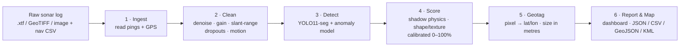

# SonarSentinel — Project Idea

| | |
|---|---|
| **Problem Statement ID** | 26057 |
| **Title** | AI-Powered Automated Underwater Marine Debris and Anomaly Detection System using Side-Scan Sonar Imagery |
| **Organization** | Ministry of Earth Sciences (MoES) — National Institute of Ocean Technology (NIOT) |
| **Category / Theme** | Software · Disaster Management |
| **Working title** | SonarSentinel |
| **Document** | Project Idea · v1.0 · 2026-09-13 |

**Related documents:** [Documentation index](README.md) · [PRD](PRD.md) · [Architecture](architecture/README.md) · [Wireframes](wireframes/README.md) · [TODO](../TODO.md)

---

## 1. The idea in one sentence

SonarSentinel reads raw side-scan sonar logs, finds man-made debris and ghost nets on the seafloor, gives each find a calibrated confidence score, and pins it on a map with GPS coordinates. It is light enough to run on a laptop or on board an underwater drone.

---

## 2. Why this matters

- **Ghost nets keep killing.** Abandoned, lost or discarded fishing gear keeps trapping fish, turtles, dolphins and seabirds for years. It also smothers coral reefs and fouls ship propellers.
- **The ocean is dark, so we use sound.** Side-scan sonar (SSS), towed behind a ship or mounted on an AUV, is the standard tool for imaging large seafloor areas.
- **People are the bottleneck.** One survey day produces hours of sonar "waterfall" imagery. Analysts scroll through it by eye, mark contacts and copy coordinates by hand. This is slow and tiring, and objects get missed.
- **Debris hides in natural features.** Nets and small objects blend in with rocks, sand ripples, acoustic shadows and speckle noise. Vehicle motion (heave, pitch, roll) and data dropouts make it worse.
- **Disaster link.** After cyclones, tsunamis and floods, harbours and shipping channels fill with submerged debris. Finding it quickly is a navigation-safety and relief priority.

Real work already shows this can be automated. WWF Germany recovered tens of tonnes of nets from the Baltic Sea after manually reviewing side-scan imagery. The GhostNetZero project (WWF + Microsoft) showed that AI on SSS imagery can flag ghost nets for expert review. SonarSentinel brings the same capability to Indian waters as an open, edge-ready, end-to-end pipeline.

---

## 3. Three core insights

| # | Insight | What it enables |
|---|---|---|
| 1 | **Sonar files already record their position.** Every ping in an `.xtf` file stores GPS, heading, altitude and range. | Geotagging is a **calculation, not a guess**. Every pixel maps to a latitude/longitude. |
| 2 | **A labelled ghost-net dataset isn't available, but "normal seafloor" data is.** | Anomaly detection learns what normal seafloor looks like and flags anything else. Synthetic nets fill the training gap. |
| 3 | **Man-made objects follow different physics.** They have sharp highlights, geometric shadows, straight edges and periodic mesh. | A **physics-aware filter** removes false alarms from rocks and shadows and produces a trustworthy 0–100% confidence. |

---

## 4. Solution overview



How the four required components map to the solution:

| Required component (problem statement) | SonarSentinel module |
|---|---|
| Object detection / semantic segmentation model | **Detect**: YOLO11-seg fine-tuned on sonar, plus a PatchCore anomaly model for unseen objects such as ghost nets |
| Confidence scoring & noise filtering | **Clean** + **Score**: speckle/dropout/motion handling, shadow-consistency check, false-positive filter, calibrated confidence |
| Anomaly reporting & geotagging engine | **Geotag** + **Report**: ping-header navigation → WGS84 coordinates, footprint, dimensions, class, exported as JSON/CSV/GeoJSON/KML |
| UI dashboard | **Dashboard**: upload, live map with streaming detections, detection detail, review queue, report download |

---

## 5. Example walkthrough

**Scenario:** An NIOT survey boat tows a side-scan sonar (600 kHz, 50 m range per side) along a 1.2 km line near Chennai Port and records `line_07.xtf`.

1. **Upload.** The analyst drops `line_07.xtf` on the dashboard. The system reads 18,240 pings and confirms GPS is present.
2. **Clean.** Water column removed, slant range corrected to 0.10 m ground resolution, brightness normalised, 212 dropout pings masked, 540 high-roll pings flagged.
3. **Detect (live).** Tiles stream through the model. Markers appear on the map as the track line grows.
4. **Score.** A dark patch with no bright return in front of it is rejected as a shadow. A rock cluster with irregular edges is rejected by the false-positive filter. A crumpled mesh texture with rope-like lines is kept.
5. **Geotag.** The detection sits at ping 10,432, starboard side, 23.7 m ground range. Using the ping's GPS position and heading, it is placed at **13.084120° N, 80.312750° E**.
6. **Report.**

```json
{
  "detection_id": "SRV-20260913-001-D0003",
  "class": "ghost_net",
  "confidence": 87.4,
  "alert_tier": "hazard",
  "position": { "lat": 13.084120, "lon": 80.312750, "depth_m": 18.5, "uncertainty_m": 4.2 },
  "dimensions": { "length_m": 6.2, "width_m": 3.1, "area_m2": 14.8 },
  "sonar_ref": { "side": "starboard", "ping_start": 10398, "ping_end": 10466 }
}
```

7. **Act.** The analyst confirms the detection in the review queue and downloads the KML. The dive team loads it into their GPS or Google Earth and goes straight to the net.

---

## 6. Real-world usage scenarios

| Scenario | Who | How SonarSentinel is used |
|---|---|---|
| **A · Towed vessel survey** | NIOT / coastal survey teams | Logs processed on a laptop on board or right after the survey. Hazards reported the same day. |
| **B · AUV on-board detection** | AUV operators | The model runs on a Jetson-class computer inside the AUV. High-confidence contacts trigger a closer re-survey pass. Compact alerts are sent to the surface. |
| **C · Post-disaster channel clearance** | Port authorities, Navy, disaster response | After a cyclone, rapid surveys of harbour approaches. Hazards to navigation ranked by confidence and size, exported for Notices to Mariners and clearance teams. |
| **D · Ghost-net cleanup campaigns** | NGOs, fisheries departments, divers | Survey known fishing grounds, flag ghost-net candidates, verify them, and plan dive/ROV recovery routes from the KML. |
| **E · Pipeline & cable inspection** | Offshore operators | Detect exposed pipe sections and debris near subsea infrastructure. |

---

## 7. What makes it different (USP)

1. **Raw sonar file → GPS pins, end-to-end.** Reads ping headers directly, with no manual copying of coordinates.
2. **Finds what it was never trained on.** Anomaly detection plus synthetic ghost-net training handles the lack of real ghost-net data.
3. **Physics-aware false-positive filtering.** Shadow geometry (highlight → shadow, height estimate) separates objects from shadows and rocks.
4. **Confidence you can trust.** Evidence fusion plus calibration, so "80%" really means about 80% precision. Every score comes with its breakdown.
5. **Robust to real sonar problems.** Explicit handling of speckle, dropouts, heave, pitch, roll, slant range and differences between sonar models.
6. **Edge-ready and offline.** ONNX/TensorRT/OpenVINO INT8 models, Docker packaging, offline maps, no cloud dependency. Suits sensitive seabed data.
7. **Learns from experts.** Every confirm/reject in the review queue becomes new training data.
8. **Open outputs.** JSON, CSV, GeoJSON and KML load directly into QGIS, Google Earth and chart workflows.

---

## 8. Key challenges and our approach

| Challenge | Approach | Details |
|---|---|---|
| Labelled datasets have no GPS; GPS data has no labels | Train on labelled images, run inference on GPS-tagged XTF, compute coordinates from ping headers | [Geotagging](architecture/04-geotagging-engine.md) |
| No ghost-net dataset | Synthetic nets + PatchCore anomaly detection + human-in-the-loop | [ML Models](architecture/03-ml-models.md) |
| Speckle vs. thin net strands | 3-channel input: raw + despeckled + local texture | [Data Pipeline](architecture/02-data-pipeline.md) |
| Shadows, rocks, ripples | Shadow physics, shape/texture features, LightGBM filter, hard negatives | [ML Models](architecture/03-ml-models.md) |
| Dropouts, heave/pitch/roll | Bottom tracking, dropout masks, motion flags, confidence penalties | [Data Pipeline](architecture/02-data-pipeline.md) |
| Varying pixel resolution | Slant-range correction + GPS-distance resampling to a fixed metres-per-pixel | [Data Pipeline](architecture/02-data-pipeline.md) |
| Edge deployment | Small model, INT8 TensorRT/OpenVINO, chunked streaming | [Deployment](architecture/07-deployment.md) |

---

## 9. Technology stack (summary)

| Layer | Choice |
|---|---|
| Languages | Python 3.11 (backend, ML) · TypeScript (frontend) |
| Sonar I/O | `pyxtf`, GDAL / `rasterio`, `sllib` (Lowrance), PINGMapper (Humminbird, later) |
| Image processing | OpenCV, NumPy, SciPy, scikit-image |
| Detection / segmentation | PyTorch · Ultralytics YOLO11-seg · SAHI sliced inference · U-Net (refinement) |
| Anomaly detection | anomalib (PatchCore / EfficientAD) |
| False-positive filter & calibration | LightGBM · scikit-learn (isotonic regression) |
| Geospatial | `pyproj`, GDAL, Shapely |
| Backend | FastAPI · WebSocket · SQLite (prototype) → PostgreSQL + PostGIS |
| Frontend | React · Vite · Leaflet (used directly via a thin React wrapper; ADR-009) |
| Edge | ONNX · TensorRT (NVIDIA Jetson) · OpenVINO (Intel) · INT8 quantization |
| Packaging | Docker / Docker Compose |
| Labelling | CVAT or Label Studio + SAM 2-assisted masks (Apache-2.0) |

---

## 10. Datasets

| Purpose | Dataset | Notes |
|---|---|---|
| Shipwreck segmentation | **AI4Shipwrecks** (Univ. of Michigan) | 286 high-res SSS images, pixel masks, Thunder Bay NMS |
| Cylinders / mine-like vs. bottom objects | **Side-scan sonar imaging data for mine detection** (Data in Brief, 2024) | 1,170 images, MILCO / NOMBO annotations |
| Classification + seafloor background | **SeabedObjects-KLSG** | Ship, airplane, mine, seafloor (victim images excluded on ethical grounds) |
| Synthetic augmentation | Our own ghost-net generator (S3Simulator only if its authors grant permission, since no licence is published) | Fills class gaps |
| GPS-tagged raw logs for inference/demo | **NOAA NCEI hydrographic surveys**, NOAA InPort `.xtf`, USGS ScienceBase | Real ping-header navigation; charted wrecks for geolocation validation |
| Ghost-net reference | GhostNetZero / WWF (on request), published MARELITT Baltic survey material | Real examples for validation if access is granted |
| More sources | Awesome-Sonar-Image-Resources, remaro OpenSonarDatasets | Curated lists |

Full dataset handling, splits and augmentation policy: [ML Models](architecture/03-ml-models.md).

---

## 11. Expected impact

- **Environment:** Faster ghost-net discovery means less entanglement of marine life and less reef damage. Supports **UN SDG 14 (Life Below Water)**.
- **Disaster management:** Rapid post-cyclone and post-tsunami hazard mapping of ports and channels.
- **Economic:** Fewer analyst hours per survey, less damage to vessels and fishing gear, safer navigation.
- **National capability:** An indigenous, offline, edge-deployable tool that fits MoES/NIOT ocean technology programmes and keeps sensitive seabed data on-premise.

---

## 12. Feasibility and MVP scope

**MVP (hackathon/prototype):**
1. `.xtf` + GeoTIFF + image+nav-CSV ingestion with pixel → GPS
2. Preprocessing pipeline (slant range, gain, despeckle, dropouts, motion flags)
3. YOLO11-seg detector (shipwreck, pipe, cylinder, ghost_net, debris_other) + PatchCore anomaly
4. Shadow check + fused, calibrated confidence + alert tiers
5. JSON/CSV reports (GeoJSON/KML if time allows)
6. Dashboard: upload → live map → detection detail → download

**Proof points for the demo:**
- Run on a public NOAA `.xtf` survey containing a charted wreck. Show the detected position vs. the charted position, error in metres.
- Show false alarms per km² before vs. after the filter module.
- Show synthetic ghost-net recall and unknown-anomaly flags.
- Show the exported model running on CPU (and on Jetson, if available).

---

## 13. Future roadmap

- More formats: EdgeTech `.jsf`, Lowrance `.sl2/.sl3`, Humminbird via PINGMapper
- Multi-line mosaicing and change detection between repeat surveys ("new debris since last month")
- Fusion with multibeam bathymetry/backscatter and forward-looking sonar
- Adaptive AUV missions: re-survey high-anomaly areas automatically
- Integration with S-100/ENC hazard workflows and fisheries gear-loss reporting
- Real ghost-net dataset from Indian waters built through the review loop

---

## 14. Suggested team roles (6 members)

| Role | Responsibilities |
|---|---|
| ML lead | Detector, anomaly model, training, evaluation |
| Sonar/signal-processing engineer | Ingestion, preprocessing, synthetic data generator |
| Geospatial engineer | Geotagging engine, mosaic, reports, validation vs. charted wrecks |
| Backend engineer | FastAPI, job pipeline, WebSocket streaming, storage |
| Frontend engineer | Dashboard, map, review queue, exports |
| Integration & edge / PM | Docker, ONNX/TensorRT export, testing, demo, documentation |

---

## 15. References

- AI4Shipwrecks dataset — https://umfieldrobotics.github.io/ai4shipwrecks/
- Side-scan sonar imaging data for mine detection (Data in Brief, 2024) — https://www.ncbi.nlm.nih.gov/pmc/articles/PMC10879765/
- SeabedObjects dataset — https://github.com/huoguanying/SeabedObjects-Ship-and-Airplane-dataset
- Awesome-Sonar-Image-Resources — https://github.com/Jorwnpay/Awesome-Sonar-Image-Resources
- OpenSonarDatasets — https://github.com/remaro-network/OpenSonarDatasets
- S3Simulator — https://arxiv.org/html/2408.12833v1
- GhostNetZero: AI for Detecting Marine Ghost Nets — https://www.microsoft.com/en-us/research/publication/ghostnetzero-ai-for-detecting-marine-ghost-nets/
- pyxtf — https://github.com/oysstu/pyxtf
- NOAA Hydrographic Survey Data — https://nauticalcharts.noaa.gov/data/hydrographic-survey-data.html
- NCEI NOS Hydrographic Survey — https://www.ncei.noaa.gov/products/nos-hydrographic-survey
