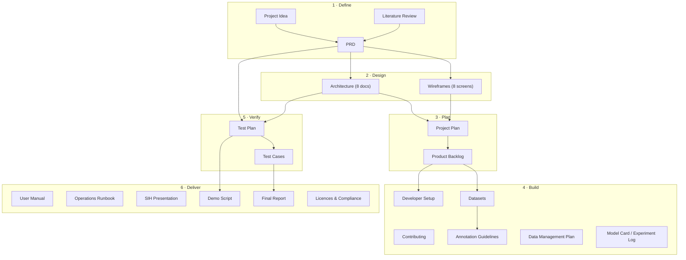

# SonarSentinel — Documentation Index

Every document needed to plan, build, test, deploy, demonstrate and hand over SonarSentinel (SIH 26057).

**Legend:** ✅ Complete (v1.0 draft, ready for team review) · 📝 Template (filled in during the project) · 🔄 Living document (updated every sprint)

## 1. Document map

## 2. All documents

### Define
| Document | Purpose | Primary audience | Status |
|---|---|---|---|
| [PROJECT_IDEA.md](PROJECT_IDEA.md) | Problem, solution idea, example, USP, impact | Everyone, judges | ✅ |
| [PRD.md](PRD.md) | Requirements, scope, metrics, acceptance criteria | Whole team | ✅ 🔄 |
| [research/LITERATURE_REVIEW.md](research/LITERATURE_REVIEW.md) | Background, prior work, datasets, methods, gaps | ML & sonar engineers, report | ✅ |

### Design
| Document | Purpose | Primary audience | Status |
|---|---|---|---|
| [architecture/README.md](architecture/README.md) | Architecture index and principles | Engineers | ✅ |
| [architecture/01-system-architecture.md](architecture/01-system-architecture.md) | Context, containers, components, flows, repo layout | Engineers | ✅ |
| [architecture/02-data-pipeline.md](architecture/02-data-pipeline.md) | Processing stages, contracts, config | Backend, sonar | ✅ |
| [architecture/03-ml-models.md](architecture/03-ml-models.md) | Models, training, synthetic data, calibration, evaluation | ML | ✅ |
| [architecture/04-geotagging-engine.md](architecture/04-geotagging-engine.md) | Pixel → lat/lon maths, layback, uncertainty | Geo | ✅ |
| [architecture/05-api-specification.md](architecture/05-api-specification.md) | REST + WebSocket API | Backend, frontend | ✅ |
| [architecture/06-data-models.md](architecture/06-data-models.md) | Report schema, exports, database, storage | Backend, geo | ✅ |
| [architecture/07-deployment.md](architecture/07-deployment.md) | Docker, edge, hardware, security, CI/CD | DevOps / edge | ✅ |
| [architecture/08-architecture-decisions.md](architecture/08-architecture-decisions.md) | ADRs | Engineers, judges | ✅ 🔄 |
| [wireframes/README.md](wireframes/README.md) | Screen inventory, flow, visual language | Frontend, UX | ✅ |
| wireframes/01 … 08 | Screen-level wireframes and behaviour | Frontend | ✅ |

### Plan
| Document | Purpose | Primary audience | Status |
|---|---|---|---|
| [planning/PROJECT_PLAN.md](planning/PROJECT_PLAN.md) | WBS, timeline, milestones, roles (RACI), communication, risk process | Whole team, mentors | ✅ 🔄 |
| [planning/PRODUCT_BACKLOG.md](planning/PRODUCT_BACKLOG.md) | Epics, stories, tasks, estimates, sprint allocation | Whole team | ✅ 🔄 |
| [../TODO.md](../TODO.md) | Master phase-by-phase checklist: every story, gate, exit criterion and continuous task | Whole team | ✅ 🔄 |
| [planning/PHASE0_REVIEW_SIGNOFF.md](planning/PHASE0_REVIEW_SIGNOFF.md) | Phase 0 review checklist, issue log and sign-off record per role | Whole team | ✅ team lead approved; R1–R5 confirm in Sprint 0 |
| [planning/SPRINT_1_PLAN.md](planning/SPRINT_1_PLAN.md) | Sprint 1 goal, committed stories, schedule, exit criteria, risks | Whole team | ✅ |
| [communications/OUTREACH_DRAFTS.md](communications/OUTREACH_DRAFTS.md) | Draft messages (SPOC, NIOT, GhostNetZero, dataset authors, mentor) + outreach tracker | PM, ML lead | 📝 drafts, not sent |

### Build
| Document | Purpose | Primary audience | Status |
|---|---|---|---|
| [../CONTRIBUTING.md](../CONTRIBUTING.md) | Git workflow, coding standards, reviews, Definition of Done | Engineers | ✅ |
| [guides/DEVELOPER_SETUP.md](guides/DEVELOPER_SETUP.md) | Environment setup on Windows/Ubuntu/Jetson | Engineers | ✅ |
| [data/DATASETS.md](data/DATASETS.md) | Dataset sources, download, conversion, class mapping | ML, data | ✅ |
| [data/ANNOTATION_GUIDELINES.md](data/ANNOTATION_GUIDELINES.md) | How to label sonar objects consistently | Annotators, ML | ✅ |
| [data/DATA_MANAGEMENT_PLAN.md](data/DATA_MANAGEMENT_PLAN.md) | Storage, versioning, splits, provenance, sensitivity | ML, data, DevOps | ✅ |
| [ml/MODEL_CARD_TEMPLATE.md](ml/MODEL_CARD_TEMPLATE.md) | Model card for each released model | ML | 📝 |
| [ml/EXPERIMENT_LOG_TEMPLATE.md](ml/EXPERIMENT_LOG_TEMPLATE.md) | Record of each training experiment | ML | 📝 |
| [../ml/datasets/LICENSES.md](../ml/datasets/LICENSES.md) | Dataset licence register: status, evidence, allowed use, permissions log | ML, PM | ✅ 🔄 |

### Verify
| Document | Purpose | Primary audience | Status |
|---|---|---|---|
| [testing/TEST_PLAN.md](testing/TEST_PLAN.md) | Strategy, levels, environments, entry/exit criteria | Whole team | ✅ |
| [testing/TEST_CASES.md](testing/TEST_CASES.md) | Test cases and requirement traceability | QA, engineers | ✅ 🔄 |
| [reports/DOCUMENTATION_VERIFICATION_REPORT.md](reports/DOCUMENTATION_VERIFICATION_REPORT.md) | Results of the documentation consistency check, fixes and open items | Whole team | ✅ |
| `scripts/docs/verify_docs.ps1` | Re-runnable check: links, anchors, ID cross-references, wireframe frames | Whole team | ✅ |

### Deliver
| Document | Purpose | Primary audience | Status |
|---|---|---|---|
| [guides/USER_MANUAL.md](guides/USER_MANUAL.md) | How to use the dashboard and CLI; interpreting results | Analysts, operators | ✅ |
| [guides/OPERATIONS_RUNBOOK.md](guides/OPERATIONS_RUNBOOK.md) | Deploy, operate, monitor, troubleshoot, recover | Operators, DevOps | ✅ |
| [hackathon/SIH_PRESENTATION.md](hackathon/SIH_PRESENTATION.md) | Slide-by-slide content for the SIH idea/finale deck | Presenters | ✅ |
| [hackathon/idea-deck/SonarSentinel_SIH2026_Idea_DRAFT.pdf](hackathon/idea-deck/SonarSentinel_SIH2026_Idea_DRAFT.pdf) ([PowerPoint source](hackathon/idea-deck/SonarSentinel_SIH2026_Idea_DRAFT.pptx)) | SIH 2026 idea submission, built on the official template (6 slides) | Team leader, presenters | 📝 draft: fill team name/ID, review, then upload the PDF |
| [hackathon/DEMO_SCRIPT.md](hackathon/DEMO_SCRIPT.md) | Timed demo, backup plan, judge Q&A | Presenters | ✅ |
| [reports/FINAL_PROJECT_REPORT_TEMPLATE.md](reports/FINAL_PROJECT_REPORT_TEMPLATE.md) | Structure of the final technical report | Whole team | 📝 |
| [legal/LICENSES_AND_COMPLIANCE.md](legal/LICENSES_AND_COMPLIANCE.md) | Third-party software and dataset licences; data sensitivity | Lead, legal/mentor | ✅ 🔄 |
| [../SECURITY.md](../SECURITY.md) | Security policy and reporting | Everyone | ✅ |
| [../CHANGELOG.md](../CHANGELOG.md) | Release history | Everyone | 🔄 |

### Repository templates
| File | Purpose |
|---|---|
| [../.github/PULL_REQUEST_TEMPLATE.md](../.github/PULL_REQUEST_TEMPLATE.md) | PR checklist |
| [../.github/ISSUE_TEMPLATE/bug_report.md](../.github/ISSUE_TEMPLATE/bug_report.md) | Bug reports |
| [../.github/ISSUE_TEMPLATE/feature_request.md](../.github/ISSUE_TEMPLATE/feature_request.md) | Feature / story requests |
| [../.github/ISSUE_TEMPLATE/data_issue.md](../.github/ISSUE_TEMPLATE/data_issue.md) | Dataset / label problems |

## 3. Reading order by role

| Role | Read in this order |
|---|---|
| **New team member** | Project Idea → PRD §1–5 → Architecture README → Project Plan → Contributing → Developer Setup |
| **ML engineer** | PRD §8, §11 → Literature Review → 03-ml-models → Datasets → Annotation Guidelines → Data Management Plan → Model Card Template |
| **Sonar / geo engineer** | 02-data-pipeline → 04-geotagging-engine → 06-data-models → Test Cases (GEO, PRE) |
| **Backend engineer** | 01-system-architecture → 02-data-pipeline → 05-api-specification → 06-data-models → Test Plan |
| **Frontend engineer** | Wireframes README → wireframes 01–08 → 05-api-specification → User Manual |
| **Edge / DevOps** | 07-deployment → Operations Runbook → Developer Setup (Jetson) → Licences & Compliance |
| **Presenter** | Project Idea → SIH Presentation → Demo Script → PRD §11 metrics |
| **NIOT mentor / judge** | Project Idea → PRD → Architecture README → Test Plan §9 results |

## 4. Document conventions

- **Format:** Markdown; diagrams in Mermaid; wireframes in ASCII.
- **Identifiers:** requirements `FR-<AREA>-NN`, `NFR-NN`; user stories `US-NN`; acceptance criteria `AC-NN`; tests `TC-<AREA>-NNN`; backlog `EP-NN` / `ST-NNN`; decisions `ADR-NNN`; risks `R-NN`.
- **Versioning:** each document carries a version/date header. Major changes are noted in [CHANGELOG.md](../CHANGELOG.md).
- **Review:** documentation changes go through pull requests like code; the owner role for each document approves.
- **Single source of truth:** requirements live in the PRD, API contracts in `05-api-specification.md`, schemas in `06-data-models.md`. Other documents link to them instead of copying.

## 5. Documentation Definition of Done

A document is **done** when:
1. It follows the conventions above and has an owner role and version.
2. All links resolve and IDs match the PRD/backlog.
3. It has been reviewed by at least one other team member.
4. Examples (commands, JSON, config) have been checked against the current implementation, or are clearly marked as *planned*.
