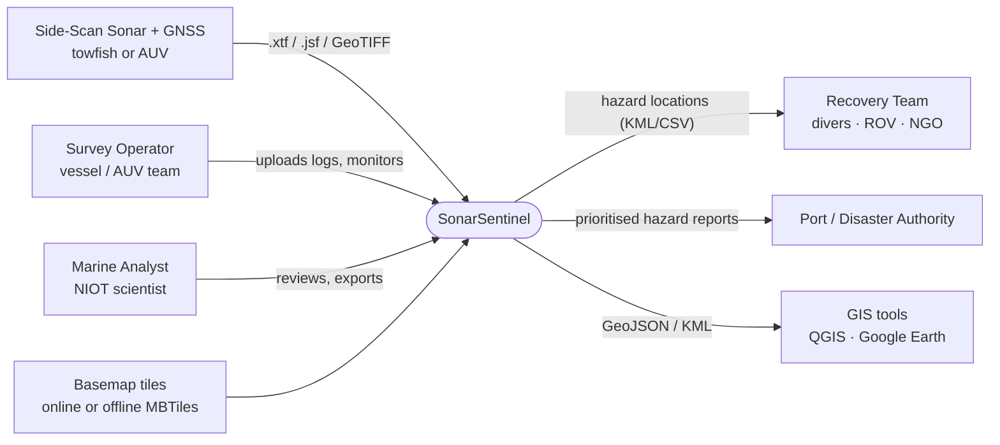
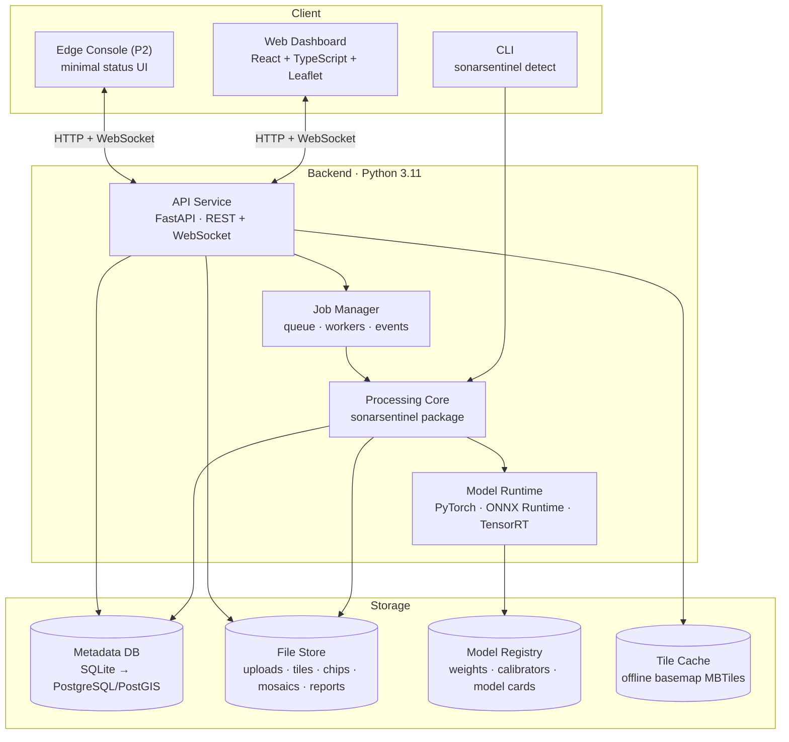
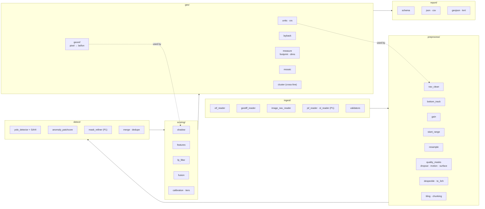
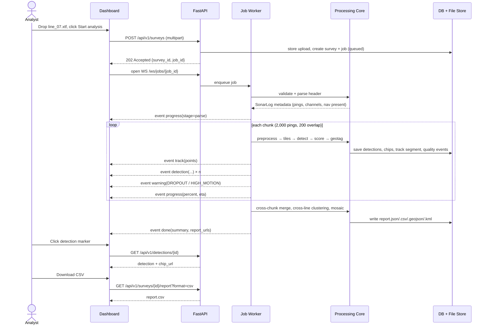
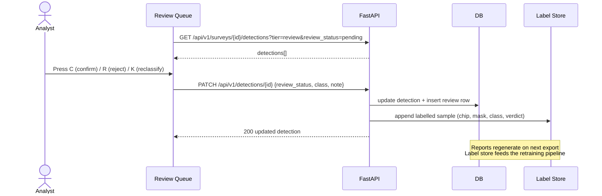
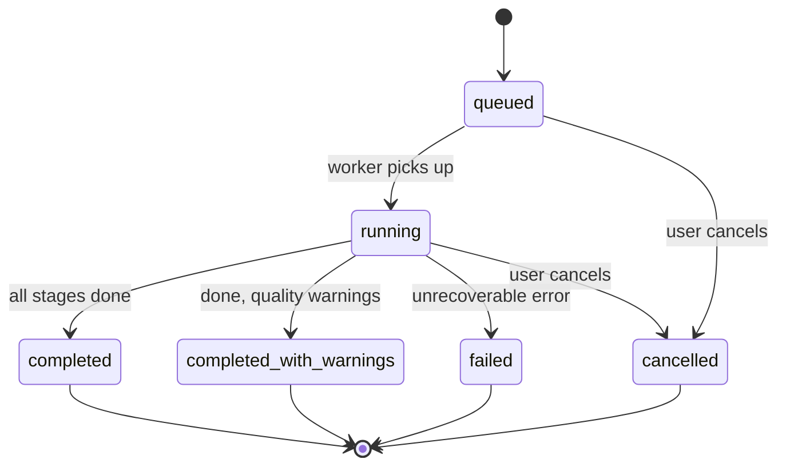

# 01 · System Architecture

[← Architecture index](README.md)

## 1. System context (C4 level 1)

Who and what interacts with SonarSentinel.



## 2. Containers (C4 level 2)



| Container | Technology | Responsibility |
|---|---|---|
| Web Dashboard | React, TypeScript, Vite, Leaflet (used directly via a thin React wrapper; ADR-009) | Upload, live map, filters, detail, review, downloads |
| CLI | Python (Typer) | Headless batch processing; scripting; edge runs |
| API Service | FastAPI, Uvicorn | REST endpoints, file upload, WebSocket event streaming, static files (chips, reports, mosaics) |
| Job Manager | asyncio worker pool (prototype) → Redis + RQ/Celery (scale-out) | Queue jobs, run pipeline per chunk, publish events, cancellation |
| Processing Core | NumPy, OpenCV, SciPy, pyxtf, GDAL, pyproj | Ingest → preprocess → detect → score → geotag → report |
| Model Runtime | PyTorch (dev), ONNX Runtime (CPU), TensorRT (Jetson), OpenVINO (Intel) | Run detector, anomaly model, FP filter, calibrator |
| Metadata DB | SQLite (prototype), PostgreSQL + PostGIS (production) | Surveys, jobs, detections, reviews, track, quality events |
| File Store | Local filesystem (volume) | Raw uploads, intermediate tiles, detection chips, mosaics, reports |
| Model Registry | Versioned folder (`models/<id>/<version>/`) | Model weights, calibrators, model cards, metrics |

## 3. Components of the Processing Core (C4 level 3)



## 4. Main flow: upload → live map → report



## 5. Review flow (P1)



## 6. Job lifecycle



Stages reported in progress events: `validate → parse → preprocess → detect → score → geotag → merge → report`.

## 7. Deployment modes

| Mode | Where | What runs | Notes |
|---|---|---|---|
| **Shore workstation** | Lab / office / ship's lab laptop | Full stack: dashboard + API + worker + all models | Default for analysts |
| **On-board edge** | AUV payload computer / Jetson on vessel | CLI/edge runner with detector + shadow check + geotag; optional minimal API + edge console | Anomaly model and mosaic can be deferred to shore |
| **Central server** (future) | NIOT data centre | Scaled API + Redis queue + multiple GPU workers + PostGIS | Multi-user, survey archive |

Details: [07-deployment.md](07-deployment.md).

## 8. Repository layout

```text
marine-debris/
├── docs/
│   ├── PROJECT_IDEA.md
│   ├── PRD.md
│   ├── architecture/
│   └── wireframes/
├── backend/
│   ├── sonarsentinel/
│   │   ├── ingest/        # xtf_reader.py, geotiff_reader.py, image_nav_reader.py, validators.py
│   │   ├── preprocess/    # nav_clean.py, bottom_track.py, gain.py, slant_range.py, resample.py,
│   │   │                  # quality_masks.py, despeckle.py, tiling.py
│   │   ├── detect/        # yolo_detector.py, anomaly_patchcore.py, mask_refiner.py, merge.py
│   │   ├── scoring/       # shadow.py, features.py, fp_filter.py, fusion.py, calibration.py
│   │   ├── geo/           # units.py, layback.py, georef.py, measure.py, mosaic.py, cluster.py
│   │   ├── report/        # schema.py, export_json.py, export_csv.py, export_geojson.py, export_kml.py
│   │   ├── api/           # main.py, routes_surveys.py, routes_detections.py, ws.py
│   │   ├── jobs/          # manager.py, worker.py, events.py
│   │   ├── storage/       # db.py, orm.py, files.py
│   │   ├── config.py
│   │   ├── pipeline.py    # orchestrates stages per chunk
│   │   └── cli.py
│   ├── configs/pipeline.yaml
│   └── tests/             # unit + integration (sample XTF fixtures)
├── ml/
│   ├── datasets/          # download + convert scripts, LICENSES.md
│   ├── synth/             # ghost_net_generator.py, pipe_generator.py
│   ├── train_detector.py
│   ├── train_anomaly.py
│   ├── train_fp_filter.py
│   ├── calibrate.py
│   ├── evaluate.py
│   └── notebooks/
├── frontend/
│   └── src/               # pages/, components/, map/, api/, store/, styles/
├── edge/                  # export_models.py, trt_runner.py, edge_console/
├── models/                # versioned weights (git-ignored; release assets / DVC)
├── data/                  # local datasets and uploads (git-ignored)
└── docker/                # Dockerfile.backend, Dockerfile.frontend, docker-compose.yml, docker-compose.edge.yml
```

## 9. Cross-cutting concerns

| Concern | Approach |
|---|---|
| Configuration | Single `pipeline.yaml` + env vars; config hash stored per job |
| Logging | Structured JSON logs (job_id, stage, chunk, duration_ms) |
| Errors | Typed exceptions per stage → job warnings or failure; see [API error model](05-api-specification.md#4-error-model) |
| Performance | Chunked streaming, batched tile inference, memory-mapped arrays, GPU when available |
| Testing | Unit tests per stage; golden-file tests for georef; integration test on a small public XTF |
| Versioning | Semantic versions for pipeline, models and report schema (`report_version`) |
