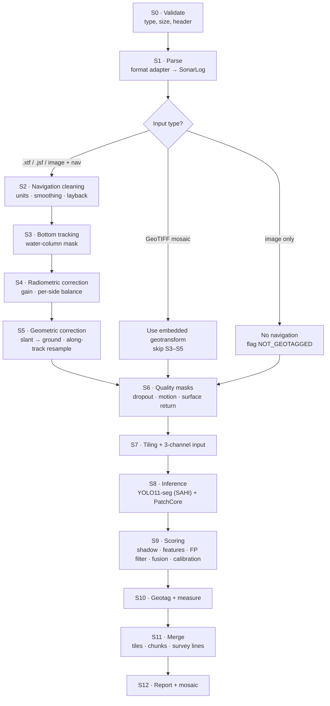
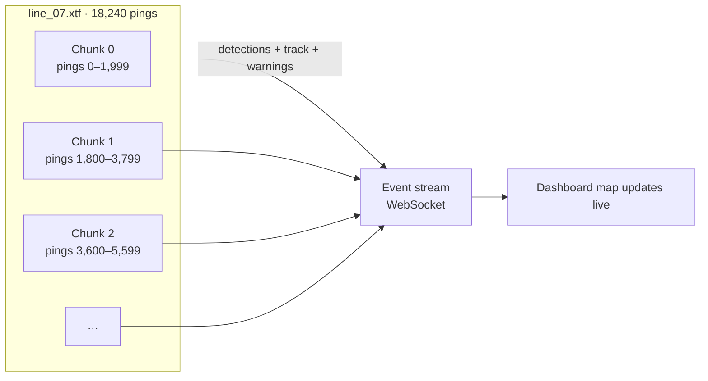

# 02 · Data Pipeline

[← Architecture index](README.md)

This document defines each processing stage, its inputs and outputs, and how the pipeline handles the core sonar problems: speckle, varying resolution, shadows, dropouts, and heave/pitch/roll.

## 1. Pipeline overview



## 2. Internal data contracts

All ingest adapters produce the same `SonarLog`. Every later stage works only on these structures.

```python
from dataclasses import dataclass, field
from typing import Literal
import numpy as np
import pandas as pd

@dataclass
class SonarInfo:
    make: str | None
    model: str | None
    frequency_khz: float | None
    samples_per_channel: int
    channel_layout: Literal["port_stbd", "port_only", "stbd_only"]

@dataclass
class SonarLog:                    # contract 1.0: backend/sonarsentinel/ingest/models.py
    source_file: str
    source_format: Literal["xtf", "jsf", "sl2", "sl3", "geotiff", "image_nav", "image_only"]
    sonar: SonarInfo
    nav: pd.DataFrame              # one row per ping, columns below; NaN allowed
    port: np.ndarray | None = None       # (n_pings, n_samples), sample 0 = nearest to nadir
    starboard: np.ndarray | None = None  # (n_pings, n_samples), may be a numpy.memmap
    image: np.ndarray | None = None      # GeoTIFF band 1, or the waterfall image as read
    ground_range_corrected: bool = False # across-track samples already ground range
    crs_hint: str | None = None    # e.g. "EPSG:4326", "EPSG:32644"
    geotransform: tuple | None = None   # GDAL order, GeoTIFF only
    warnings: list[str] = field(default_factory=list)
    # reader warnings: TRUNCATED_FILE, NO_NAVIGATION, NOT_GEOTAGGED, GPS_INTERPOLATED,
    # HEADING_FROM_COG, SHIP_POSITION_ONLY, PORT_ORDER_ASSUMED

NAV_COLUMNS = [
    "ping", "time_utc", "lat", "lon", "heading_deg", "altitude_m", "sensor_depth_m",
    "speed_mps", "roll_deg", "pitch_deg", "slant_range_m", "cable_out_m", "layback_m",
    "nav_source",            # "sensor" | "ship" | "csv" | "interpolated"
]

@dataclass
class ProcessedChunk:
    chunk_id: int
    ping_offset: int               # first original ping index in this chunk
    image: np.ndarray              # (rows, cols) ground-range, fixed resolution, uint8
    image_3ch: np.ndarray          # (rows, cols, 3) raw | despeckled | local std
    row_to_ping: np.ndarray        # resampled row → original ping index
    ground_res_m: float
    nadir_col: int                 # column of the nadir line
    masks: dict[str, np.ndarray]   # "water_column", "dropout", "motion", "surface" (bool per row/pixel)
    nav: pd.DataFrame              # cleaned nav for this chunk's pings

@dataclass
class Detection:
    detection_id: str
    cls: str
    bbox_px: tuple[int, int, int, int]      # x1, y1, x2, y2 in chunk image
    mask_rle: str | None
    raw_score: float
    scores: dict[str, float]                # detector, anomaly, shadow, fp_filter, persistence, penalties, fused
    confidence: float                       # 0–100 calibrated
    alert_tier: str
    quality_flags: list[str]
    geo: dict | None                        # lat, lon, footprint, dims, depth, uncertainty
```

## 3. Stage specifications

### S0 · Validate
| | |
|---|---|
| **Input** | Uploaded file(s), optional nav CSV, user options |
| **Checks** | Extension allow-list; magic bytes / XTF file header; size ≤ limit; GeoTIFF has CRS; CSV has required columns |
| **Output** | Validation result shown per file on the upload screen |
| **Failure** | `UNSUPPORTED_FORMAT`, `FILE_TOO_LARGE`, `CORRUPT_HEADER`, `NAV_CSV_INVALID` |

### S1 · Parse
| Adapter | Library | Notes |
|---|---|---|
| `xtf_reader` | `pyxtf` | Reads file header (channels, `NavUnits`), sonar packets; extracts port/stbd arrays and per-ping nav (`SensorX/Ycoordinate`, `ShipX/Ycoordinate`, heading, altitude, depth, roll, pitch, slant range, cable out, layback) |
| `geotiff_reader` | `rasterio` / GDAL | Reads raster + geotransform + CRS; single image, no ping structure |
| `image_nav_reader` | OpenCV + pandas | Image rows ↔ CSV `ping`; layout from options (`port_stbd` with nadir at centre by default) |
| `jsf_reader`, `sl_reader` (P1) | custom / `sllib` | Same `SonarLog` output |

Large files are read **ping-by-ping into memory-mapped arrays** so the whole file never has to sit in RAM.

**XTF details (implemented in Sprint 1):**
- Two passes: a header-only scan indexes complete sonar pings (a partial last packet gives `TRUNCATED_FILE`), then samples are copied into `numpy` arrays or `.npy` memmaps (`work_dir`). Chunks are views over those arrays (`ingest/chunking.py`).
- Channels: first port/starboard pair from `ChanInfo.TypeOfChannel`, or indices 0/1 when types are unset; `channels=(2, 3)` selects another pair (e.g. high frequency).
- Port sample order: the XTF specification reverses odd-numbered side-scan channels, so port is stored far range first (confirmed on USGS Klein 3900 files). The reader detects the order by correlating the port and starboard range profiles, which works in both deep water (dark nadir band) and shallow water (bright nadir). It falls back to far-first with `PORT_ORDER_ASSUMED` when the evidence is weak; `port_order` overrides it. **Confirm on each new sonar model** (TC-ING-006).
- Altitude: `SensorPrimaryAltitude` can be wrong (the Grand Bay files record 1–74 m in ~3 m of water), so S3 bottom tracking must check it against the data.
- Navigation: `SensorX/Ycoordinate`, falling back per ping to `ShipX/Ycoordinate` (`SHIP_POSITION_ONLY`); (0, 0) fixes become NaN; `NavUnits` 0 requires an EPSG code (`CRS_REQUIRED`); `SensorSpeed` knots → m/s; zero altitude → NaN.

### S2 · Navigation cleaning
1. **Units/CRS**: `NavUnits` header + value-range check; convert projected coordinates to WGS84 (`pyproj`); user UTM override.
2. **Invalid fixes**: (0,0), NaN, and jumps > max plausible speed × Δt → marked invalid and interpolated (`GPS_INTERPOLATED`).
3. **Smoothing**: Savitzky–Golay on UTM eastings/northings (window 31 pings); circular smoothing of heading.
4. **Layback**: if only ship position exists, compute towfish position from cable out and sensor depth (see [Geotagging](04-geotagging-engine.md#4-layback-correction)); flag `LAYBACK_ESTIMATED`.

### S3 · Bottom tracking
- If `altitude_m` is missing or implausible, detect the first seabed return per ping (smoothed intensity above k × noise floor), then median-filter across pings (window 31).
- Build the **water-column mask** (samples before the first return), which removes nadir and fish-school clutter.
- Flag `NO_ALTITUDE_BOTTOM_TRACKED` at survey level when used.

### S4 · Radiometric correction
- **Across-track**: divide by a running mean column profile over a 200-ping along-track window (removes beam pattern / range loss).
- **Per side**: normalise port and starboard medians separately (removes roll imbalance).
- **Dynamic range**: `log1p` then percentile clip (1–99.5%) → uint8.

### S5 · Geometric correction
- **Slant → ground range** per ping: `g = sqrt(s² − h²)` using altitude `h`; interpolate onto a fixed ground grid (default 0.10 m).
- **Along-track resampling**: cumulative GPS distance between pings → rows at fixed spacing (0.10 m). Keep `row_to_ping` for geotagging.
- **Heave alignment**: shift pings so the seabed first return aligns (from S3).
- Output: square-pixel image, `nadir_col` at centre, port on the left (flipped), starboard on the right.

### S6 · Quality masks

| Mask / flag | Rule (defaults, configurable) | Effect |
|---|---|---|
| `DROPOUT` | Row std < 5% of median row std, or row mean < 1, or duplicate of previous row, or invalid nav | Gaps ≤ 3 pings inpainted; longer gaps masked (no detections inside); overlapping detections get a penalty |
| `HIGH_MOTION` | \|roll\| > 5°, \|pitch\| > 5°, or yaw rate > 3°/ping | Penalty; track segment highlighted in UI |
| `SURFACE_RETURN_BAND` (P1) | Columns where slant range ≈ sensor depth (± 0.5 m) | Linear detections parallel to track in the band suppressed |
| `NEAR_NADIR` | Ground range < 0.3 × altitude (steep-incidence zone, poor shadows, strong distortion) | Penalty; flag |
| `TILE_EDGE` | Detection box touches a tile edge without a merge partner | Flag only |

Quality events (ping ranges with a flag type) are stored and streamed as `warning` events.

### S7 · Tiling and 3-channel input
- 3 channels: **raw normalised** | **Lee despeckled (5×5)** | **local standard deviation (7×7)**, each scaled to uint8.
- Tiles: 640 × 640, 25% overlap; tile → chunk offsets stored for merging.
- Tiles whose area is > 80% masked (water column/dropout) are skipped.

### S8 · Inference
- **Detector**: YOLO11-seg via SAHI sliced prediction, batched on GPU, raw score threshold 0.20.
- **Anomaly**: PatchCore on 256 × 256 tiles (downsampled from 640 or native), giving a heatmap and tile score. Connected components above the threshold that don't overlap detector boxes (IoU < 0.1) → `unknown_anomaly` candidates.
- See [ML Models](03-ml-models.md).

### S9 · Scoring
Per detection: shadow score, shape/texture features → FP-filter probability, anomaly score (mean heatmap inside mask), persistence (after S11), quality penalties. Then:

```text
fused = 0.45·detector + 0.15·anomaly + 0.15·shadow + 0.15·fp_filter + 0.10·persistence
        − 0.20·dropout_overlap − 0.10·motion_flag
confidence = 100 × isotonic_calibrator(fused)
tier = hazard (≥80) | review (≥50) | anomaly (≥30 and anomaly ≥ τ) | hidden
```

Weights are the defaults in `pipeline.yaml`. They are tuned on the validation set before calibration is fitted.

### S10 · Geotag and measure
- Mask → minimum-area rectangle (`cv2.minAreaRect`) → length, width, orientation; area = mask pixels × res².
- Centroid and rectangle corners → `row_to_ping` + across-track distance → WGS84 (see [Geotagging](04-geotagging-engine.md)).
- Depth = sensor depth + altitude at the ping (if available); uncertainty from the error budget.

### S11 · Merge
1. **Across tiles**: SAHI merging (NMS/IoS on global chunk coordinates); pipes merged by collinearity.
2. **Across chunks**: detections in the 200-ping overlap are matched by IoU; the copy whose centre is farther from its chunk edge is kept.
3. **Across survey lines** (P1): DBSCAN on lat/lon with haversine metric (5 m). Merged detection keeps the max-confidence member's geometry, averages the position, sets `n_views`, and recomputes the persistence score and confidence.

### S12 · Report and mosaic
- Write JSON / CSV (P0) and GeoJSON / KML (P1) via [report schemas](06-data-models.md).
- Detection chips: 256 × 256 PNG crops with mask outline, saved as `chips/<detection_id>.png`.
- Mosaic (P1): GCP-based warp to EPSG:4326 PNG + bounds for Leaflet (see [Geotagging §7](04-geotagging-engine.md#7-georeferenced-mosaic)).

## 4. Chunking and streaming



- Chunk size 2,000 pings, 200-ping overlap (configurable).
- Chunk-level normalisation windows reach into the overlap to avoid brightness seams.
- Detections are emitted after in-chunk merging. Cross-chunk duplicates are resolved when the next chunk completes, and the UI receives a `detection_update` or `detection_removed` event.

## 5. Error handling

| Situation | Behaviour | Job outcome |
|---|---|---|
| Unsupported / corrupt header | Reject at S0 | `failed` (upload error shown) |
| Truncated final records | Process readable pings; warning `TRUNCATED_FILE` | `completed_with_warnings` |
| No navigation in XTF | Offer nav CSV or continue as image-only | `completed_with_warnings` + `NOT_GEOTAGGED` |
| Unknown CRS for projected coordinates | Ask for UTM zone (UI) / require `--utm-epsg` (CLI) | Waits for input / `failed` in CLI |
| GPU unavailable | Fall back to ONNX Runtime CPU; warning `CPU_FALLBACK` | Normal |
| Model file missing / version mismatch | Fail fast at job start | `failed` |
| Chunk-level exception | Retry chunk once; then skip with warning `CHUNK_SKIPPED` (ping range) | `completed_with_warnings` |

## 6. Pipeline configuration (`backend/configs/pipeline.yaml`)

```yaml
pipeline_version: 0.3.0

ingest:
  max_upload_gb: 2
  image_layout: port_stbd          # port_stbd | port_only | stbd_only
  utm_epsg: auto                   # or e.g. 32644

navigation:
  smoothing_window_pings: 31
  heading_smoothing_window_pings: 25
  max_speed_mps: 6.0
  apply_layback: auto              # auto | true | false

preprocess:
  ground_resolution_m: 0.10
  bottom_tracking: { enabled: auto, threshold_k: 3.0, median_window: 31 }
  gain: { along_track_window_pings: 200, per_side: true, clip_percentiles: [1, 99.5] }
  despeckle: { method: lee, window: 5 }
  local_std_window: 7
  dropout: { min_row_std_ratio: 0.05, max_inpaint_gap_pings: 3 }
  motion: { max_roll_deg: 5, max_pitch_deg: 5, max_yaw_rate_deg_per_ping: 3 }
  surface_return_mask: false       # P1

tiling:
  size_px: 640
  overlap: 0.25
  skip_if_masked_fraction_gt: 0.8

chunking:
  pings_per_chunk: 2000
  overlap_pings: 200

detection:
  model: models/detector/yolo11s-seg-sonar/1.2.0/best.onnx
  runtime: auto                    # torch | onnxruntime | tensorrt | openvino | auto
  min_raw_score: 0.20
  sahi: true
  classes: [shipwreck, pipe, cylinder, ghost_net, debris_other]

anomaly:
  enabled: true
  model: models/anomaly/patchcore-seafloor/1.0.0
  tile_px: 256
  threshold: 0.50
  min_region_m2: 0.25

scoring:
  weights: { detector: 0.45, anomaly: 0.15, shadow: 0.15, fp_filter: 0.15, persistence: 0.10 }
  penalties: { dropout: 0.20, motion: 0.10 }
  fp_filter_model: models/fp_filter/lgbm/1.1.0/model.txt
  calibrator: models/calibrator/isotonic/1.1.0/calibrator.pkl
  tiers: { hazard: 80, review: 50, anomaly: 30 }

geo:
  datum: WGS84
  cluster_radius_m: 5
  coordinate_decimals: 6

report:
  formats: [json, csv, geojson, kml]
  chip_size_px: 256
  mosaic: true
```
