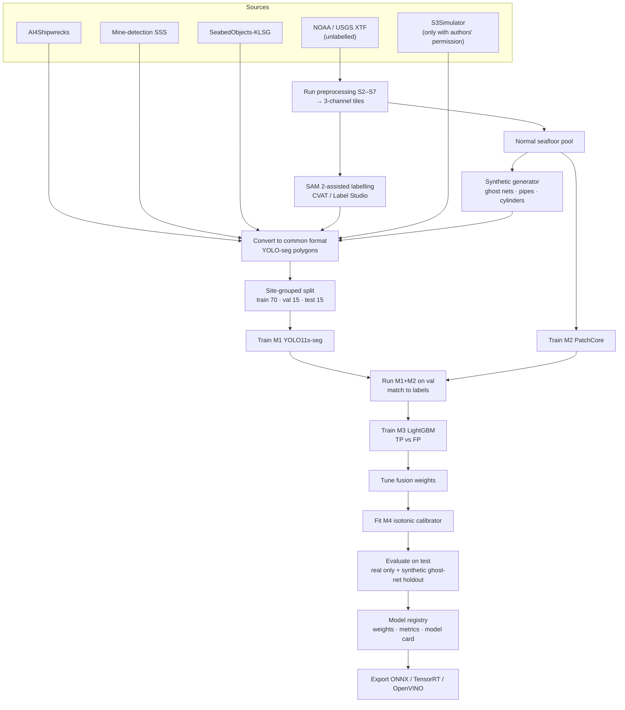
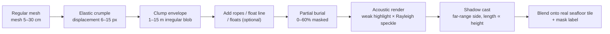
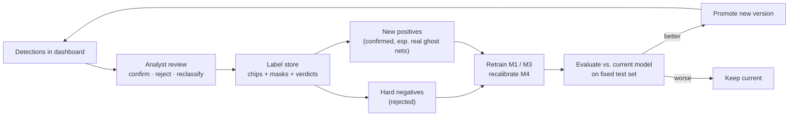

# 03 · ML Models

[← Architecture index](README.md)

## 1. Model inventory

| ID | Model | Task | Input | Output | Runtime | Priority |
|---|---|---|---|---|---|---|
| M1 | **YOLO11s-seg** fine-tuned on sonar | Detect + segment 5 known classes | 640×640, 3-channel (raw, despeckled, local std) | Boxes, masks, class scores | PyTorch / ONNX / TensorRT / OpenVINO | P0 |
| M2 | **PatchCore** (anomalib), WideResNet-50 or ResNet-18 backbone | Anomaly score + heatmap vs. normal seafloor | 256×256 tiles | Tile score, pixel heatmap | PyTorch / ONNX / OpenVINO | P0 |
| M3 | **LightGBM** false-positive filter | P(true positive) from handcrafted + model features | Feature vector (~25 features) | Probability | LightGBM (CPU) | P1 |
| M4 | **Isotonic regression** calibrator | Map fused score → calibrated probability | Scalar | 0–1 | scikit-learn (CPU) | P0 |
| M5 | **U-Net** (ResNet-18 encoder) mask refiner | Fine masks for thin structures (`ghost_net`, `pipe`) | 256×256 crops | Binary mask | PyTorch / ONNX | P1 |

**Size and speed targets:** M1 ≤ 25 MB FP32 (≈ 10 M params), ≤ 10 MB INT8. M1 + shadow + geotag must meet [NFR-01…03](../PRD.md#7-non-functional-requirements).

## 2. Class taxonomy and data sources

| Class | Definition | Real data sources | Synthetic |
|---|---|---|---|
| `shipwreck` | Vessels and large wreck structures | AI4Shipwrecks (masks), SeabedObjects-KLSG ship images, hand-labelled charted wrecks from NOAA XTF | — |
| `cylinder` | Drums, barrels, mine-like cylinders | Mine-detection dataset (MILCO) | Pasted cylinder renders |
| `pipe` | Pipes, cables, long linear man-made objects | Hand-labelled NOAA/USGS survey segments | Line-based generator |
| `ghost_net` | Nets, tangled lines, ropes with floats | GhostNetZero/WWF/NIOT samples (if obtained; validation first) | **Primary source**: ghost-net generator |
| `debris_other` | Tyres, containers, aircraft parts, misc. man-made | KLSG airplane; reviewed NOMBO objects | Mixed primitives |
| `unknown_anomaly` | Not a trained M1 class; produced by M2 | — | — |

**Negatives / background:** KLSG seafloor, NOAA tiles without contacts, rocky/ripple/seagrass tiles, reviewed NOMBO natural objects, mined false positives.

## 3. Training pipeline



### 3.1 Dataset preparation rules
1. **Everything goes through the same preprocessing** as inference (S2–S7), including 3-channel conversion.
2. **Resample to 0.10 m/px** where the source resolution is known. Otherwise estimate it from object sizes or keep it as a separate domain group.
3. **Group split by site/survey** (`GroupKFold`) to prevent leakage.
4. **Synthetic ≤ 40%** of positive training tiles. Test set = real only; the synthetic ghost-net holdout is reported separately.
5. **Background tiles ≈ 10%** of the training set, weighted towards hard negatives.
6. Record licences in `ml/datasets/LICENSES.md`. Annotation formats vary between datasets, so check each on download and convert with scripts in `ml/datasets/`.

### 3.2 Augmentation policy

| Augmentation | Setting | Why |
|---|---|---|
| Horizontal flip | p = 0.5 | Swaps port/starboard; shadow direction flips consistently |
| Vertical flip | p = 0.5 | Along-track direction is arbitrary |
| Rotation / perspective | **off** | Shadows must stay aligned with the range axis |
| HSV hue/saturation | **off** | Grayscale sonar |
| Brightness (hsv_v) | 0.3 | Gain variation |
| Speckle (Rayleigh multiplicative) | exponent 0.2–0.6 | Sensor noise variation |
| Gain ramp across range | 0.6–1.3 | TVG/beam-pattern differences |
| Dropout stripes | 0–3 per tile, 1–4 rows | Robust to missing pings |
| Row jitter | ±3 px | Heave artifacts |
| Scale | 0.7–1.3 | Residual resolution differences |
| Mosaic | 1.0 (off for last 15 epochs) | Context variety |
| Copy-paste (seg) | 0.4 | Multiply rare objects |

### 3.3 M1 training configuration

```python
from ultralytics import YOLO

model = YOLO("yolo11s-seg.pt")
model.train(
    data="ml/datasets/sonar-seg.yaml",
    imgsz=640, epochs=200, batch=16, patience=40,
    freeze=10,                         # first stage; unfreeze and fine-tune after
    degrees=0, perspective=0, shear=0,
    hsv_h=0, hsv_s=0, hsv_v=0.3,
    fliplr=0.5, flipud=0.5, scale=0.3,
    mosaic=1.0, close_mosaic=15, copy_paste=0.4,
    cos_lr=True, seed=42,
)
```
Custom sonar augmentations (speckle, gain ramp, dropouts, row jitter) are applied **offline** while generating training tiles, since they aren't built-in Ultralytics options.

Small-object variant (if ghost-net recall is low): `imgsz=1024`, P2-head model config, SAHI slices of 512 px.

## 4. Synthetic ghost-net generator (`ml/synth/ghost_net_generator.py`)



| Parameter | Range | Notes |
|---|---|---|
| Mesh size | 5–30 cm (0.5–3 px at 0.10 m/px) | Fine meshes appear as texture, not lines |
| Clump size | 1–15 m | Small bundles to large sheets |
| Reflectivity | 30–120 (uint8 add) | Nets are weak reflectors; randomised |
| Burial fraction | 0–60% | Nets are often partly buried |
| Height above seabed | 0–1.5 m | Controls shadow length: `Ls = h·(r)/(H − h)` |
| Attachments | ropes (wavy lines), floats (bright blobs + shadows), lead line | Often the most visible part |
| Background | Sampled from normal pool across seabed types | Sand, mud, ripple, rock, seagrass |
| Side | Port or starboard | Shadow direction set accordingly |

**Realism checks:** a sonar analyst rates a random sample of 100 synthetic tiles. Fréchet distance between feature statistics of real and synthetic backgrounds is tracked. Parameters that give obviously fake tiles are tuned.

## 5. M2 — Anomaly detection (PatchCore)

- **Training data:** normal seafloor tiles only, balanced across seabed types. A contaminated normal pool (hidden debris) reduces sensitivity, so spot-check the pool.
- **Threshold τ:** 99th percentile of anomaly scores on the normal validation tiles (≈ 1% tile false-alarm rate), then tuned for ghost-net holdout recall.
- **Use in pipeline:**
  1. Heatmap mean inside each M1 mask → `scores.anomaly` feature.
  2. Connected components of heatmap > τ, area ≥ 0.25 m², IoU < 0.1 with M1 boxes → `unknown_anomaly` detections.
- **Edge:** optional; can run on shore after the survey.

```python
from anomalib.data import Folder
from anomalib.models import Patchcore
from anomalib.engine import Engine

datamodule = Folder(name="seafloor", root="data/anomaly",
                    normal_dir="normal", abnormal_dir="synthetic_debris")
engine = Engine()
engine.fit(model=Patchcore(), datamodule=datamodule)
engine.test(datamodule=datamodule)
```
*(The anomalib API differs between versions; pin the version in `requirements.txt`.)*

## 6. M3 — False-positive filter (LightGBM)

**Training labels:** run M1 + M2 on the validation set. Detections matched to ground truth (IoU ≥ 0.5) = 1, unmatched = 0. Add mined hard negatives.

| Feature group | Features |
|---|---|
| Model | detector score, class one-hot, anomaly mean/max in mask |
| Shadow physics | highlight contrast, shadow darkness, shadow length (m), estimated height (m), highlight-then-shadow ordering |
| Geometry | length, width, area (m²), aspect ratio, solidity, extent, orientation relative to track |
| Edges / lines | Hough line count, longest line / length, right-angle corner count |
| Texture | GLCM contrast/homogeneity/energy, FFT periodicity peak ratio, local std mean |
| Context | object-vs-ring intensity difference, ring texture similarity (ripple check), tile-level ripple FFT peak |
| Data quality | dropout overlap fraction, motion flag, near-nadir flag, ground range (m) |

Split by site; the model is explained with SHAP feature importance in the model card.

## 7. Fusion, M4 calibration and tiers

```text
fused = 0.45·detector + 0.15·anomaly + 0.15·shadow + 0.15·fp_filter + 0.10·persistence
        − 0.20·dropout_overlap − 0.10·motion_flag            (clipped to [0, 1])
```

1. Tune weights on validation (grid search maximising average precision), with the constraint weights ≥ 0 and sum = 1.
2. Fit `IsotonicRegression(out_of_bounds="clip")` on (fused, is_true_positive) using a **separate calibration split**.
3. `confidence = 100 × calibrator(fused)`.
4. Report ECE (10 bins) and a reliability diagram in the model card.

| Tier | Rule | UI treatment |
|---|---|---|
| `hazard` | confidence ≥ 80 | Solid marker, listed first, included in hazard exports |
| `review` | 50 ≤ confidence < 80 | Outlined marker, goes to review queue |
| `anomaly` | 30 ≤ confidence < 50 **and** anomaly ≥ τ | Dashed marker, "possible unknown object" |
| `hidden` | otherwise | Hidden by default; visible via slider |

## 8. Evaluation protocol

| Metric | Data | Target |
|---|---|---|
| mAP@50, mAP@50-95 (boxes and masks) | Real test set (site-held-out) | mAP@50 ≥ 0.70 |
| Per-class recall at the `review` threshold | Real test set | shipwreck/cylinder ≥ 0.85 |
| Ghost-net recall / precision | Synthetic ghost-net holdout on unseen seafloor; real samples reported separately | recall ≥ 0.80 |
| Mask IoU / Dice (`ghost_net`, `pipe`) | Holdout | report |
| False positives per km² | Contact-free NOAA survey lines | ≥ 50% reduction after M3 + shadow |
| ECE | Calibration split | ≤ 0.10 |
| Anomaly AUROC | Normal vs. debris tiles | report |
| Robustness | Test set with injected speckle/dropouts/jitter | mAP drop ≤ 5 points |
| INT8 degradation | Test set | ≤ 3 points mAP@50 |
| Latency | 640 tile, batch 1 | GPU / CPU / Jetson reported |

`ml/evaluate.py` writes `metrics.json` and figures (PR curves, confusion matrix, reliability diagram) to the model registry entry.

## 9. Model registry and versioning

```text
models/
└── detector/yolo11s-seg-sonar/1.2.0/
    ├── best.pt
    ├── best.onnx
    ├── best_int8.engine        # device-specific, built on target
    ├── metrics.json
    ├── model_card.md           # data, classes, limits, metrics, intended use
    └── train_config.yaml       # + dataset manifest hash
```

- Semantic versioning: **major** = class set or input format change; **minor** = retrain; **patch** = export/calibration only.
- Each report records `models.detector = "yolo11s-seg-sonar@1.2.0"` and the other model versions.

## 10. Continuous improvement loop



## 11. Edge optimisation

| Step | Tool | Notes |
|---|---|---|
| Export | `model.export(format="onnx", imgsz=640, dynamic=False)` | Static shape for TensorRT |
| Jetson FP16 | `model.export(format="engine", half=True)` on device | Build engine on target hardware |
| Jetson INT8 | `model.export(format="engine", int8=True, data="sonar-seg.yaml")` | Calibrate with real sonar tiles |
| Intel INT8 | `model.export(format="openvino", int8=True, data="sonar-seg.yaml")` | For NUC / Intel CPUs |
| Pipeline trimming on edge | Run M1 + shadow + geotag; defer M2, M3 (optional) and mosaic to shore | Keeps up with acquisition |
