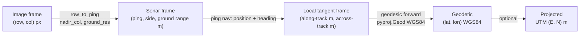
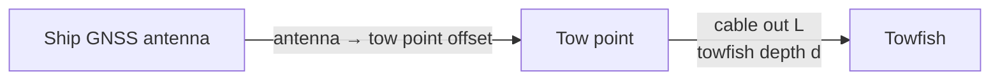

# 04 · Geotagging Engine

[← Architecture index](README.md)

The geotagging engine turns a pixel in a sonar image into a real-world position (WGS84 latitude/longitude), footprint, size and depth.

## 1. Coordinate frames



| Frame | Units | Origin / axes |
|---|---|---|
| Image | pixels | Top-left; rows = along-track (resampled), columns = across-track; `nadir_col` at centre; port left, starboard right |
| Sonar | ping index, metres | Towfish at the ping; ground range ≥ 0 per side |
| Local tangent | metres | Towfish position; x = heading direction, y = starboard |
| Geodetic | degrees | WGS84 ellipsoid; output with 6 decimals (≈ 0.11 m) |
| Projected | metres | UTM zone of the survey (e.g. EPSG:32643/32644/32645 for India) |

## 2. Pixel → geographic position

For a pixel at `(row, col)` in a processed chunk:

```text
ping         = row_to_ping[row]                       # original ping index
side         = starboard if col ≥ nadir_col else port
ground_range = |col − nadir_col| × ground_res_m       # already slant-corrected in S5
bearing      = heading(ping) + 90°  (starboard)
             = heading(ping) − 90°  (port)
(lat, lon)   = geod.fwd(lon_fish(ping), lat_fish(ping), bearing, ground_range)
```

```python
from pyproj import Geod
geod = Geod(ellps="WGS84")

def pixel_to_latlon(row, col, chunk):
    ping = int(chunk.row_to_ping[row])
    nav = chunk.nav.loc[ping]
    offset = col - chunk.nadir_col
    ground_range = abs(offset) * chunk.ground_res_m
    bearing = (nav.heading_deg + (90 if offset >= 0 else -90)) % 360
    lon, lat, _ = geod.fwd(nav.lon, nav.lat, bearing, ground_range)
    return lat, lon
```

### 2.1 Unprocessed slant-range images (image + nav CSV, not ground-corrected)

```text
slant_range  = |col − nadir_col| / samples_per_side × slant_range_max
ground_range = sqrt(max(slant_range² − altitude², 0))
```

### 2.2 GeoTIFF mosaics

```python
import rasterio
from pyproj import Transformer

with rasterio.open(path) as ds:
    x, y = ds.xy(row, col)                        # pixel centre in raster CRS
    to_wgs84 = Transformer.from_crs(ds.crs, "EPSG:4326", always_xy=True)
    lon, lat = to_wgs84.transform(x, y)
```

## 3. Units and CRS detection

| Check | Rule |
|---|---|
| XTF header | `NavUnits`: 0 = metres (projected), 3 = latitude/longitude |
| Value range | \|x\| ≤ 180 and \|y\| ≤ 90 for all valid fixes → geographic |
| Projected | Requires EPSG: from the file, user selection (UI) or `--utm-epsg` (CLI) |
| Axis order | Always use `always_xy=True` (lon, lat) inside code; output JSON uses explicit `lat`/`lon` keys |
| Sanity | Reject tracks with implied speed > `max_speed_mps` (default 6 m/s ≈ 11.7 kn) between fixes |

## 4. Layback correction

Needed when the file stores **ship** position and the sonar is a **towfish**.



```text
layback ≈ sqrt(max(L² − (d − tow_point_height)², 0)) + antenna_to_tow_point
fish position = geod.fwd(ship_lon, ship_lat, heading + 180°, layback)
```

- Straight-line cable is an approximation. Real cable sag makes the true layback slightly **shorter**, so report the uncertainty.
- If the XTF `Layback` field is populated, use it directly.
- If a USBL acoustic position is available, use it (most accurate) and skip layback estimation.
- Apply the along-track **time lag** as well: the fish passes a point after the ship.
- Flag: `LAYBACK_ESTIMATED`.

## 5. Navigation smoothing

```python
import numpy as np
from scipy.signal import savgol_filter
from scipy.ndimage import uniform_filter1d
from pyproj import Transformer

def smooth_positions(lat, lon, utm_epsg, window=31):
    fwd = Transformer.from_crs("EPSG:4326", f"EPSG:{utm_epsg}", always_xy=True)
    inv = Transformer.from_crs(f"EPSG:{utm_epsg}", "EPSG:4326", always_xy=True)
    e, n = fwd.transform(lon, lat)
    e, n = savgol_filter(e, window, 2), savgol_filter(n, window, 2)
    lon_s, lat_s = inv.transform(e, n)
    return lat_s, lon_s

def smooth_heading(heading_deg, window=25):
    r = np.radians(heading_deg)
    return np.degrees(np.arctan2(uniform_filter1d(np.sin(r), window),
                                 uniform_filter1d(np.cos(r), window))) % 360
```

If compass heading is missing, use **course over ground** from the smoothed track. Flag `HEADING_FROM_COG`, because currents cause a crab angle and so extra across-track error.

## 6. Measurements

| Output | Method |
|---|---|
| Centroid | Mask centroid → `pixel_to_latlon` |
| Footprint | `cv2.minAreaRect(mask contour)` → 4 corners → `pixel_to_latlon` each |
| Length / width | Rectangle sides × `ground_res_m` (length = longer side) |
| Area | Mask pixel count × `ground_res_m²` |
| Orientation | Long-axis angle in the local frame + heading → degrees from true north (0–180) |
| Height (P1) | From shadow length `Ls`, ground range `r` to the object's far edge and altitude `H`: `h = Ls·H / (r + Ls)` |
| Depth | `sensor_depth_m + altitude_m` at the ping (null if unavailable) |

## 7. Georeferenced mosaic

Ground control points (GCPs) are sampled along each chunk and the image is warped with thin-plate splines. This handles curved tracks.

```python
from osgeo import gdal

def build_mosaic(png_path, out_path, chunk, every_rows=50):
    h, w = chunk.image.shape
    gcps = []
    for row in range(0, h, every_rows):
        for col in (0, chunk.nadir_col, w - 1):
            lat, lon = pixel_to_latlon(row, col, chunk)
            gcps.append(gdal.GCP(lon, lat, 0, col, row))
    tmp = gdal.Translate("/vsimem/src.tif", png_path, GCPs=gcps, outputSRS="EPSG:4326")
    gdal.Warp(out_path, tmp, tps=True, dstSRS="EPSG:4326", dstNodata=0)
```

The output is north-up, so the dashboard shows it with `L.imageOverlay(url, bounds)`. For large surveys, convert to a Cloud-Optimized GeoTIFF and serve tiles.

## 8. Position uncertainty budget

Horizontal 1-σ uncertainty is the root-sum-square of independent terms:

| Source | Model | Typical magnitude |
|---|---|---|
| GNSS fix | Receiver spec (standalone / SBAS / RTK) | ~1–3 m / <1 m / <0.1 m |
| Layback | ~10% of estimated layback when estimated; USBL spec otherwise | 0–10+ m for towed systems |
| Heading error | `ground_range × sin(σ_heading)` | 50 m × sin 2° ≈ 1.7 m |
| Altitude / slant correction | `σ_alt × altitude / ground_range` | ~0.1–0.5 m |
| Time sync | `speed × σ_time` | 2 m/s × 0.2 s = 0.4 m |
| Pixel quantisation | `ground_res_m / √12` per axis | ~0.03 m |

```text
uncertainty_m = sqrt(σ_gnss² + σ_layback² + σ_heading² + σ_alt² + σ_time² + σ_pixel²)
```

Defaults are in config and can be overridden by known equipment specs.

## 9. Validation

| Test | Method | Pass criterion |
|---|---|---|
| Unit: geodesy | Known pixel → known lat/lon for synthetic straight/curved tracks | < 0.05 m |
| Unit: units/CRS | Degrees and UTM versions of the same track produce identical outputs | < 0.1 m |
| Charted wreck | NOAA XTF survey over a charted wreck; compare detection centroid with the charted position | Report median error (target ≤ 10 m, towed) |
| Reciprocal lines | Same object seen on opposite-heading lines; offset reveals layback/time errors | Offset after correction < 2 × uncertainty |
| Round trip | Export GeoJSON → load in QGIS → overlay mosaic | Visual alignment |
