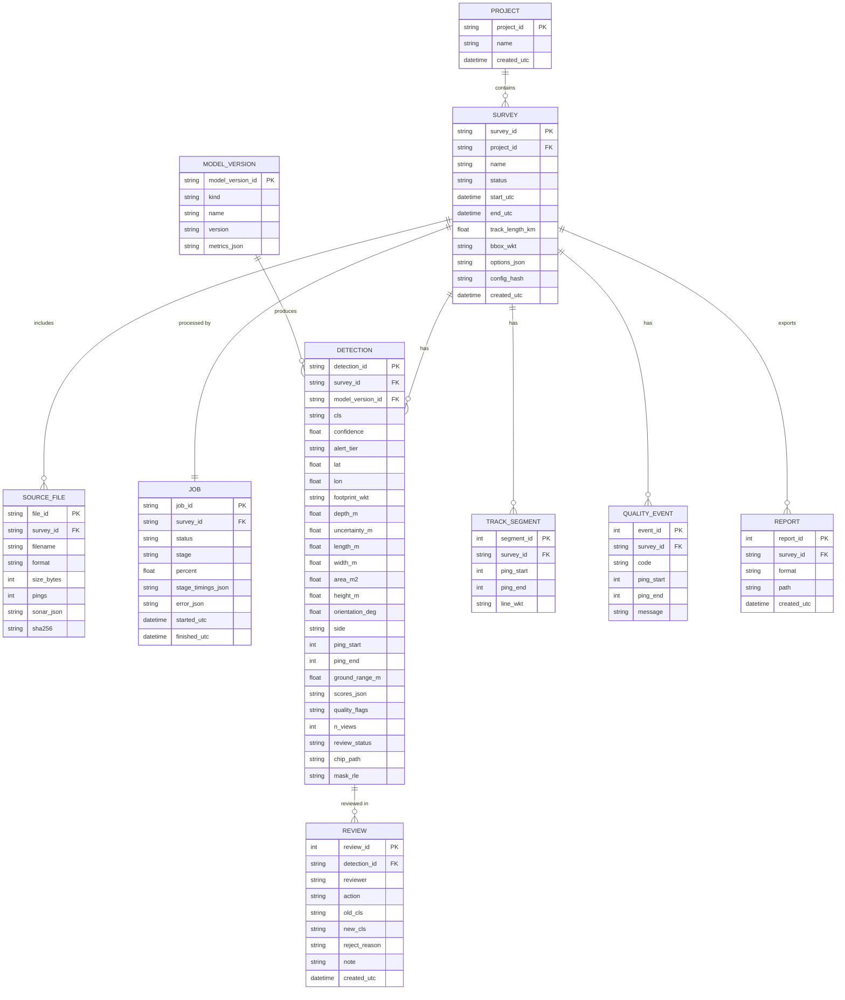

# 06 · Data Models

[← Architecture index](README.md)

## 1. Report (JSON) — top level

```json
{
  "report_version": "1.0",
  "generated_utc": "2026-09-13T10:42:18Z",
  "survey": {
    "survey_id": "SRV-20260913-001",
    "name": "Chennai-Port-Line07",
    "project": "NIOT-Cleanup-2026",
    "source_files": ["line_07.xtf"],
    "source_format": "xtf",
    "sonar": { "make": "EdgeTech", "model": "4200", "frequency_khz": 600, "range_m": 50 },
    "start_utc": "2026-09-12T05:10:02Z",
    "end_utc": "2026-09-12T05:19:52Z",
    "track_length_km": 1.18,
    "area_covered_km2": 0.118,
    "datum": "WGS84",
    "ground_resolution_m": 0.10,
    "bbox": [80.3071, 13.0802, 80.3189, 13.0875]
  },
  "processing": {
    "pipeline_version": "0.3.0",
    "models": {
      "detector": "yolo11s-seg-sonar@1.2.0",
      "anomaly": "patchcore-seafloor@1.0.0",
      "fp_filter": "lgbm-fp@1.1.0",
      "calibrator": "isotonic@1.1.0"
    },
    "config_hash": "sha256:9c1e4f...",
    "runtime": "tensorrt-fp16",
    "duration_s": 48.6,
    "quality": {
      "dropout_pings": 212,
      "high_motion_pings": 540,
      "bottom_tracked": false,
      "layback_estimated": false,
      "warnings": ["DROPOUT", "HIGH_MOTION"]
    }
  },
  "summary": {
    "total_detections": 7,
    "by_class": { "ghost_net": 2, "shipwreck": 1, "pipe": 1, "cylinder": 1, "debris_other": 1, "unknown_anomaly": 1 },
    "by_tier": { "hazard": 3, "review": 3, "anomaly": 1 }
  },
  "detections": [ "<Detection objects, see §2>" ]
}
```

## 2. Detection object

```json
{
  "detection_id": "SRV-20260913-001-D0003",
  "class": "ghost_net",
  "confidence": 87.4,
  "alert_tier": "hazard",
  "position": { "lat": 13.084120, "lon": 80.312750, "depth_m": 18.5, "uncertainty_m": 4.2 },
  "footprint": [
    [13.084141, 80.312722], [13.084146, 80.312779],
    [13.084099, 80.312778], [13.084094, 80.312721]
  ],
  "dimensions": { "length_m": 6.2, "width_m": 3.1, "area_m2": 14.8, "height_m": 0.4 },
  "orientation_deg": 12.0,
  "sonar_ref": {
    "source_file": "line_07.xtf",
    "side": "starboard",
    "ping_start": 10398,
    "ping_end": 10466,
    "ground_range_m": 23.7,
    "time_utc": "2026-09-12T05:17:21Z"
  },
  "scores": {
    "detector": 0.81, "anomaly": 0.92, "shadow": 0.64, "fp_filter": 0.88,
    "persistence": 0.50, "dropout_penalty": 0.0, "motion_penalty": 0.0, "fused": 0.78
  },
  "quality_flags": [],
  "n_views": 1,
  "review": { "status": "pending", "reviewer": null, "reject_reason": null, "note": null, "updated_utc": null },
  "model_version": "yolo11s-seg-sonar@1.2.0",
  "chip_url": "/api/v1/detections/SRV-20260913-001-D0003/chip.png"
}
```

### 2.1 Field rules

| Field | Type | Rules |
|---|---|---|
| `detection_id` | string | `<survey_id>-D<4+ digits>`; stable for the survey |
| `class` | enum | `shipwreck`, `pipe`, `cylinder`, `ghost_net`, `debris_other`, `unknown_anomaly` |
| `confidence` | number | 0–100, 1 decimal |
| `alert_tier` | enum | `hazard`, `review`, `anomaly`, `hidden` |
| `position.lat` / `lon` | number \| null | WGS84, 6 decimals; `null` when `NOT_GEOTAGGED` |
| `position.depth_m` | number \| null | Positive downwards |
| `position.uncertainty_m` | number \| null | 1-σ horizontal |
| `footprint` | array \| null | 4 × [lat, lon], clockwise |
| `dimensions.*` | number \| null | Metres / m²; `height_m` null if shadow unusable |
| `orientation_deg` | number \| null | Long axis, 0–180° from true north |
| `sonar_ref.side` | enum | `port`, `starboard`, `n/a` (GeoTIFF) |
| `sonar_ref.pixel_bbox` | array | Present instead of lat/lon fields for image-only inputs: `[x1, y1, x2, y2]` |
| `scores.*` | number | 0–1 |
| `quality_flags` | enum[] | See §2.2 |
| `review.status` | enum | `pending`, `confirmed`, `rejected`, `reclassified` |

### 2.2 Quality flags

| Flag | Meaning |
|---|---|
| `DROPOUT` | Detection overlaps masked or inpainted pings |
| `HIGH_MOTION` | Roll/pitch/yaw rate above threshold at the detection |
| `NEAR_NADIR` | Very close to nadir; shape and shadow unreliable |
| `SURFACE_RETURN_BAND` | Within the surface-return range band |
| `TILE_EDGE` | Clipped at a tile edge without a merge partner |
| `GPS_INTERPOLATED` | Position derived from interpolated navigation |
| `LAYBACK_ESTIMATED` | Towfish position estimated from cable out |
| `HEADING_FROM_COG` | Heading derived from course over ground |
| `NO_ALTITUDE_BOTTOM_TRACKED` | Altitude from bottom tracking |
| `NOT_GEOTAGGED` | No navigation; pixel coordinates only |

## 3. Export formats

### 3.1 CSV (one row per detection, UTF-8, comma-separated, header row)

```text
detection_id,survey_id,class,confidence,alert_tier,lat,lon,depth_m,uncertainty_m,length_m,width_m,area_m2,height_m,orientation_deg,side,ping_start,ping_end,ground_range_m,time_utc,n_views,quality_flags,review_status,source_file
SRV-20260913-001-D0003,SRV-20260913-001,ghost_net,87.4,hazard,13.084120,80.312750,18.5,4.2,6.2,3.1,14.8,0.4,12.0,starboard,10398,10466,23.7,2026-09-12T05:17:21Z,1,,pending,line_07.xtf
```
`quality_flags` is `;`-separated. Empty cells mean null.

### 3.2 GeoJSON (RFC 7946, `[lon, lat]` order)

Each detection → 2 features: a `Point` (centroid) and a `Polygon` (footprint), linked by `detection_id`. A `LineString` feature holds the survey track.

```json
{
  "type": "FeatureCollection",
  "features": [
    {
      "type": "Feature",
      "geometry": { "type": "Point", "coordinates": [80.312750, 13.084120] },
      "properties": { "feature_kind": "detection", "detection_id": "SRV-20260913-001-D0003",
                      "class": "ghost_net", "confidence": 87.4, "alert_tier": "hazard",
                      "length_m": 6.2, "width_m": 3.1, "depth_m": 18.5 }
    },
    {
      "type": "Feature",
      "geometry": { "type": "Polygon", "coordinates": [[
        [80.312722, 13.084141], [80.312779, 13.084146], [80.312778, 13.084099],
        [80.312721, 13.084094], [80.312722, 13.084141]
      ]] },
      "properties": { "feature_kind": "footprint", "detection_id": "SRV-20260913-001-D0003" }
    }
  ]
}
```

### 3.3 KML
- One `Folder` per class; `Placemark` per detection with a class-coloured icon style
- `<description>` HTML table: class, confidence, tier, size, depth, coordinates (DD + DMS), detection ID
- Footprint as `Polygon`; track as `LineString`

## 4. JSON Schema (excerpt)

Published at `backend/sonarsentinel/report/schema/report-1.0.schema.json`.

```json
{
  "$schema": "https://json-schema.org/draft/2020-12/schema",
  "$id": "sonarsentinel/report-1.0",
  "type": "object",
  "required": ["report_version", "generated_utc", "survey", "processing", "summary", "detections"],
  "properties": {
    "report_version": { "const": "1.0" },
    "detections": {
      "type": "array",
      "items": {
        "type": "object",
        "required": ["detection_id", "class", "confidence", "alert_tier", "position", "dimensions", "scores", "quality_flags"],
        "properties": {
          "class": { "enum": ["shipwreck", "pipe", "cylinder", "ghost_net", "debris_other", "unknown_anomaly"] },
          "confidence": { "type": "number", "minimum": 0, "maximum": 100 },
          "alert_tier": { "enum": ["hazard", "review", "anomaly", "hidden"] },
          "position": {
            "type": "object",
            "required": ["lat", "lon"],
            "properties": {
              "lat": { "type": ["number", "null"], "minimum": -90, "maximum": 90 },
              "lon": { "type": ["number", "null"], "minimum": -180, "maximum": 180 },
              "depth_m": { "type": ["number", "null"] },
              "uncertainty_m": { "type": ["number", "null"], "minimum": 0 }
            }
          }
        }
      }
    }
  }
}
```

## 5. Navigation CSV input format

Used with PNG/JPG/TIFF waterfall images. A downloadable template is on the upload screen.

| Column | Required | Unit | Notes |
|---|---|---|---|
| `ping` | yes | index | Image row (0 = top). If fewer rows than the image, positions are interpolated (`GPS_INTERPOLATED`) |
| `lat` | yes | degrees | WGS84 (or `easting` + `utm_epsg` option) |
| `lon` | yes | degrees | WGS84 (or `northing`) |
| `heading_deg` | yes* | degrees true | *If missing, course over ground is used (`HEADING_FROM_COG`) |
| `slant_range_m` | yes | m | Maximum range per side for that ping |
| `altitude_m` | no | m | Bottom tracking used if missing |
| `sensor_depth_m` | no | m | For depth output |
| `time_utc` | no | ISO 8601 | For reports |
| `speed_mps`, `roll_deg`, `pitch_deg` | no | — | Motion flags |
| `ground_range_corrected` | no | bool | `true` if the image is already slant-range corrected |

```text
ping,time_utc,lat,lon,heading_deg,slant_range_m,altitude_m,sensor_depth_m,roll_deg,pitch_deg
0,2026-09-12T05:10:02.000Z,13.080210,80.307100,62.4,50.0,8.1,10.2,0.8,-0.3
50,2026-09-12T05:10:04.500Z,13.080262,80.307195,62.6,50.0,8.0,10.2,1.1,-0.2
```

## 6. Database schema

Prototype: SQLite. Production: PostgreSQL + PostGIS (`geometry(Point, 4326)`, `geometry(Polygon, 4326)`, GiST indexes).



**Indexes:** `detection(survey_id, alert_tier, confidence)`, `detection(cls)`, `detection(review_status)`; PostGIS GiST on detection point and footprint.

## 7. File storage layout

```text
data/
├── uploads/<survey_id>/line_07.xtf
├── work/<survey_id>/                # deletable intermediates
│   ├── chunks/chunk_0000.npy        # memory-mapped processed chunks
│   └── tiles/…
└── results/<survey_id>/
    ├── chips/<detection_id>.png
    ├── masks/<detection_id>.png
    ├── mosaic.png  mosaic.tif  mosaic_bounds.json
    ├── track.geojson
    ├── report.json  report.csv  report.geojson  report.kml
    └── job.log.jsonl

labels/                              # review feedback (P1)
└── <yyyy-mm>/<detection_id>/{chip.png, mask.png, label.json}
```

**Retention:** `work/` is deleted after job completion (configurable). `uploads/` and `results/` are kept until the survey is deleted.
