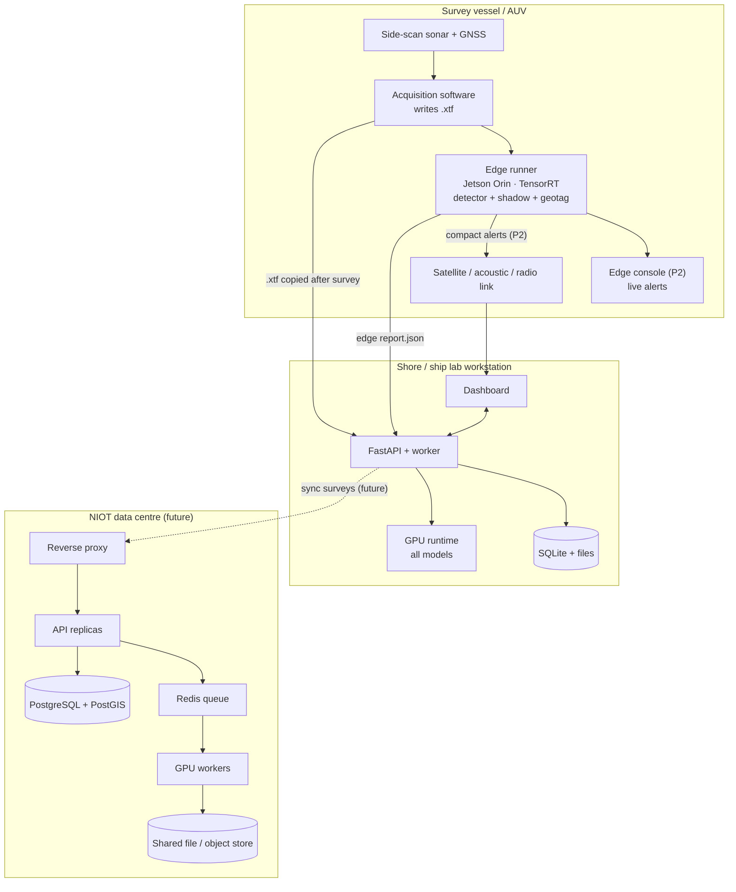
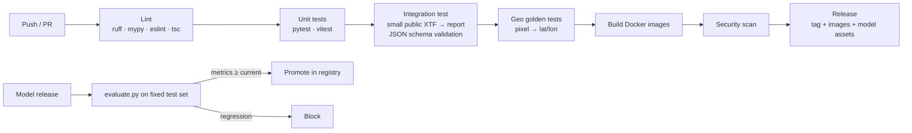

# 07 · Deployment

[← Architecture index](README.md)

## 1. Deployment topologies



| Mode | Use case | Components | Data flow |
|---|---|---|---|
| **A · Shore workstation** (default, P0) | Analysts process surveys | Docker Compose: `frontend`, `backend` (API + worker), volumes | Upload via browser; everything local |
| **B · On-board edge** (P1) | Live detection during survey | `edge` container or native service on Jetson; optional minimal API | Watches the acquisition folder for new `.xtf` files; writes reports; sends alerts |
| **C · Central server** (future) | Multi-user archive | API replicas, Redis, GPU workers, PostGIS | Surveys synced from vessels |

## 2. Hardware recommendations

| Target | Minimum | Recommended | Expected role |
|---|---|---|---|
| Shore workstation | 8-core CPU, 16 GB RAM, 256 GB SSD, CPU only | 8–16 cores, 32 GB RAM, NVIDIA RTX 3060 12 GB or better, 1 TB NVMe | Full pipeline |
| Laptop (field) | 4-core CPU, 16 GB RAM | RTX 4050/4060 laptop GPU | Full pipeline, smaller batches |
| Edge (NVIDIA) | Jetson Orin Nano 8 GB | Jetson Orin NX 16 GB | Detector (TensorRT INT8/FP16) + shadow + geotag |
| Edge (Intel) | Core i5 NUC, 16 GB | Core Ultra with NPU | OpenVINO INT8 detector |
| Storage | — | Raw logs can reach many GB per survey day; plan ≥ 2 TB for archives | — |

## 3. Docker Compose (shore workstation)

```yaml
# docker/docker-compose.yml
services:
  backend:
    build: { context: .., dockerfile: docker/Dockerfile.backend }
    image: sonarsentinel/backend:0.3.0
    command: sonarsentinel serve --host 0.0.0.0 --port 8000
    ports: ["8000:8000"]
    environment:
      SS_CONFIG: /app/configs/pipeline.yaml
      SS_DATA_DIR: /data
      SS_MODELS_DIR: /models
      SS_MAX_UPLOAD_GB: "2"
      SS_OFFLINE_TILES: /tiles/basemap.mbtiles
    volumes:
      - ../data:/data
      - ../models:/models:ro
      - ../tiles:/tiles:ro
    deploy:
      resources:
        reservations:
          devices: [{ driver: nvidia, count: 1, capabilities: [gpu] }]   # remove for CPU-only
    healthcheck:
      test: ["CMD", "curl", "-f", "http://localhost:8000/api/v1/health"]
      interval: 30s

  frontend:
    build: { context: .., dockerfile: docker/Dockerfile.frontend }
    image: sonarsentinel/frontend:0.3.0
    ports: ["8080:80"]           # nginx serving the built React app, proxying /api and /ws
    depends_on: [backend]
```

**Start:** `docker compose -f docker/docker-compose.yml up -d` → open `http://localhost:8080`.

**Images:**
- `Dockerfile.backend`: `nvidia/cuda` runtime base (or `python:3.11-slim` for CPU), GDAL from conda-forge/apt, pinned `requirements.txt`.
- `Dockerfile.frontend`: multi-stage Node build → `nginx:alpine`.

## 4. Edge deployment (Jetson)

```yaml
# docker/docker-compose.edge.yml
services:
  edge:
    image: sonarsentinel/edge:0.3.0-jetson     # built on an L4T/JetPack base image
    runtime: nvidia
    command: >
      sonarsentinel watch /acquisition --out /data/results
      --runtime tensorrt --no-anomaly --no-mosaic --alerts-min-conf 80
    volumes:
      - /mnt/acquisition:/acquisition:ro
      - /mnt/ssd/sonarsentinel:/data
      - /opt/sonarsentinel/models:/models:ro
    restart: unless-stopped
```

**Edge procedure:**
1. Build the TensorRT engine **on the device** (`edge/export_models.py --target tensorrt --int8`), calibrating with sonar tiles.
2. `watch` mode polls the acquisition folder, processes files once they are closed or stable in size, and also tails growing files chunk by chunk.
3. Writes `report.json` and chips locally; optional alert messages (≤ 256 bytes) for low-bandwidth links:
   ```text
   SS1|SRV-20260913-001|D0003|ghost_net|87|13.08412|80.31275|6.2x3.1|18.5|2026-09-12T05:17:21Z
   ```
   Fields: version · survey ID · detection suffix · class · confidence % · lat · lon · L×W (m) · depth (m) · UTC time (same format as [S-08 Edge Console](../wireframes/08-edge-console.md#compact-alert-message-low-bandwidth-link)).
4. After recovery, results are imported into the shore system (`POST /surveys` with the edge report attached for comparison).
5. Monitor power and thermals (`tegrastats`); drop to FP16/INT8 or a smaller model if throttling.

## 5. Offline maps

- Basemap: pre-download OpenStreetMap-derived raster tiles for the survey region into `tiles/basemap.mbtiles`. Respect tile provider usage policies and licences; generate tiles yourself for bulk offline use.
- Optional nautical chart overlay: convert available ENC/charts to MBTiles if licensing permits.
- The backend serves tiles at `/tiles/{z}/{x}/{y}.png`. The frontend switches between online and offline sources in Settings.
- No CDN assets: all fonts, icons and JS are bundled into the frontend build.

## 6. Configuration and environment

| Variable | Default | Purpose |
|---|---|---|
| `SS_CONFIG` | `configs/pipeline.yaml` | Pipeline config |
| `SS_DATA_DIR` | `./data` | Uploads, work, results |
| `SS_MODELS_DIR` | `./models` | Model registry |
| `SS_RUNTIME` | `auto` | `torch`, `onnxruntime`, `tensorrt`, `openvino` |
| `SS_MAX_UPLOAD_GB` | `2` | Upload limit |
| `SS_WORKERS` | `1` | Concurrent jobs (per GPU) |
| `SS_OFFLINE_TILES` | unset | Path to MBTiles |
| `SS_KEEP_WORK_FILES` | `false` | Keep intermediates for debugging |
| `SS_LOG_LEVEL` | `INFO` | Logging |

## 7. Security

| Area | Control |
|---|---|
| Network | Binds to localhost by default; LAN exposure is an explicit setting; HTTPS via reverse proxy when shared |
| Data residency | On-premise only; no telemetry; basemap requests are the only optional external calls |
| Uploads | Extension allow-list + header/magic-byte checks; size limits; files stored outside the web root; never executed |
| Parsing | Parsers run in the worker process with timeouts; malformed files fail gracefully |
| Dependencies | Pinned versions; `pip-audit` / `npm audit` in CI; container image scanning |
| Access control (P2) | Token login; roles: viewer (read), analyst (upload/review), admin (settings/models/delete) |
| Audit | Review actions stored with reviewer and timestamp; job logs retained |

## 8. Observability

- **Logs:** JSON lines per job (`data/results/<survey_id>/job.log.jsonl`) with `job_id`, `stage`, `chunk`, `duration_ms`, warnings.
- **Metrics (P1):** `/metrics` Prometheus endpoint: jobs by status, stage latency, tiles/s, GPU memory.
- **Health:** `/api/v1/health` for Docker healthchecks and the dashboard status indicator.

## 9. CI/CD



- GitHub Actions (or GitLab CI) workflow per `backend/`, `frontend/`, `ml/`.
- Model weights are not committed to git; they are stored as release assets or tracked with DVC.

## 10. Backup and retention

| Data | Retention | Backup |
|---|---|---|
| Raw uploads | Until survey deleted | Copy to archive storage / external drive after each campaign |
| Results and reports | Until survey deleted | Included in archive |
| Work intermediates | Deleted after job | None |
| Label store | Permanent | Versioned backup (valuable training data) |
| Database | — | Nightly SQLite file copy / `pg_dump` |
