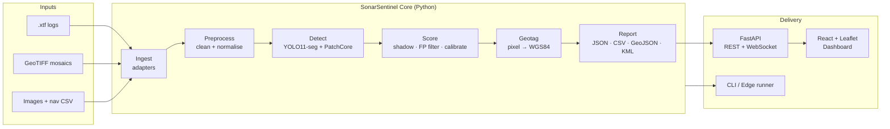

# SonarSentinel — Architecture

This folder describes how SonarSentinel is built: its components, data flow, models, geotagging maths, APIs, data formats, deployment and key decisions.

**Related:** [Project Idea](../PROJECT_IDEA.md) · [PRD](../PRD.md) · [Wireframes](../wireframes/README.md)

## Documents

| # | Document | What it covers |
|---|---|---|
| 01 | [System Architecture](01-system-architecture.md) | Context, containers, components, main sequence flows, repository layout |
| 02 | [Data Pipeline](02-data-pipeline.md) | Stage-by-stage processing from raw log to scored detections; chunking; quality flags; config |
| 03 | [ML Models](03-ml-models.md) | Model inventory, datasets, synthetic ghost nets, anomaly detection, false-positive filter, calibration, evaluation |
| 04 | [Geotagging Engine](04-geotagging-engine.md) | Coordinate frames, pixel → lat/lon maths, layback, uncertainty, mosaic, validation |
| 05 | [API Specification](05-api-specification.md) | REST endpoints, WebSocket events, error model |
| 06 | [Data Models](06-data-models.md) | Report JSON schema, CSV/GeoJSON/KML, navigation CSV input, database schema, file storage |
| 07 | [Deployment](07-deployment.md) | Shore workstation, on-board edge, Docker, hardware, offline maps, security, CI/CD |
| 08 | [Architecture Decisions](08-architecture-decisions.md) | ADRs: why each major technology/approach was chosen |

## Architecture at a glance

## Architecture principles

1. **Pipeline of pure stages.** Each stage takes a well-defined input and returns a well-defined output (see the [data contracts](02-data-pipeline.md#2-internal-data-contracts)). Stages can be unit-tested and swapped independently.
2. **One core, many front doors.** The same `sonarsentinel` Python package powers the API, the CLI and the edge runner.
3. **Stream, don't batch.** Long logs are processed in overlapping chunks, and results are pushed to the UI as each chunk finishes.
4. **Physics before statistics.** Sonar geometry (slant range, shadows, layback) is modelled explicitly. ML is used where physics alone is not enough.
5. **Every number is explainable.** Confidence always comes with its score breakdown and data-quality flags.
6. **Offline and on-premise by default.** No cloud dependency, which suits both edge deployment and sensitive seabed data.
7. **Reproducible.** Every report records the pipeline version, model versions and config hash.
