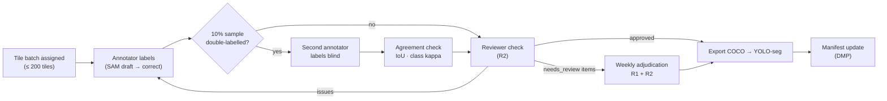

# SonarSentinel — Annotation Guidelines

| | |
|---|---|
| **Version** | v1.0 · 2026-09-13 |
| **Owner** | Sonar Engineer (R2); approved by ML Lead (R1) |
| **Applies to** | All manual and SAM-assisted labels on real sonar tiles, and review of synthetic labels |

**Related:** [Datasets](DATASETS.md) · [Data Management Plan](DATA_MANAGEMENT_PLAN.md) · [ML Models](../architecture/03-ml-models.md) · [PRD classes](../PRD.md#13-detection-classes)

---

## 1. Goal

Produce **consistent, physically meaningful** labels so the models learn what man-made objects look like in side-scan sonar and don't learn annotator habits. When in doubt, **don't guess**: flag the object for review.

## 2. Tooling and setup

| Item | Setting |
|---|---|
| Tool | CVAT (recommended) or Label Studio |
| Assist | **SAM 2** (Segment Anything 2, Apache-2.0) point/box prompt → **always correct the mask by hand**. Don't use SAM 3: its licence prohibits military uses ([Licences §2.3](../legal/LICENSES_AND_COMPLIANCE.md#23-tools-used-during-development)) |
| Image to label | Preprocessed ground-range tile, **0.10 m/px**, 640×640 ([Data Pipeline S7](../architecture/02-data-pipeline.md#s7--tiling-and-3-channel-input)) |
| Views | Toggle between *raw normalised* and *despeckled* channels; view at 100% and 200% |
| Orientation note | Tile metadata shows which side is **nadir** (near) and which is **far range**; shadows fall on the far-range side |
| Label type | **Polygon masks** (boxes are derived automatically) |
| Master format | COCO JSON with attributes; exported to YOLO-seg for training |

**Display settings:** keep the same gain/contrast preset for everyone (CVAT: default, no auto-contrast) so annotators see the same thing.

## 3. Sonar image basics for annotators

```text
 nadir (near)                                   far range
 |<---------------------- ground range ---------------------->|
 | .:.:.:.:.:.:.:.:.:.:.:[####]      :.:.:.:.:.:.:.:.:.:.:.:.:|
 | .:.:.:.:.:.:.:.:.:.:.:[####]      :.:.:.:.:.:.:.:.:.:.:.:.:|
 |                        ^^^^  ^^^^^^                        |
 |                  highlight   acoustic shadow (dark)        |
```

- **Highlight:** the bright echo from the object, on the side facing the sonar.
- **Shadow:** a dark area behind the object (away from nadir) where sound can't reach. Taller objects cast longer shadows.
- **Speckle:** grainy noise everywhere. Don't label speckle clusters.
- **Nadir strip / water column:** the dark centre area, already removed or masked in our tiles.

**The mask covers the object (highlight and body), never the shadow.** Shadows are used by the scoring module, not the detector.

## 4. Class definitions

### 4.1 `ghost_net`
| | |
|---|---|
| **Is** | Fishing nets (on the seabed or tangled), net clumps, tangled lines/ropes associated with nets, nets wrapped around rocks or wrecks |
| **Looks like** | Irregular patch with fine **mesh/grid or cross-hatched texture**; wavy thin bright lines (ropes, float/lead lines); small bright dots with short shadows (floats); weak overall brightness; often low or no shadow; may drape over other objects |
| **Mask** | One polygon around the whole visible net clump, **including attached ropes and floats within ~1 m**. A rope extending more than 2 m from the clump → separate `ghost_net` polygon with attribute `part=rope` and the same `group_id` |
| **Not** | Seagrass/algae patches (soft, blotchy, no linear structure); sand ripples (regular parallel bands over a large area); speckle |

### 4.2 `shipwreck`
| | |
|---|---|
| **Is** | Hull of a wrecked vessel, large wreck structures, wreck sections |
| **Looks like** | Large bright structure with **straight edges, regular outline, internal structure** (decks, frames); long geometric shadow |
| **Mask** | One polygon per connected wreck structure. Scattered fragments > 1 m around the site → separate `shipwreck` polygons with `part=fragment` and the same `group_id` |
| **Not** | Rock outcrops (irregular, rounded, clustered, rough shadows) |

### 4.3 `pipe`
| | |
|---|---|
| **Is** | Pipelines, cables, pipe sections, long cylindrical man-made objects (length ≥ 5× width) |
| **Looks like** | **Long straight or gently curved bright line** of constant width with a continuous parallel shadow; may be partly buried (dashed appearance) |
| **Mask** | Polygon following the visible pipe. If interrupted by burial, a dropout or the tile edge → separate segments with the same `group_id` |
| **Not** | Sand ripple crests (many parallel lines); survey-line artifacts running **exactly parallel to the track across the whole tile** (surface return / nadir artifacts); geological ridges (irregular width) |

### 4.4 `cylinder`
| | |
|---|---|
| **Is** | Drums, barrels, mine-like cylinders, gas cylinders, cylindrical objects with length < 5× width |
| **Looks like** | Compact bright object with **uniform highlight** and a **regular shadow with straight sides** |
| **Mask** | Tight polygon around the highlight/body |
| **Not** | Boulders (irregular highlight and shadow shape) |

### 4.5 `debris_other`
| | |
|---|---|
| **Is** | Any other clearly **man-made** object: tyres, containers, anchors, vehicles, aircraft parts, construction debris, crates, fishing traps/pots |
| **Looks like** | Man-made cues (straight edges, right angles, circular rims, regular shadows) that don't fit the other classes |
| **Mask** | One polygon per object. Add attribute `subtype` if known (`tyre`, `container`, `trap`, `aircraft`, `anchor`, `other`) |
| **Not** | Natural objects of any kind |

### 4.6 `unknown_anomaly`
**Never labelled manually.** It is produced only by the anomaly model. If you see something clearly unusual but can't tell whether it is man-made, label it as the closest class with `certainty=low` and `needs_review=true`, or leave it unlabelled and tag the tile `needs_review`.

## 5. Attributes

| Attribute | Values | When |
|---|---|---|
| `certainty` | `high` · `medium` · `low` | Always |
| `truncated` | `true` / `false` | Object cut by the tile edge |
| `partially_buried` | `true` / `false` | Visible parts suggest burial |
| `occluded_by_dropout` | `true` / `false` | Part of the object lies on dropout/masked data |
| `part` | `main` · `fragment` · `rope` | Wrecks and nets |
| `group_id` | integer | Pieces of the same physical object |
| `subtype` | see 4.5 | `debris_other` |
| `needs_review` | `true` / `false` | Any doubt |
| `source` | `manual` · `sam_corrected` · `pseudo_label_verified` · `synthetic` | Always (set automatically where possible) |

**Tile-level tags** (for hard negatives and analysis): `negative_type` = `rock`, `ripple`, `shadow`, `seagrass`, `fish_school`, `speckle_noise`, `nadir_artifact`, `surface_return`, `sediment_patch`; `seabed_type` = `sand`, `mud`, `rock`, `mixed`, `vegetated`.

## 6. General rules

1. **Minimum size:** label objects ≥ **5 px (0.5 m)** in both dimensions. Smaller → don't label; tag the tile `has_tiny_objects` if they look man-made.
2. **Polygon accuracy:** follow the highlight edge to within ~2 px. Don't include speckle halo or the shadow.
3. **One object, one polygon** (except the `group_id` cases).
4. **Label every qualifying object in the tile.** Missed objects become false "negatives" and hurt training.
5. **Never label natural features** as objects. Mark interesting natural confusers with `negative_type` instead.
6. **Use context:** neighbouring tiles (CVAT sequence view) help decide if a line is a pipe or a ripple field.
7. **SAM output is a draft:** check every vertex region; SAM often includes shadows or merges objects.
8. **Pseudo-labels** (model predictions) must be accepted, corrected or deleted one by one. Set `source=pseudo_label_verified`.
9. **Don't label synthetic tiles manually;** review them only (accept/reject the whole tile).
10. **Sensitive content:** if a tile contains what may be human remains, **stop, don't label it**, and tag it `exclude_sensitive`. It is removed from all datasets.

## 7. Edge cases

| Situation | Decision |
|---|---|
| Net draped over a wreck | Two polygons: `shipwreck` for the hull; `ghost_net` for the visible net (overlap allowed) |
| Pipe partly buried, visible as dashes | Segments with the same `group_id`, `partially_buried=true` |
| Object on the tile edge | Label the visible part, `truncated=true` |
| Bright blob with no shadow and irregular edges | Usually a sediment patch or rock → don't label; tag `negative_type=sediment_patch` |
| Dark shape with no highlight | Shadow or depression → don't label; tag `negative_type=shadow` |
| Regular straight line across the full tile, parallel to track | Artifact → don't label; tag `nadir_artifact` or `surface_return` |
| Cluster of bright points with shadows in a line | Could be floats of a net → `ghost_net`, `certainty=medium`, `needs_review=true` |
| Tyre stack | `debris_other`, `subtype=tyre`, one polygon per clearly separable tyre, else one for the stack |
| Unsure whether it is man-made | Closest class + `certainty=low` + `needs_review=true` |
| Object within a dropout band | Label visible parts, `occluded_by_dropout=true` |

## 8. Workflow



## 9. Quality control

| Check | Target | Frequency |
|---|---|---|
| Double-labelled sample | 10% of each batch | Every batch |
| Mask agreement (IoU of matched objects) | ≥ 0.70 median | Every batch |
| Detection agreement (objects found by both / union) | ≥ 0.85 | Every batch |
| Class agreement (Cohen's kappa) | ≥ 0.80 | Every batch |
| Reviewer rejection rate | < 10% of tiles | Weekly trend |
| Calibration session (all annotators label the same 20 tiles, then discuss) | — | Weekly while labelling |

If targets are missed: stop the batch, discuss disagreements, update these guidelines (bump the version), relabel the affected tiles.

## 10. Export and naming

- Tile ID: `<dataset>_<site>_<file-stem>_r<row0>_c<col0>` e.g. `noaa_H13326_line07_r10240_c0320`
- COCO master: `data/interim/labels/<batch_id>.coco.json` (keeps attributes)
- YOLO-seg: `data/processed/sonar-seg/labels/<split>/<tile_id>.txt`, one line per polygon: `class_id x1 y1 x2 y2 …` (normalised 0–1)
- Class IDs: `0 shipwreck, 1 pipe, 2 cylinder, 3 ghost_net, 4 debris_other`
- Attributes and tile tags go into the dataset manifest for analysis (not used by YOLO directly)

## 11. Annotator checklist (per tile)

- [ ] Checked both raw and despeckled views
- [ ] Every man-made object ≥ 0.5 m labelled with a polygon (no shadows included)
- [ ] Correct class; attributes set (`certainty`, `truncated`, …)
- [ ] Natural confusers tagged with `negative_type`
- [ ] Doubtful items marked `needs_review`
- [ ] No sensitive content (otherwise `exclude_sensitive` and stop)

## 12. Change log

| Version | Date | Change |
|---|---|---|
| 1.0 | 2026-09-13 | Initial guidelines |
