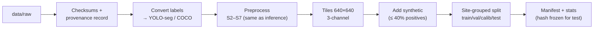

# SonarSentinel — Datasets Guide

| | |
|---|---|
| **Version** | v1.0 · 2026-09-13 |
| **Owner** | ML Lead (R1) with Sonar Engineer (R2) and Geo Engineer (R3) |

**Related:** [Annotation Guidelines](ANNOTATION_GUIDELINES.md) · [Data Management Plan](DATA_MANAGEMENT_PLAN.md) · [ML Models](../architecture/03-ml-models.md) · [Licences & Compliance](../legal/LICENSES_AND_COMPLIANCE.md)

> **Always check the licence/terms on each dataset's official page before downloading and record them in `ml/datasets/LICENSES.md`.** The notes below are a starting point, not legal advice.

---

## 1. Why we need two kinds of data

| Kind | What it gives | What it lacks | Used for |
|---|---|---|---|
| **Labelled image datasets** | Object labels (boxes/masks/classes) | Usually **no GPS** | Training and evaluating models |
| **GPS-tagged raw survey data** (`.xtf`, GeoTIFF) | Real navigation in ping headers / georeferencing | Usually **no labels** | Inference, geotagging, geolocation validation, pseudo-labelling |

The pipeline **trains on the first kind and runs on the second**, computing GPS coordinates from sonar navigation ([Geotagging Engine](../architecture/04-geotagging-engine.md)).

## 2. Dataset summary

| # | Dataset | Type | Size (as published) | Labels | GPS | Our use | Priority |
|---|---|---|---|---|---|---|---|
| D1 | **AI4Shipwrecks** | SSS images (PNG) | 286 images, 28 shipwrecks | Pixel-wise segmentation | Survey sites known; per-image nav not assumed | `shipwreck` segmentation train/test | P0 |
| D2 | **Side-scan sonar imaging data for mine detection** | SSS images (JPG) | 1,170 images | Annotations (`.txt`): MILCO, NOMBO | No | `cylinder`; hard negatives / `debris_other` after review | P0 |
| D3 | **SeabedObjects-KLSG** | SSS image crops | 385 wreck, 36 victim, 62 airplane, 129 mine, 578 seafloor | Class per image | No | Normal seafloor pool; `shipwreck`/`debris_other` support | P0 |
| D4 | **S3Simulator** | Simulated SSS | See paper | Simulated labels | No | ❌ Excluded unless authors grant permission (no licence) | P2 |
| D5 | **Our synthetic generators** | Real seafloor + rendered objects | Generated (2,000+ tiles/class) | Masks (automatic) | No | `ghost_net`, `pipe`, `cylinder` augmentation | P0 |
| D6 | **NOAA NCEI / Office of Coast Survey hydrographic surveys** | Raw XTF (where included), georeferenced SSS mosaics | Many surveys | None | **Yes** | Inference, geolocation validation, pseudo-labels, background | P0 |
| D7 | **NOAA InPort side-scan data** (e.g. Hudson River SSS `.xtf` tiles) | Raw XTF | Varies | None | **Yes** | Parser testing, demo | P0 |
| D8 | **USGS ScienceBase** coastal & marine data releases | Raw SSS (XTF/SEG-Y), mosaics | Varies | None | **Yes** | Parser variety, domain variety | P1 |
| D9 | **NOAA charted wrecks & obstructions** (ENC / wrecks database) | Point positions | — | Wreck positions | **Yes** | Geolocation ground truth | P0 |
| D10 | **GhostNetZero / WWF, MARELITT Baltic, NIOT** | Real ghost-net SSS | On request | Varies | Varies | Real ghost-net validation | P1 (if granted) |

## 3. Dataset cards

### D1 · AI4Shipwrecks
- **Source:** University of Michigan Field Robotics Group — https://umfieldrobotics.github.io/ai4shipwrecks/ (data hosted on Deep Blue Data)
- **Content:** 286 high-resolution SSS images of 28 shipwrecks with pixel-wise segmentation labels. Collected in 2022–2023 at NOAA Thunder Bay National Marine Sanctuary (Lake Huron) with an Iver3 AUV and EdgeTech 2205 dual-frequency sonar. Labels are based on marine-archaeology expert references.
- **Format:** PNG images + label masks.
- **Citation:** A. V. Sethuraman et al., "Machine learning for shipwreck segmentation from side scan sonar imagery: Dataset and benchmark," *International Journal of Robotics Research*, vol. 44, no. 3, pp. 341–354, 2025, doi: 10.1177/02783649241266853. arXiv:2401.14546.
- **Licence:** ❓ **not yet confirmed.** The Deep Blue record (DOI 10.7302/dmf4-x492) blocks automated access, and no licence is stated on the project site or in DataCite. Open the record in a browser and record the licence field (TODO Phase 1). Until then: research use with citation, no redistribution.
- **Our handling:** masks → YOLO-seg polygons (`ml/datasets/convert_ai4shipwrecks.py`); site ID = wreck name (for grouped splits); resample to 0.10 m/px where resolution metadata is available.
- **Caveats:** freshwater (Great Lakes) seabed; large wrecks only, so it doesn't cover small debris.

### D2 · Side-scan sonar imaging data of underwater vehicles for mine detection
- **Source:** Figshare — https://dx.doi.org/10.6084/m9.figshare.24574879
- **Content:** 1,170 real SSS images taken between 2010 and 2021 with a Teledyne Marine Gavia AUV and a 900–1800 kHz Marine Sonic dual-frequency sonar. Objects are annotated as **MILCO** (mine-like contacts) and **NOMBO** (non-mine-like bottom objects).
- **Format:** `.jpg` images and `.txt` annotation files.
- **Citation:** N. Pessanha Santos, R. Moura, G. Sampaio Torgal, V. Lobo, and M. de Castro Neto, "Side-scan sonar imaging data of underwater vehicles for mine detection," *Data in Brief*, vol. 53, Art. no. 110132, 2024, doi: 10.1016/j.dib.2024.110132.
- **Licence:** ✅ **CC BY 4.0** (Figshare record v2, 2024-01-17). Attribution required; commercial use and redistribution allowed.
- **Our handling:** verify the annotation format on download (inspect a few files and the paper); MILCO → `cylinder`. NOMBO objects are **reviewed manually**: clearly man-made → `debris_other`; natural or ambiguous → hard negatives. Group splits by survey date/mission where identifiable.
- **Caveats:** military mine-like shapes; very high frequency (fine detail); domain differs from lower-frequency survey sonars.

### D3 · SeabedObjects-KLSG
- **Source:** https://github.com/huoguanying/SeabedObjects-Ship-and-Airplane-dataset · extended variant https://github.com/HHUCzCz/-SeabedObjects-KLSG--II (❌ not used: no licence)
- **Content:** SSS image crops of wrecks, airplanes, mines, drowning victims and seafloor. Real images contributed by several sonar manufacturers and survey companies.
- **Citation:** G. Huo, Z. Wu, and J. Li, "Underwater object classification in sidescan sonar images using deep transfer learning and semisynthetic training data," *IEEE Access*, vol. 8, pp. 47407–47418, 2020, doi: 10.1109/ACCESS.2020.2978880.
- **Licence:** ⚠ `huoguanying` repository: README states it "can be used for academic purpose"; no LICENSE file, so **academic research only**, no redistribution, not in commercial models. ❌ The `HHUCzCz` KLSG-II repository has **no licence or terms** (one sample image only), so it is **not used**.
- **Our handling:** **seafloor** images → normal pool for PatchCore and background tiles. Ship/airplane crops → auxiliary classification checks and optional `shipwreck`/`debris_other` box labels (drawn by us).
- **⚠ Ethics:** the **drowning-victim images are excluded** from training, demos and screenshots (see [Data Management Plan §7](DATA_MANAGEMENT_PLAN.md#7-sensitive-data-and-ethics)).

### D4 · S3Simulator
- **Source:** S. Kamal Basha and A. Nambiar, "S3Simulator: A benchmarking side scan sonar simulator dataset for underwater image analysis," *ICPR 2024*, LNCS vol. 15316, Springer, 2025, pp. 219–235, doi: 10.1007/978-3-031-78444-6_15 (arXiv:2408.12833)
- **Licence:** ❌ **none published** for the dataset or repository (`NambiarAthira/S3Simulator`; the paper's `bashakamal/S3Simulator` link is 404), so all rights are reserved by default.
- **Our handling:** **excluded** unless the authors grant written permission; if granted, record it in `ml/datasets/LICENSES.md`, use it as synthetic training data only, and keep it out of the real test set.

### D5 · Our synthetic generators
- **Tools:** `ml/synth/ghost_net_generator.py`, `pipe_generator.py`, `cylinder_generator.py`
- **Design:** [ML Models §4](../architecture/03-ml-models.md#4-synthetic-ghost-net-generator-mlsynthghost_net_generatorpy)
- **Backgrounds:** real normal seafloor tiles from D3, D6, D7, D8
- **Metadata:** every generated tile stores its generator version, seed and parameters (`*.params.json`)
- **Rule:** ≤ 40% of positive training tiles; separate **synthetic ghost-net holdout** built on background sites never used in training

### D6 · NOAA NCEI hydrographic surveys
- **Sources:**
  - NOAA Office of Coast Survey — Hydrographic Survey Data: https://nauticalcharts.noaa.gov/data/hydrographic-survey-data.html
  - NCEI NOS Hydrographic Survey: https://www.ncei.noaa.gov/products/nos-hydrographic-survey
  - NCEI Bathymetric Data Viewer (map search of surveys)
- **Content:** Survey products can include descriptive reports, BAG bathymetry, and **georeferenced side-scan sonar mosaics**. Some survey packages also contain raw sonar data. Check each survey's file listing.
- **Terms:** ✅ NCEI: data are "free to the public with no restrictions". NOS survey metadata adds **"Not to be used for navigation"** and a no-warranty clause, so SonarSentinel outputs from NOAA data carry a not-for-navigation notice. Data from external sources may have restrictions; check each record's metadata. Cite NOAA as the source.
- **Our handling:** see §5 for how we choose surveys. GeoTIFF mosaics → FR-ING-02 path; raw XTF → FR-ING-01 path.

### D7 · NOAA InPort side-scan XTF
- **Example:** "Side-Scan Sonar backscatter tiles for Hudson River, NY (.xtf)" — https://www.fisheries.noaa.gov/inport/item/47922
- **Our handling:** first parser test files; check `NavUnits` and coordinate ranges.

### D8 · USGS ScienceBase
- **Source:** USGS Coastal and Marine Hazards and Resources Program data releases on ScienceBase (search "sidescan sonar").
- **Terms:** ✅ mostly U.S. public domain; a release "may contain proprietary data as noted in the individual metadata records" (permission needed for those parts). Credit USGS.
- **Our handling:** extra XTF variety (different sonars, frequencies, environments). Record the DOI of each release and check its metadata for proprietary parts.

### D9 · Charted wrecks for geolocation ground truth
- **Source:** NOAA Electronic Navigational Charts (wreck/obstruction features) and NOAA's wrecks and obstructions information (successor to the AWOIS database).
- **Use:** pick wrecks inside the footprint of a D6/D7 survey; compare our detected centroid with the charted position ([Geotagging §9](../architecture/04-geotagging-engine.md#9-validation)).
- **Caveat:** charted positions have their own accuracy (older records may be off by tens of metres). Record each position's source and quality attribute, and prefer recent survey-derived positions.

### D10 · Real ghost-net imagery (on request)
- **Contacts to try:** WWF Germany / GhostNetZero project; Baltic MARELITT project outputs; NIOT.
- **Use:** validation only unless the terms allow training. Never redistribute.

### More sources
- Awesome-Sonar-Image-Resources — https://github.com/Jorwnpay/Awesome-Sonar-Image-Resources
- OpenSonarDatasets — https://github.com/remaro-network/OpenSonarDatasets

## 4. Class mapping

| Our class | D1 AI4Shipwrecks | D2 Mine SSS | D3 KLSG | D5 Synthetic | D6–D8 NOAA/USGS (our labels) |
|---|---|---|---|---|---|
| `shipwreck` | shipwreck mask | — | ship (box drawn by us) | — | charted wrecks, other wrecks |
| `pipe` | — | — | — | pipe generator | pipelines/cables seen |
| `cylinder` | — | MILCO | mine (box drawn by us) | cylinder generator | drums/barrels if seen |
| `ghost_net` | — | — | — | **ghost-net generator** | rarely; label only if certain |
| `debris_other` | — | NOMBO (man-made, reviewed) | airplane | primitives | tyres, containers, etc. |
| *(background)* | non-wreck areas | NOMBO (natural) | seafloor | backgrounds | contact-free tiles |
| *(excluded)* | — | — | drowning victim | — | — |

## 5. Choosing NOAA/USGS surveys

1. Open the NCEI Bathymetric Data Viewer; enable the NOS hydrographic survey layer.
2. Zoom to a coastal area with **charted wrecks** (switch on the chart/ENC overlay).
3. Click surveys in that area; open the survey page and check the product list for **side-scan sonar mosaics** and/or raw sonar files.
4. Prefer surveys that are recent, high-resolution, cover a charted wreck, and have a descriptive report (it lists sonar model, frequency, range and positioning method).
5. Download into `data/raw/noaa/<survey_id>/`; fill in a provenance record ([DMP §4](DATA_MANAGEMENT_PLAN.md#4-provenance-record)).
6. Record the charted wreck ID and position in `data/raw/noaa/<survey_id>/ground_truth.json`.

**Target set for the prototype:** ≥ 3 raw XTF surveys (≥ 2 sonar models) and ≥ 2 GeoTIFF mosaic surveys, with ≥ 3 charted wrecks between them.

## 6. Local directory layout

```text
data/
├── raw/                      # untouched downloads (read-only after download)
│   ├── ai4shipwrecks/
│   ├── mine_sss_2024/
│   ├── klsg/
│   ├── s3simulator/
│   ├── noaa/<survey_id>/
│   └── usgs/<release_doi_slug>/
├── interim/                  # converted formats, resampled images
├── processed/                # 3-channel tiles, YOLO-seg datasets, anomaly pools
│   ├── sonar-seg/{images,labels}/{train,val,calib,test}/
│   └── anomaly/{normal,synthetic_debris}/
├── synthetic/<generator>/<version>/
└── manifests/                # dataset manifests (tracked in git)
```

## 7. Conversion and preparation pipeline



| Script (planned) | Purpose |
|---|---|
| `ml/datasets/download.py` | Download with checksums where available; write provenance stub |
| `ml/datasets/convert_ai4shipwrecks.py` | Masks → polygons |
| `ml/datasets/convert_mine_sss.py` | Annotations → YOLO; MILCO/NOMBO mapping |
| `ml/datasets/build_normal_pool.py` | Seafloor tiles for PatchCore |
| `ml/datasets/xtf_to_tiles.py` | NOAA/USGS XTF → preprocessed tiles for labelling / pseudo-labelling |
| `ml/datasets/make_splits.py` | Grouped splits + leakage check + manifest |
| `ml/datasets/stats.py` | Class counts, object sizes (m), per-site distribution |

**Dataset YAML (`ml/datasets/sonar-seg.yaml`):**
```yaml
path: data/processed/sonar-seg
train: images/train
val: images/val
test: images/test
names:
  0: shipwreck
  1: pipe
  2: cylinder
  3: ghost_net
  4: debris_other
```

## 8. Data quality checklist (per dataset)

- [ ] Licence/terms recorded in `ml/datasets/LICENSES.md`
- [ ] Checksums recorded; raw folder set read-only
- [ ] 20 random samples visually checked after conversion (labels align)
- [ ] Resolution (m/px) known or estimated and recorded
- [ ] Site/group IDs assigned for splitting
- [ ] Sensitive content excluded (e.g. victim images)
- [ ] Class counts and object-size histogram in the stats report
- [ ] Added to the dataset manifest with version
