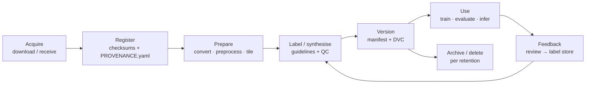

# SonarSentinel — Data Management Plan (DMP)

| | |
|---|---|
| **Version** | v1.0 · 2026-09-13 |
| **Owner** | ML Lead (R1); storage/backup by Integration & Edge Lead (R6) |

**Related:** [Datasets](DATASETS.md) · [Annotation Guidelines](ANNOTATION_GUIDELINES.md) · [Licences & Compliance](../legal/LICENSES_AND_COMPLIANCE.md) · [Deployment §10](../architecture/07-deployment.md#10-backup-and-retention)

---

## 1. Purpose and scope

Defines how SonarSentinel collects, stores, versions, splits, protects, shares and retains data:

- Public training/evaluation datasets and their derived tiles and labels
- Raw sonar survey logs (public, and NIOT-provided if any)
- Synthetic data
- Model weights, calibrators and evaluation outputs
- Runtime uploads, results and review feedback (label store)

## 2. Data inventory

| Category | Examples | Typical size | Sensitivity | Location | Versioned by |
|---|---|---|---|---|---|
| Raw public datasets | AI4Shipwrecks, mine SSS, KLSG | 1–10 GB | Low (licence terms) | `data/raw/` | Checksums + DVC |
| Raw public survey logs | NOAA/USGS `.xtf`, mosaics | 10–200 GB | Low | `data/raw/noaa`, `data/raw/usgs` | Checksums + DVC |
| NIOT / partner data | Survey logs, ghost-net samples | Varies | **Restricted** | `data/restricted/` (encrypted drive) | Checksums; never pushed to shared remotes without approval |
| Derived data | Converted labels, 3-channel tiles, splits | 10–50 GB | Follows source | `data/interim`, `data/processed` | DVC + manifests |
| Synthetic data | Generated tiles + masks + params | 5–20 GB | Low | `data/synthetic/` | Generator version + seed |
| Labels (manual) | COCO JSON with attributes | < 1 GB | Follows source | `data/interim/labels` | DVC + manifests |
| Models | `.pt`, `.onnx`, calibrators, model cards | < 1 GB | Low–medium | `models/` | Registry version (SemVer) + DVC/release assets |
| Experiment records | Logs, metrics, plots | < 1 GB | Low | `ml/experiments/` | Git (text) + DVC (plots) |
| Runtime uploads & results | Uploaded logs, reports, chips | Varies | Follows source | `data/uploads`, `data/results` | Survey ID |
| Label store (review feedback) | Chips, masks, verdicts | < 5 GB | Follows source | `labels/` | Monthly snapshot |

## 3. Storage, structure and versioning

### 3.1 Git vs. DVC
| In git | Not in git (DVC / shared storage) |
|---|---|
| Code, configs, docs | Raw data, tiles, labels exports |
| Dataset **manifests** (`data/manifests/*.json`) | Model weights |
| Small test fixtures (< 1 MB) | Large test fixtures (fetched by script) |
| Experiment logs (Markdown) | Plots/artifacts > 1 MB |

### 3.2 DVC setup (planned)
```bash
dvc init
dvc remote add -d teamstore <shared-drive-or-S3-compatible-path>
dvc add data/raw/ai4shipwrecks data/processed/sonar-seg models/detector
git add data/raw/*.dvc data/processed/*.dvc models/*.dvc .dvc/config
dvc push
```

### 3.3 Dataset manifest (one per dataset version)
```json
{
  "manifest_version": "1.0",
  "dataset": "sonar-seg",
  "version": "0.3.0",
  "created_utc": "2026-10-02T12:00:00Z",
  "created_by_role": "R1",
  "git_commit": "abc1234",
  "preprocessing_config_hash": "sha256:9c1e…",
  "ground_resolution_m": 0.10,
  "classes": ["shipwreck", "pipe", "cylinder", "ghost_net", "debris_other"],
  "sources": [
    { "id": "D1", "name": "AI4Shipwrecks", "licence_ref": "ml/datasets/LICENSES.md#d1", "tiles": 412 },
    { "id": "D5", "name": "synthetic-ghost-net", "generator_version": "1.1.0", "seed": 42, "tiles": 1800 }
  ],
  "splits": {
    "train": { "tiles": 5120, "sites": 41 },
    "val":   { "tiles": 1090, "sites": 9 },
    "calib": { "tiles": 540,  "sites": 5 },
    "test":  { "tiles": 1110, "sites": 9, "frozen": true, "sha256": "e3b0c4…" }
  },
  "leakage_check": "passed",
  "stats_report": "data/manifests/sonar-seg-0.3.0-stats.html"
}
```

### 3.4 Naming conventions
| Item | Convention | Example |
|---|---|---|
| Dataset version | SemVer | `sonar-seg 0.3.0` |
| Tile ID | `<dataset>_<site>_<stem>_r<row>_c<col>` | `noaa_H13326_line07_r10240_c0320` |
| Survey ID (runtime) | `SRV-YYYYMMDD-NNN` | `SRV-20260913-001` |
| Model | `<kind>/<name>/<semver>` | `detector/yolo11s-seg-sonar/1.2.0` |
| Experiment | `EXP-YYYYMMDD-<short>` | `EXP-20261006-synth40` |

## 4. Provenance record

Every raw dataset or survey folder contains `PROVENANCE.yaml`:

```yaml
id: D6-H13326
name: NOAA NOS hydrographic survey H13326 (example)
source_url: https://www.ncei.noaa.gov/products/nos-hydrographic-survey
downloaded_utc: 2026-09-19T08:30:00Z
downloaded_by_role: R3
licence_terms: "NOAA public data — cite source"   # copy exact terms from source page
citation: "NOAA NCEI, NOS Hydrographic Survey H13326"
files:
  - path: raw/line_07.xtf
    sha256: "…"
    size_bytes: 1503238553
sonar: { make: EdgeTech, model: "4200", frequency_khz: 600 }
positioning: "GNSS + layback (see descriptive report)"
crs: EPSG:4326
notes: "Covers charted wreck; see ground_truth.json"
sensitivity: low
```

## 5. Splitting policy

1. **Group by site** (wreck name, survey ID, mission). A site appears in only one split.
2. Splits: **train 70% · val 15% · calib (from val pool, separate sites) · test 15%**, stratified by class where possible.
3. The **test set is frozen**: its manifest hash is recorded, and it is changed only by an explicit version bump approved by R1 and PM.
4. **Synthetic data:** train (and val for synthetic-specific metrics) only. The **synthetic ghost-net holdout** uses background sites unseen in training.
5. **Pseudo-labels** from NOAA/USGS enter training only from sites not in val/test.
6. `make_splits.py` runs an automatic **leakage check** (site IDs and perceptual-hash near-duplicates) and fails if leakage is found.

## 6. Metadata standards

| Field type | Standard |
|---|---|
| Time | ISO 8601 UTC (`2026-09-12T05:17:21Z`) |
| Position | WGS84 decimal degrees, `lat`/`lon` explicit; EPSG codes for projected CRS |
| Units | SI with unit suffixes in field names (`_m`, `_deg`, `_mps`, `_khz`) |
| Classes | PRD class IDs only |
| Text encoding | UTF-8 |
| Tabular | CSV with header, or Parquet for large tables |

## 7. Sensitive data and ethics

| Topic | Rule |
|---|---|
| **Human remains** | KLSG "drowning victim" images and any tile possibly showing human remains are **excluded** from training, evaluation, demos, screenshots and publications. Tag `exclude_sensitive`; delete derived copies. |
| **Strategic / security-sensitive locations** | Survey data near ports, naval or critical infrastructure (including any NIOT data) is treated as **restricted**: stored encrypted, not uploaded to public services, not shown in public demos without permission. |
| **NIOT / partner data** | Used only under the agreed terms; no redistribution; deleted or returned at project end if required. |
| **Wreck locations** | Some wrecks are protected heritage sites or war graves. Public materials don't highlight precise coordinates of sensitive wrecks beyond what is already publicly charted. |
| **Personal data** | None expected. Reviewer names in the label store are stored as role or user IDs only. |
| **Licence compliance** | Terms tracked per source ([Licences & Compliance](../legal/LICENSES_AND_COMPLIANCE.md)); academic-use-only data isn't used in any commercial release. |

## 8. Access control

| Data | Who can access |
|---|---|
| Public raw & derived data | All team members |
| Restricted (NIOT/partner, sensitive) | Named members approved by PM; encrypted drive; access logged |
| Models & results | All team members; public release decided by team + mentor |
| Credentials for remotes | Stored in a password manager; never in git |

## 9. Backup and retention

- **3-2-1 rule:** 3 copies, 2 media types (e.g. laptop/external SSD + shared drive/cloud storage), 1 off-site.
- **Frozen test set, manifests, labels and label store:** backed up after every change (highest value, hard to recreate).
- **Raw public data:** can be re-downloaded; keep checksums and provenance for reproducibility.
- **Intermediate data** (`data/interim`, `data/work`): may be deleted and regenerated.

| Data | Retention |
|---|---|
| Raw public data | Project duration + 1 year (or until re-downloadable is confirmed) |
| Restricted data | Per agreement; default deleted at project end |
| Labels, manifests, label store | Permanent (project archive) |
| Model releases | All promoted versions permanent; failed experiments 3 months |
| Runtime uploads/results | Until survey deleted by user |

## 10. Data lifecycle



## 11. Responsibilities

| Task | Role |
|---|---|
| Dataset acquisition & provenance | R1, R2, R3 (per dataset) |
| Label QC and guideline updates | R2 |
| Splits, manifests, leakage checks | R1 |
| DVC remotes, backups, access control | R6 |
| Sensitive-data screening | Everyone; escalate to PM |
| Licence tracking | R6 with R1 |
