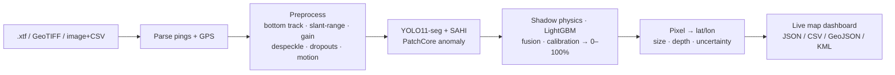

# SonarSentinel — SIH Presentation Content

| | |
|---|---|
| **Version** | v1.0 · 2026-09-13 |
| **Owner** | Integration & Edge Lead / PM (R6) with Frontend Engineer (R5) for visuals |
| **Use** | (A) Idea-submission deck · (B) Grand-finale / evaluation deck |

**Related:** [Project Idea](../PROJECT_IDEA.md) · [Demo Script](DEMO_SCRIPT.md) · [PRD §11 metrics](../PRD.md#11-success-metrics) · [Literature Review](../research/LITERATURE_REVIEW.md)

> **Official SIH 2026 idea template (checked 2026-09-13).** Download: https://sih.gov.in/letters/2026/SIH2026-IDEA-Presentation-Format.pptx
> - **Deadline:** idea submission and team nomination close **30 Sept 2026** (SIH 2026 Guidelines; PS list). An older SPOC guideline PDF mentions 15 Sept, so **confirm with your college SPOC**.
> - **Max 6 slides including the title slide**, in the template's fixed order: Title · Idea title / proposed solution · Technical approach · Feasibility and viability · Impact and benefits · Research and references (this matches Part A below).
> - **Don't change the section headings.** Use points, diagrams and pictures, not paragraphs. Delete the instructions slide before uploading.
> - **Upload as PDF only** (PPT/Word not accepted); no file-size limit is published.
> - **Footer:** `@SIH Idea submission- Template` + your team name.
> - **Title slide fields:** Problem Statement ID, Problem Statement Title, Theme, PS Category, Team ID, Team Name (as registered on the portal).
> - PS 26057 is on the official SIH 2026 list (MoES / NIOT · Software · Disaster Management).
>
> **Never present unmeasured numbers as results.** Items in `<angle brackets>` must be replaced with measured values from the [Test Summary Report](../testing/TEST_PLAN.md#9-test-summary-report-template), or clearly labelled as *targets*.

---

## Part A — Idea-submission deck (6 slides)

### Slide 1 · Title
- **Problem Statement ID:** 26057
- **Title:** AI-Powered Automated Underwater Marine Debris and Anomaly Detection System using Side-Scan Sonar Imagery
- **Theme:** Disaster Management · **Category:** Software
- **Organisation:** Ministry of Earth Sciences — National Institute of Ocean Technology
- **Team ID / Team Name (as registered on the SIH portal):** `<team id>` / `<team name>` (the name must be unique and must not contain the institute's name)
- **Solution name:** **SonarSentinel**, "Find the net. Pin the location."

*Visual:* dark ocean background; a sonar waterfall strip with one glowing diamond marker and a GPS label.

### Slide 2 · Proposed solution
**Headline:** From raw sonar logs to GPS-tagged hazards, automatically.

- **What:** An end-to-end AI pipeline + map dashboard that reads raw side-scan sonar files (`.xtf`, GeoTIFF, image + navigation CSV), detects **ghost nets, shipwrecks, pipes, cylinders and debris**, and outputs **latitude/longitude, size, class and a 0–100% confidence** for each.
- **How it solves the problem:**
  - Removes the manual-review bottleneck: analysts check flagged hazards instead of scrolling through hours of waterfall data.
  - Separates debris from rocks, sand ripples and shadows using **sonar physics + AI**.
  - Handles speckle, varying resolution, dropouts and heave/pitch/roll explicitly.
  - Runs **offline on a laptop or an AUV's edge computer**.
- **Innovation & uniqueness:**
  1. **Geotagging from sonar ping headers.** Every pixel maps to a GPS position with an uncertainty estimate.
  2. **Finds ghost nets without a ghost-net dataset:** synthetic nets + anomaly detection + expert feedback loop.
  3. **Physics-aware, calibrated confidence:** the shadow geometry check and calibration mean 80% really means about 80%.
  4. **Explainable:** every score shows *why* (detector, shadow, anomaly, quality penalties).

*Visual:* 6-step flow icons: Upload → Clean → Detect → Score → Geotag → Map & Report.

### Slide 3 · Technical approach
**Technologies**
| Layer | Stack |
|---|---|
| Sonar I/O & geo | Python · pyxtf · GDAL/rasterio · pyproj |
| Processing | OpenCV · NumPy/SciPy (Lee despeckle, slant-range correction, gain normalisation, dropout & motion masks) |
| AI models | **YOLO11-seg** (detection + masks) · **SAHI** (small objects) · **PatchCore** (anomaly) · **LightGBM** (false-positive filter) · isotonic calibration |
| Backend | FastAPI (REST + WebSocket live streaming) · SQLite/PostGIS |
| Dashboard | React + TypeScript + Leaflet (offline maps) |
| Edge | ONNX · TensorRT (Jetson) · OpenVINO · INT8 |
| Outputs | JSON · CSV · GeoJSON · KML |

**Methodology (flowchart)**

*Speaker note:* show the example output JSON (ghost net, 87.4%, 13.084120 N, 80.312750 E) as a callout. Say it is an illustrative example.

### Slide 4 · Feasibility and viability
**Feasibility**
- Open-source stack, no paid services; runs on a GPU laptop, CPU-only in reduced mode, and on Jetson.
- Public data available: AI4Shipwrecks (286 SSS images, masks), mine-detection SSS dataset (1,170 images), SeabedObjects-KLSG, NOAA hydrographic surveys with navigation.
- 6-week build plan with weekly milestones ([Project Plan](../planning/PROJECT_PLAN.md)).

**Challenges & risks → strategies**
| Challenge | Strategy |
|---|---|
| No public ghost-net sonar dataset | Synthetic ghost-net generator + anomaly detection + review queue that collects real labels |
| Rocks/shadows cause false alarms | Shadow-geometry check, texture/shape filter, hard-negative mining, calibrated tiers |
| Different sonars and resolutions | Fixed metres-per-pixel resampling, normalisation, sonar-specific augmentation |
| Position errors (layback, heading) | Layback correction, smoothing, uncertainty estimate, validation on charted wrecks |
| Edge compute limits | Small YOLO model, INT8 TensorRT, heavy steps deferred to shore |

### Slide 5 · Impact and benefits
**Target users:** NIOT/MoES survey teams · Port & coastal authorities · Navy/Coast Guard (post-disaster clearance) · Fisheries departments & NGOs (ghost-gear recovery) · Offshore infrastructure operators.

| Benefit type | Benefits |
|---|---|
| **Environmental** | Faster ghost-net discovery → less marine-life entanglement and reef damage; supports **SDG 14** |
| **Disaster management** | Rapid post-cyclone/tsunami mapping of submerged hazards in ports and channels |
| **Economic** | Fewer analyst hours per survey (target ≥ 70% time saving); fewer propeller/gear damages; faster channel reopening |
| **Operational** | Same-day hazard reports; on-board alerts; standard GIS outputs for field teams |
| **Strategic** | Indigenous, offline, on-premise tool that keeps sensitive seabed data in-country |

### Slide 6 · Research and references
- GhostNetZero: AI for Detecting Marine Ghost Nets — Microsoft Research / WWF, 2025
- Sethuraman et al., *Machine learning for shipwreck segmentation from side scan sonar imagery: Dataset and benchmark*, IJRR 2025 (AI4Shipwrecks)
- Santos et al., *Side-scan sonar imaging data of underwater vehicles for mine detection*, Data in Brief, 2024
- Huo et al., *Underwater object classification in sidescan sonar images using deep transfer learning and semisynthetic training data*, IEEE Access, 2020
- Roth et al., *Towards total recall in industrial anomaly detection* (PatchCore), CVPR 2022
- Akyon et al., *Slicing aided hyper inference* (SAHI), ICIP 2022
- Guo et al., *On calibration of modern neural networks*, ICML 2017
- Richardson et al., *Estimates of fishing gear loss rates at a global scale*, Fish and Fisheries, 2019
- NOAA NCEI hydrographic survey data; pyxtf; Ultralytics YOLO11

Full list: [Literature Review](../research/LITERATURE_REVIEW.md#references).

---

## Part B — Grand-finale / evaluation deck (12 slides, ~8 minutes + live demo)

| # | Slide | Content | Time |
|---|---|---|---|
| 1 | **Title & team** | PS 26057, SonarSentinel, team roles (photo row) | 0:20 |
| 2 | **The problem in one picture** | Sonar waterfall where a net blends into rocks; "Hours of sonar, minutes of attention" | 0:40 |
| 3 | **Who needs this** | NIOT survey team, post-cyclone port clearance, ghost-gear recovery NGOs | 0:30 |
| 4 | **Our solution** | 6-step flow; one example output card with GPS | 0:40 |
| 5 | **Architecture** | Container diagram ([01-system-architecture](../architecture/01-system-architecture.md)) simplified; offline/edge callouts | 0:40 |
| 6 | **How we beat sonar noise** | Before/after panels: raw → despeckled → slant-corrected → dropouts masked | 0:40 |
| 7 | **Finding ghost nets without ghost-net data** | Synthetic net examples + anomaly heatmap + review loop diagram | 0:50 |
| 8 | **Trustworthy confidence** | Shadow check illustration; reliability diagram `<ECE>`; FP/km² before vs. after `<values>` | 0:50 |
| 9 | **Exact locations** | Pixel → GPS diagram; charted-wreck validation: `<median error> m`; KML in Google Earth | 0:40 |
| 10 | **LIVE DEMO** | Switch to dashboard ([Demo Script](DEMO_SCRIPT.md)) | 3:00 |
| 11 | **Results & performance** | Metrics table: mAP@50 `<>` · ghost-net recall (synthetic) `<>` · ECE `<>` · geo error `<>` · 1 km in `<>` s (GPU) / `<>` (CPU) / `<>`× real time (Jetson) | 0:40 |
| 12 | **Impact, roadmap & ask** | SDG 14 + disaster management; roadmap (real NIOT data, AUV adaptive missions, change detection); ask: sample NIOT logs & ghost-net ground truth for validation | 0:40 |

### Visual guidelines
- Dark navy background (`#0B1D2E`), white text, class colours from the [wireframes](../wireframes/README.md#4-visual-language); ghost net = red diamond throughout.
- At most one idea per slide, ≤ 20 words of body text; details go in speaker notes.
- Every number on a slide has a source (test report or reference) in the notes.
- **Idea deck footer (required):** `@SIH Idea submission- Template` + team name. **Finale deck footer:** project name + PS ID.
- Export a PDF backup of the deck; embed fonts.

### Speaker notes: key messages to repeat
1. "We don't guess locations. We **compute** them from the sonar's own navigation data."
2. "No ghost-net dataset exists, so we **simulate nets** and **learn what normal seabed looks like**."
3. "Our confidence is **calibrated and explainable**, not just a raw AI score."
4. "It runs **offline**, on a laptop or **on the drone**."

### Honesty rules for claims
| Say | Don't say |
|---|---|
| "Ghost-net recall of `<x>` on a synthetic holdout; real-world validation needs NIOT data" | "Detects 95% of ghost nets" (unmeasured) |
| "Target: ≥ 70% analyst time saving; measured `<x>` in our user test" | "Saves 90% of time" (unmeasured) |
| "Median error `<x>` m against charted wrecks on NOAA data" | "GPS-accurate to centimetres" |
