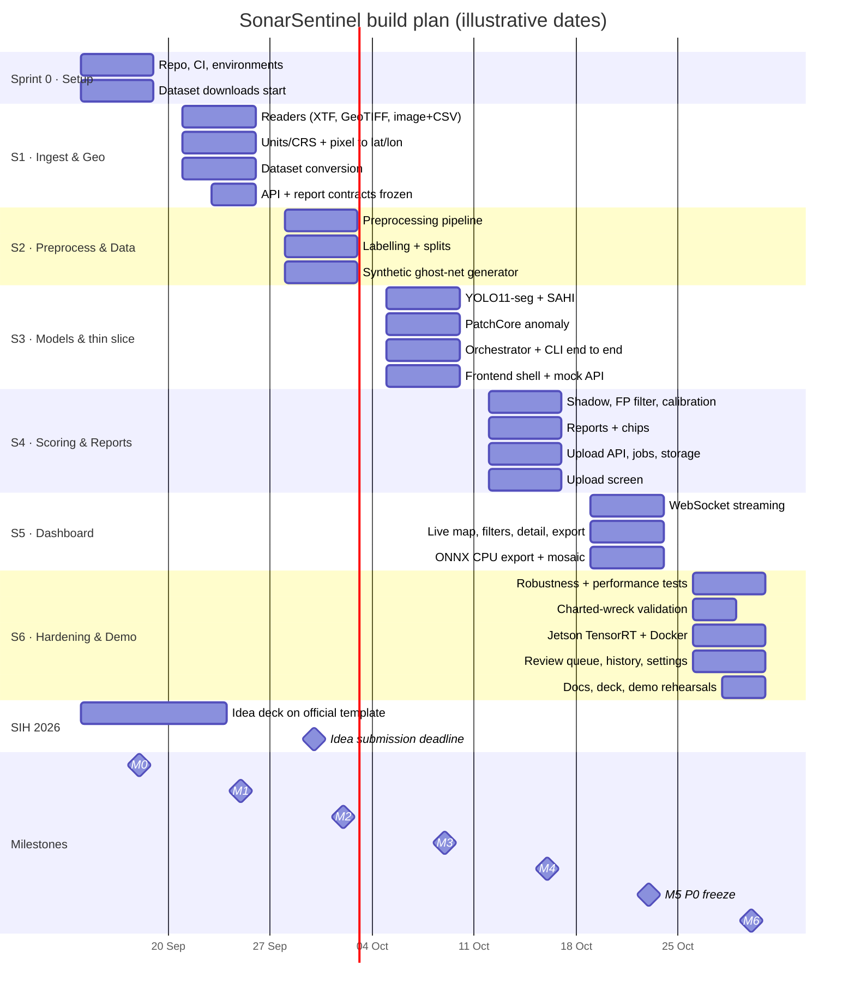
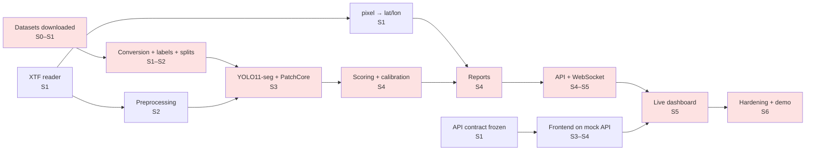

# SonarSentinel — Project Plan

| | |
|---|---|
| **Version** | v1.0 · 2026-09-13 |
| **Owner** | Integration & Edge Lead / PM |
| **Status** | ✅ Baseline approved 2026-09-13 · living document (updated each sprint) |

**Related:** [PRD](../PRD.md) · [Product Backlog](PRODUCT_BACKLOG.md) · [Test Plan](../testing/TEST_PLAN.md) · [Architecture](../architecture/README.md)

---

## 1. Objectives

Deliver a working, demonstrable prototype of SonarSentinel that meets all **P0 requirements** in the [PRD](../PRD.md) and the success metrics in [PRD §11](../PRD.md#11-success-metrics):

1. Upload a sonar log → live map with detections → downloadable JSON/CSV report with GPS coordinates.
2. Detect shipwrecks, pipes, cylinders, ghost nets, other debris and unknown anomalies with calibrated 0–100% confidence.
3. Validated geolocation on a public survey with a charted wreck.
4. A model exported for CPU and edge (Jetson if available).
5. Complete documentation, a rehearsed demo and the SIH presentation.

## 2. Approach

- **Scrum-lite:** one Sprint 0 (setup) plus **six one-week sprints**, each ending in a milestone demo.
- **Vertical slices early:** a thin end-to-end path (XTF → detections → CSV) works by the end of Sprint 3, and is then improved.
- **Contract-first:** API ([05-api-specification](../architecture/05-api-specification.md)) and report schema ([06-data-models](../architecture/06-data-models.md)) are fixed in Sprint 1, so frontend and backend work in parallel (the frontend uses a mock server).
- **P0 feature freeze** at the end of Sprint 5; Sprint 6 is for hardening, validation, stretch goals and the demo.

> **SIH 2026 schedule check (2026-09-13).** The official SIH 2026 Guidelines and problem-statement list give **30 Sept 2026** as the deadline for idea submission and team nomination. An older SPOC guideline PDF mentions 15 Sept, so **confirm with the college SPOC immediately**. Teams must come through the college internal hackathon before nomination. Shortlisting dates aren't published, and the grand finale is *proposed* for **December 2026** with no exact dates yet. Build sprints stay as planned (finishing 2026-10-30, ahead of the finale). The idea submission is added as milestone **IS**. Re-check sih.gov.in when shortlisting and finale dates are announced.

## 3. Milestones

| ID | Milestone | Sprint | Target date | Exit criteria |
|---|---|---|---|---|
| M0 | Project set up | S0 | 2026-09-18 | Repo, CI, environments working on all laptops; datasets downloading; roles assigned |
| M1 | Ingest & Geo | S1 | 2026-09-25 | XTF/GeoTIFF/image+CSV readers; NOAA XTF track plotted correctly; georef golden tests pass |
| IS | **SIH idea submission** | S0–S1 | Target 2026-09-25 · official deadline **2026-09-30** (confirm with SPOC) | College internal hackathon passed; team nominated by SPOC; idea PDF (official 2026 template, ≤ 6 slides) uploaded by the team leader |
| M2 | Preprocess & Data | S2 | 2026-10-02 | Preprocessing pipeline visually verified; datasets converted; site splits; synthetic ghost-net generator v1 |
| M3 | Models & thin slice | S3 | 2026-10-09 | YOLO11-seg + PatchCore trained; CLI produces a JSON/CSV report from an XTF end-to-end |
| M4 | Scoring & Reports | S4 | 2026-10-16 | Shadow check, fusion, calibration (ECE ≤ 0.10), tiers; JSON/CSV exports validated; upload API + jobs |
| M5 | Dashboard (P0 freeze) | S5 | 2026-10-23 | Upload → live map → detail → download works end to end (AC-01…05, AC-07) |
| M6 | Hardening & Demo | S6 | 2026-10-30 | Robustness, performance, charted-wreck validation, edge export, Docker, docs, 3 demo rehearsals |
| F | SIH grand finale readiness | — | Finale proposed for Dec 2026 (exact dates not yet published) | Demo machine and backup ready; presentation final |

## 4. Work Breakdown Structure (WBS)

```text
1  Project management
   1.1 Planning & backlog grooming      1.2 Sprint ceremonies      1.3 Risk tracking      1.4 Mentor/NIOT liaison
2  Data
   2.1 Dataset acquisition              2.2 Format conversion       2.3 Labelling (SAM-assisted)
   2.4 Splits & manifests               2.5 Synthetic generators    2.6 Data management
3  Ingestion & Geotagging
   3.1 SonarLog contract & validators   3.2 XTF reader              3.3 GeoTIFF reader
   3.4 Image + nav CSV reader           3.5 Units/CRS, smoothing    3.6 pixel→lat/lon, measurements
   3.7 Layback & uncertainty            3.8 Mosaic                  3.9 Cross-line clustering
4  Preprocessing
   4.1 Bottom tracking                  4.2 Gain normalisation      4.3 Slant-range & resampling
   4.4 Quality masks                    4.5 3-channel input         4.6 Tiling & chunking
5  Machine learning
   5.1 YOLO11-seg training              5.2 SAHI inference          5.3 PatchCore anomaly
   5.4 Merge/dedupe                     5.5 Evaluation tooling      5.6 Mask refiner (stretch)
6  Scoring
   6.1 Shadow physics                   6.2 Features & FP filter    6.3 Fusion & calibration   6.4 Tiers & penalties
7  Reporting & CLI
   7.1 Schema & JSON/CSV                7.2 GeoJSON/KML             7.3 Chips                  7.4 Orchestrator & CLI
8  Backend API
   8.1 FastAPI & storage                8.2 Jobs & workers          8.3 WebSocket events       8.4 Review endpoints
9  Frontend
   9.1 Shell & tokens                   9.2 Upload                  9.3 Live map               9.4 Detail & filters
   9.5 Reports                          9.6 Review queue            9.7 Waterfall (stretch)    9.8 History & settings
10 Edge & Deployment
   10.1 ONNX/CPU                        10.2 TensorRT/Jetson        10.3 Docker                10.4 Offline tiles
11 Testing & Validation
   11.1 Unit/integration                11.2 Robustness             11.3 Performance           11.4 Geo validation
   11.5 Usability
12 Documentation & Presentation
   12.1 User manual & runbook           12.2 Final report           12.3 SIH deck              12.4 Demo rehearsal
```

Stories for each WBS element are in the [Product Backlog](PRODUCT_BACKLOG.md).

## 5. Timeline



## 6. Team roles and responsibilities

| Role | Primary ownership | Backup for |
|---|---|---|
| **R1 · ML Lead** | Detector, anomaly model, FP filter, calibration, evaluation, model cards | Data |
| **R2 · Sonar & Signal Engineer** | Ingest readers, preprocessing, synthetic generators, annotation QA | Geo |
| **R3 · Geospatial Engineer** | Geotagging, measurements, mosaic, exports (GeoJSON/KML), geo validation | Sonar |
| **R4 · Backend Engineer** | FastAPI, jobs, WebSocket, storage, orchestrator, CLI | Edge |
| **R5 · Frontend Engineer** | Dashboard screens, map, UX, accessibility, usability test | Presentation |
| **R6 · Integration, Edge & PM** | Plan, backlog, CI/CD, Docker, edge export, test plan, demo, docs | Backend |

> **SIH 2026 team rules** (Guidelines & FAQ): exactly **6 members** (one per role above) including **at least one female member**, all from the **same college** (different branches allowed); up to **2 mentors**; the team name must be unique and **must not contain the institute's name**; nomination only through the college SPOC after the internal hackathon.

### RACI matrix

R = Responsible · A = Accountable · C = Consulted · I = Informed

| Deliverable | R1 ML | R2 Sonar | R3 Geo | R4 Backend | R5 Frontend | R6 PM/Edge |
|---|---|---|---|---|---|---|
| PRD & scope changes | C | C | C | C | C | **A/R** |
| Datasets & labels | **A** | R | C | I | I | I |
| Synthetic generators | C | **A/R** | I | I | I | I |
| Ingest readers | I | **A/R** | C | C | I | I |
| Preprocessing | C | **A/R** | C | I | I | I |
| Geotagging & validation | I | C | **A/R** | C | I | I |
| Detection & anomaly models | **A/R** | C | I | I | I | C |
| Scoring & calibration | **A/R** | C | C | I | I | I |
| Reports & schema | C | I | R | **A** | C | I |
| API, jobs, streaming | I | I | C | **A/R** | C | C |
| Dashboard | I | I | C | C | **A/R** | C |
| Edge export & Docker | C | I | I | C | I | **A/R** |
| Test plan & execution | R | R | R | R | R | **A** |
| User manual & runbook | C | C | C | R | R | **A** |
| SIH deck & demo | C | C | C | C | R | **A/R** |
| Final report | R | R | R | R | R | **A** |

## 7. Ceremonies and communication

| Event | When | Duration | Output |
|---|---|---|---|
| Sprint planning | Monday, start of sprint | 45 min | Sprint goal, committed stories |
| Daily stand-up | Every day | 15 min | Yesterday / today / blockers |
| Mid-sprint integration check | Wednesday | 30 min | End-to-end run on latest `main` |
| Sprint review (milestone demo) | Friday | 45 min | Demo against milestone exit criteria |
| Retrospective | Friday, after review | 20 min | 1–3 improvement actions |
| Mentor / NIOT sync | Weekly (if available) | 30 min | Feedback, data access, open questions |

| Channel | Use |
|---|---|
| GitHub Projects board | Backlog, sprint board, status |
| GitHub Issues / PRs | Bugs, stories, code review |
| Team chat (e.g. Slack/Discord/WhatsApp group) | Daily coordination |
| Shared drive | Datasets not in git, recordings, deck drafts |
| `docs/` in repo | All authoritative documentation |

### Weekly status report (posted every Friday)

```text
Sprint: S3 (2026-10-05 → 2026-10-09)     Milestone: M3 — Models & thin slice
Status: 🟢 On track / 🟡 At risk / 🔴 Off track
Done:        ST-050, ST-052, ST-074 …
In progress: ST-053 (70%), ST-075 (50%)
Metrics:     mAP@50 (val) 0.61 · ghost-net synthetic recall 0.74 · CLI XTF → CSV working
Risks:       R1 ghost-net recall below target → trying imgsz 1024 (ST-055)
Blockers:    Need NIOT sample XTF (Q1)
Next sprint: Scoring, calibration, upload API
```

## 8. Dependencies and critical path



**Critical path (shaded):** datasets → labels → models → scoring → reports → API → dashboard → demo. Any delay in data acquisition moves the whole project, so it starts in Sprint 0.

**External dependencies:**

| Dependency | Needed by | Fallback |
|---|---|---|
| Public dataset downloads | S1 | Mirror on the shared drive once downloaded |
| NIOT sample logs (PRD Q1) | S2 (nice to have) | NOAA/USGS XTF only |
| Real ghost-net samples (PRD Q6) | S4 (validation) | Synthetic holdout only; state this clearly |
| GPU compute | S3–S4 | Kaggle / Colab free GPU; smaller model |
| Jetson device | S6 | Show ONNX CPU benchmark; Jetson marked future |

## 9. Risk management

The risk register is in [PRD §14](../PRD.md#14-risks-and-mitigations). The process:
1. Review top risks at every sprint planning; update likelihood/impact.
2. Each risk has an owner role and a **trigger** that activates the contingency plan.
3. New risks can be added by anyone through an issue labelled `risk`.

| Risk | Owner | Trigger | Contingency |
|---|---|---|---|
| R1 Ghost-net recall low | R1 | Synthetic holdout recall < 0.60 by end of S3 | Small-object variant (imgsz 1024, P2 head); increase generator variety; lean on anomaly tier |
| R2 Domain gap | R1 | mAP on NOAA-derived test tiles < 0.5 | More NOAA pseudo-labels; stronger normalisation/augmentation |
| R3 XTF variants break parser | R2 | Any of 3 sample surveys fails to parse by S1 end | Try alternative pyxtf implementation; adapter per variant |
| R4 Geolocation error high | R3 | Charted-wreck error > 20 m | Check units, layback, time offset; reciprocal-line calibration |
| R5 False positives high | R1 | FP/km² reduction < 30% after S4 | More hard negatives; tune shadow thresholds; raise tier limits |
| R6 Edge performance | R6 | < 1× real time on Jetson | FP16/INT8, yolo11n, disable anomaly on edge |
| R7 Memory on large files | R4 | > 8 GB RAM on 2 GB file | Smaller chunks; memory-map everything |
| R9 Scope creep | R6 | P0 stories not Done by S5 mid-sprint | Cut P1 items from S5/S6; stretch items dropped first |

## 10. Quality gates

| Gate | When | Criteria |
|---|---|---|
| G1 Contracts | End S1 | API spec + report schema approved; mock server running |
| G2 Thin slice | End S3 | `sonarsentinel detect sample.xtf` produces a schema-valid report; integration test in CI |
| G3 Model quality | End S4 | Baseline metrics meet ≥ 80% of PRD targets; calibration ECE ≤ 0.10 |
| G4 P0 complete | End S5 | All P0 stories Done; AC-01…05, AC-07 pass |
| G5 Release candidate | End S6 | Test Plan exit criteria met; demo rehearsed 3× without blockers |

Details: [Test Plan §8](../testing/TEST_PLAN.md#8-entry-and-exit-criteria).

## 11. Resources

| Resource | Details | Source |
|---|---|---|
| Developer laptops | 6; ≥ 16 GB RAM; at least 1 with an NVIDIA GPU | Team |
| Training compute | GPU with ≥ 12 GB VRAM, or Kaggle/Colab GPU sessions | Team / free tiers |
| Storage | ≥ 500 GB shared (datasets + NOAA XTF + results) | External drive / shared drive |
| Edge device (optional) | NVIDIA Jetson Orin Nano / NX | College lab / mentor / NIOT |
| Software | All open-source; no paid services required | — |
| Data | Public datasets (see [Datasets](../data/DATASETS.md)); NIOT data if provided | Public / NIOT |

## 12. Change control

- Scope changes are proposed as an issue labelled `scope-change`, stating the impact on P0, schedule and risks.
- PM + affected owners decide at sprint planning; the PRD and backlog are updated in the same PR.
- **After P0 freeze (end S5):** only bug fixes, validation, docs and pre-approved stretch items.

## 13. Hackathon finale readiness

**SIH 2026 key dates (checked 2026-09-13; re-check sih.gov.in regularly)**
| Event | Date | Status |
|---|---|---|
| Idea submission + team nomination close | 30 Sept 2026 | Official (older PDF says 15 Sept, so confirm with SPOC) |
| Shortlisting results | Not published | Check portal and team email |
| Grand finale (software edition) | Proposed December 2026, offline at nodal centres | No exact dates yet |

**Before the finale**
- [ ] Demo laptop with Docker images pre-built and models loaded (no downloads needed on site)
- [ ] Offline basemap tiles for the demo region
- [ ] Demo data prepared: NOAA XTF with charted wreck, image + CSV example, synthetic ghost-net example
- [ ] Backup: screen recording of the full demo; exported reports; second laptop
- [ ] Deck finalised ([SIH Presentation](../hackathon/SIH_PRESENTATION.md)); demo rehearsed 3× ([Demo Script](../hackathon/DEMO_SCRIPT.md))
- [ ] Judge Q&A practiced; metrics slide updated with measured values

**During the finale**
| Phase | Focus | Roles |
|---|---|---|
| Opening | Environment check, run the full demo once, fix blockers | All |
| Build block 1 | Implement mentor/judge feedback; top-priority improvements | R1–R5 |
| Evaluation rounds | Present + demo; note judge feedback | R6 presents, R1 + R3 answer technical questions |
| Build block 2 | Polish UI, update metrics, rehearse | R5, R6 |
| Final | Final presentation; submit code/docs as required | All |

## 14. Plan maintenance

This plan is reviewed at each sprint planning. Record significant changes in the version table below and in [CHANGELOG.md](../../CHANGELOG.md).

| Version | Date | Change | Author role |
|---|---|---|---|
| 1.0 | 2026-09-13 | Initial plan | PM |
