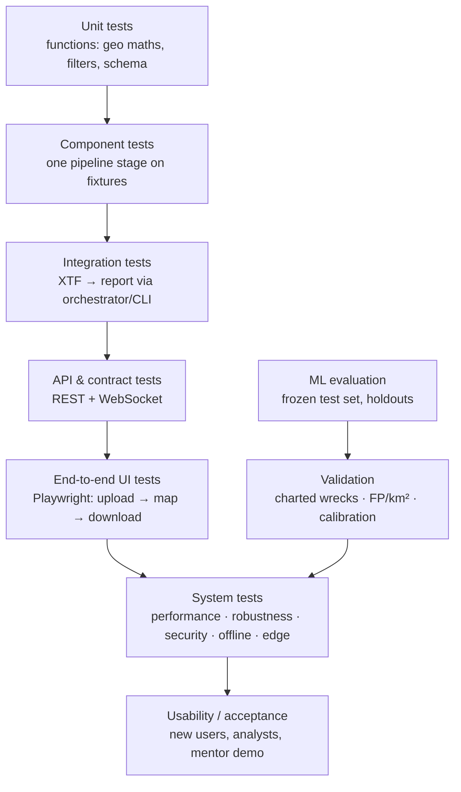

# SonarSentinel — Test Plan

| | |
|---|---|
| **Version** | v1.0 · 2026-09-13 |
| **Owner** | Integration & Edge Lead (R6); each module owner executes tests for their area |
| **Status** | Draft for team review |

**Related:** [Test Cases](TEST_CASES.md) · [PRD](../PRD.md) · [Architecture](../architecture/README.md) · [Project Plan §10 Quality gates](../planning/PROJECT_PLAN.md#10-quality-gates)

---

## 1. Introduction

This plan defines how SonarSentinel is verified against the [PRD](../PRD.md): functional requirements (FR), non-functional requirements (NFR), acceptance criteria (AC-01…AC-10) and success metrics (§11). It covers software testing, ML model evaluation and geolocation validation.

**Objectives**
1. Prove every P0 requirement works end to end on realistic data.
2. Measure model and geolocation quality with honest, leakage-free protocols.
3. Show robustness to sonar problems (noise, dropouts, motion, corrupt files).
4. Confirm performance targets on workstation, CPU and edge hardware.
5. Catch regressions automatically on every change.

## 2. Scope

| In scope | Out of scope |
|---|---|
| Ingestion, preprocessing, detection, scoring, geotagging, reporting | Certification of nautical chart products |
| REST API, WebSocket streaming, jobs, storage | Multi-tenant cloud load testing |
| Dashboard (S-01…S-07) and CLI | Physical at-sea field trials (future) |
| ML evaluation (detector, anomaly, FP filter, calibration) | Formal penetration testing (basic security tests only) |
| Geolocation accuracy on public surveys | P2 features unless implemented |
| Performance on workstation / CPU / Jetson (if available) | |
| Usability with first-time users | |

## 3. Test strategy

### 3.1 Test levels



| Level | What | Tools | Owner | When |
|---|---|---|---|---|
| Unit | Pure functions (georef, smoothing, filters, scoring maths, schema) | pytest, hypothesis (property tests), Vitest | Module owner | Every PR (CI) |
| Component | One stage on fixtures (e.g. XTF reader on TD-01/02) | pytest + fixtures | Module owner | Every PR (CI) |
| Integration | Orchestrator / CLI end to end on small sample | pytest, CLI | R4 / R6 | Every PR (CI, CPU) |
| API contract | Endpoints match OpenAPI; error model; WebSocket events | pytest + httpx, schemathesis | R4 | Every PR |
| UI component | Components, stores, WebSocket hook | Vitest + React Testing Library | R5 | Every PR |
| End-to-end | Browser flows (AC-01…03, 07) | Playwright (Chromium, Firefox) | R5 / R6 | Nightly + milestone |
| ML evaluation | Metrics on frozen test and holdouts | `ml/evaluate.py` | R1 | Every candidate model |
| Geo validation | Charted wrecks, reciprocal lines, golden tracks | pytest + validation notebook | R3 | M1 (golden), M6 (charted) |
| Robustness | Injected faults, corrupt files, missing nav | pytest + fault injection scripts | R2 / R6 | Nightly + M6 |
| Performance | NFR-01…07, UI rendering | `scripts/benchmark.py`, browser profiler | R6 | M4, M6 |
| Security | Upload validation, path handling, dependencies, network | pytest, pip-audit, npm audit, image scan | R6 | CI + M6 |
| Usability / UAT | First-time users; analyst review speed | Moderated sessions, SUS questionnaire | R5 | M6 |

### 3.2 Automation policy
- Unit, component, integration, API and UI component tests are **automated in CI** and block merge on failure.
- End-to-end, robustness and security scans run **nightly** on `main`.
- ML evaluation, geo validation, performance and usability are **milestone activities** with results recorded in the Test Summary Report (§9).

### 3.3 Coverage targets
| Package | Line coverage |
|---|---|
| `geo/`, `scoring/`, `ingest/`, `report/` | ≥ 70% (CI enforced) |
| Other backend packages | ≥ 50% |
| Frontend stores and hooks | ≥ 60% |

## 4. Test data

| ID | Test data | Purpose | Source / generation | Stored |
|---|---|---|---|---|
| TD-01 | **Synthetic XTF survey** with known track (straight + curved), altitude, heading, and objects at known positions/sizes | Golden geotagging and preprocessing tests with exact ground truth | `tests/tools/make_synthetic_xtf.py` (writes XTF via pyxtf) | Generated in CI |
| TD-02 | Small public XTF files (2–3 sonar models) | Parser compatibility, integration | NOAA InPort / USGS (see [Datasets](../data/DATASETS.md)) | Fetched by script |
| TD-03 | GeoTIFF SSS mosaic (small crop) | GeoTIFF path | NOAA survey mosaic crop | Fetched by script |
| TD-04 | Waterfall PNG + nav CSV (full and sparse rows) | Image + CSV path, interpolation | Rendered from TD-01 | Generated |
| TD-05 | Corrupt/truncated XTF, wrong magic bytes, oversized dummy | Validation, robustness, security | Mutated TD-01 | Generated |
| TD-06 | PNG without navigation | Not-geotagged path | From TD-04 | Generated |
| TD-07 | Robustness variants (10% zeroed pings, GPS gaps, roll ±10°, missing altitude, heavy speckle) | Robustness tests | Fault injection on TD-01/TD-02 | Generated |
| TD-08 | **Frozen ML test set** (real, site-held-out) | Detection metrics | [DMP §5](../data/DATA_MANAGEMENT_PLAN.md#5-splitting-policy) | DVC |
| TD-09 | **Synthetic ghost-net holdout** (unseen backgrounds) | Ghost-net recall | Generator on held-out sites | DVC |
| TD-10 | Survey covering **charted wreck(s)** | Geolocation accuracy | NOAA survey + chart position | DVC / shared drive |
| TD-11 | **Contact-free survey lines** (≥ 1 km²) | False positives per km² | NOAA/USGS lines reviewed as empty | DVC |
| TD-12 | Large XTF (~2 GB) | Memory/performance | Public survey or concatenated synthetic | Shared drive |
| TD-13 | Curated confuser set: 50 shadow-only / rock false positives | AC-08 shadow filtering | Mined from raw detector outputs | DVC |
| TD-14 | 2,000-detection mock survey | UI performance | Mock API generator | Generated |

## 5. Test environments

| Env | Spec | Used for |
|---|---|---|
| **CI** | GitHub Actions `ubuntu-latest`, CPU only | Unit, component, integration (TD-01/04/05/06), API, UI component |
| **Dev laptops** | Windows 11 and Ubuntu 22.04, ≥ 16 GB RAM | Local runs, exploratory testing |
| **GPU workstation** | NVIDIA RTX 3060-class, 32 GB RAM | ML evaluation, NFR-01, E2E demo configuration |
| **CPU reference** | 8-core laptop CPU, 16 GB RAM, no GPU | NFR-02, CPU fallback |
| **Edge** | Jetson Orin Nano/NX (if available) | NFR-03, AC-09, edge tests |
| **Browsers** | Chrome, Firefox, Edge (latest); mobile Chrome (responsive) | UI and E2E |
| **Offline** | Workstation with network disabled + MBTiles | AC-10, TC-SEC-006 |

Record the exact hardware, driver, CUDA and package versions with every performance or ML result.

## 6. Specialised testing

### 6.1 ML evaluation protocol
Follows [ML Models §8](../architecture/03-ml-models.md#8-evaluation-protocol).
- Evaluate **only release candidates** on TD-08 (frozen test). Tune on validation, calibrate on the calibration split.
- Report per class: precision, recall, AP@50, AP@50-95 (boxes and masks), confusion matrix, PR curves.
- Report separately: TD-09 ghost-net holdout, real ghost-net samples (if any), anomaly AUROC.
- **Calibration:** ECE (10 bins) + reliability diagram on the calibration split.
- **Robustness:** same metrics on TD-08 with injected speckle/dropouts/row jitter.
- **Statistical honesty:** state test set sizes; give 95% bootstrap confidence intervals for mAP and recall.

### 6.2 Geolocation validation
1. **Golden tests (TD-01):** error < 0.05 m for straight and curved tracks, both sides.
2. **Charted wrecks (TD-10):** median and max horizontal error (m) between detection centroid and chart position; record chart position quality.
3. **Reciprocal lines:** offset between the same object seen on opposite headings (reveals layback/time offsets).
4. **External check:** GeoJSON/KML overlaid in QGIS / Google Earth on the mosaic.

### 6.3 False-positive validation
- Run the full pipeline on TD-11. Count detections by tier per km² **with the detector alone** vs. **after shadow + FP filter + calibration tiers**. Target ≥ 50% reduction (PRD §11).
- AC-08 on TD-13.

### 6.4 Robustness
Run TD-05 and TD-07 through the CLI and API. Expected: no crash; warnings with ping ranges; correct flags and penalties; valid reports.

### 6.5 Performance
- `scripts/benchmark.py` runs the pipeline 3× on the reference 1 km line (50 m range/side, 0.10 m) and reports the **median** end-to-end time and per-stage timings.
- Memory: peak RSS sampled every 100 ms on TD-12.
- UI: Chrome Performance panel with TD-14; measure frame rate while panning and filter update latency.
- Edge: tiles/s, real-time factor, power, temperature over a 30-minute run.

### 6.6 Security (basic)
Upload validation (type/magic bytes/size), path traversal in filenames, streaming large uploads, dependency vulnerabilities (pip-audit, npm audit, image scan), default bind address, and no external calls in offline mode.

### 6.7 Usability and acceptance
- **Participants:** ≥ 3 people who haven't used the system (ideally 1 with marine/sonar background); plus a mentor/NIOT walkthrough if possible.
- **Tasks:** (1) upload the sample XTF and start analysis; (2) find the highest-confidence ghost net and copy its coordinates; (3) hide detections below 60%; (4) download the CSV; (5) reject one false detection in the review queue.
- **Measures:** task success, time (NFR-13: ≤ 5 min for tasks 1–4), errors, System Usability Scale (target ≥ 70), comments.

## 7. Schedule and responsibilities

| Sprint | Testing focus | Responsible |
|---|---|---|
| S0 | CI pipeline; test fixture tooling (TD-01 generator) | R6 |
| S1 | Ingest + geo unit/golden tests (TC-ING, TC-GEO-001…008) | R2, R3 |
| S2 | Preprocessing component tests (TC-PRE) | R2 |
| S3 | Integration test in CI (TC-REP-008); first ML evaluation (baseline) | R4, R1 |
| S4 | Scoring tests (TC-CONF), report tests (TC-REP), API tests (TC-API) | R1, R4 |
| S5 | WebSocket + UI tests (TC-WS, TC-UI); E2E AC-01…03 | R4, R5 |
| S6 | Robustness, performance, security, edge, geo validation, usability; Test Summary Report | All, led by R6 |

## 8. Entry and exit criteria

### 8.1 Per level
| Level | Entry | Exit |
|---|---|---|
| Unit/component | Story implementation started | Tests pass; coverage thresholds met |
| Integration | Stages merged on `main` | TC-REP-008 and TC-E2E flows pass in CI |
| ML evaluation | Candidate model + model card draft; frozen test set available | Metrics recorded with CIs; compared to current model |
| System (perf/robustness/security) | P0 features complete (M5) | All P0 system test cases pass or have approved waivers |
| Usability | Dashboard P0 complete | Tasks completed; findings triaged |

### 8.2 Release candidate (M6) exit criteria
- [ ] 100% of **P0 test cases** executed; ≥ 95% pass; no open **S1/S2** defects
- [ ] AC-01…AC-08 pass; AC-09/AC-10 pass or have a documented waiver (e.g. no Jetson available)
- [ ] ML metrics meet PRD §11 targets, **or** the gap is documented honestly with next steps
- [ ] Geolocation error on charted wrecks measured and documented
- [ ] Performance results recorded for workstation and CPU (and Jetson if available)
- [ ] Test Summary Report (§9) complete and reviewed

## 9. Test summary report (template)

Fill in at each milestone (at least M4 and M6) and save as `docs/testing/reports/TSR-M<n>.md`.

```markdown
# Test Summary Report — M<n> (<date>)

## Build under test
- Git commit: …   Pipeline version: …   Models: detector@… anomaly@… calibrator@…
- Environments: CI / GPU workstation (<GPU, driver, CUDA>) / CPU ref / Jetson (<model, JetPack>)

## Execution summary
| Area | Planned | Executed | Passed | Failed | Blocked |
|---|---|---|---|---|---|
| ING | | | | | |
| … | | | | | |

## Acceptance criteria
| AC | Result | Evidence |
|---|---|---|
| AC-01 | Pass/Fail | link to run / video |

## Key metrics vs. targets
| Metric | Target | Result (95% CI) | Status |
|---|---|---|---|
| mAP@50 (test) | ≥ 0.70 | | |
| Ghost-net recall (synthetic holdout) | ≥ 0.80 | | |
| FP/km² reduction | ≥ 50% | | |
| ECE | ≤ 0.10 | | |
| Geolocation median error | ≤ 10 m | | |
| 1 km processing (GPU / CPU / Jetson) | 60 s / 5 min / ≥1× | | |

## Open defects
| ID | Severity | Summary | Plan |
|---|---|---|---|

## Waivers and known limitations
…

## Recommendation
Go / No-go for <milestone/demo>, with reasons.
```

## 10. Defect management

| Severity | Definition | Example | Response |
|---|---|---|---|
| **S1 Critical** | Crash, data loss, wrong coordinates, blocks demo | Detections placed on the wrong side of the track | Fix immediately; blocks release |
| **S2 Major** | Feature broken without workaround | CSV export missing detections | Fix in current sprint |
| **S3 Minor** | Feature works with a workaround or cosmetic issue affecting use | Filter count off by one | Next sprint |
| **S4 Trivial** | Cosmetic | Misaligned icon | Backlog |

**Workflow:** New → Triaged (severity, owner) → In progress → Fixed (PR linked, regression test added) → Verified → Closed. Use the [bug report template](../../.github/ISSUE_TEMPLATE/bug_report.md).

**Geo and units defects are S1 by default** until proven otherwise: a wrong coordinate sends a dive team to the wrong place.

## 11. Testing risks

| Risk | Mitigation |
|---|---|
| No real ghost-net data for validation | Report synthetic holdout separately and clearly; request real samples; don't overstate claims |
| Charted wreck positions inaccurate | Use several wrecks; record position quality; prefer survey-derived positions; also use reciprocal-line checks |
| Public XTF files too large for CI | Synthetic TD-01 in CI; large files only in nightly/milestone runs |
| Jetson not available | Document CPU/ONNX results; AC-09 waiver |
| Test set leakage | Automated leakage check in `make_splits.py`; frozen test hash |
| Flaky WebSocket/UI tests | Deterministic mock event streams; retries only for network setup, never for assertions |
