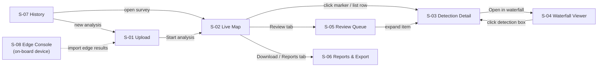

# SonarSentinel — Wireframes

Low-fidelity wireframes for the SonarSentinel dashboard. They define layout, content, interactions and states for each screen. Visual design (exact colours, typography) is refined during implementation.

**Related:** [Project Idea](../PROJECT_IDEA.md) · [PRD](../PRD.md) · [Architecture](../architecture/README.md) · [API](../architecture/05-api-specification.md)

## 1. Screen inventory

| ID | Screen | File | Priority | Requirements |
|---|---|---|---|---|
| S-01 | Upload / New analysis | [01-upload.md](01-upload.md) | P0 | FR-UI-01, FR-ING-01…07 |
| S-02 | Live Map (processing + results workspace) | [02-live-map.md](02-live-map.md) | P0 | FR-UI-02…05, FR-UI-07, FR-UI-08, FR-UI-13 |
| S-03 | Detection Detail | [03-detection-detail.md](03-detection-detail.md) | P0 | FR-UI-06, FR-CONF-06 |
| S-04 | Waterfall Viewer | [04-waterfall-viewer.md](04-waterfall-viewer.md) | P1 | FR-UI-09 |
| S-05 | Review Queue | [05-review-queue.md](05-review-queue.md) | P1 | FR-UI-10, FR-OPS-04 |
| S-06 | Reports & Export | [06-reports-export.md](06-reports-export.md) | P0 / P1 | FR-UI-07, FR-REP-01…06 |
| S-07 | Survey History & Settings | [07-history-settings.md](07-history-settings.md) | P1 | FR-UI-11, FR-UI-12, FR-UI-14 |
| S-08 | Edge Console (on-board) | [08-edge-console.md](08-edge-console.md) | P2 | FR-UI-15, FR-OPS-06 |

## 2. Navigation flow



**Primary happy path:** S-01 Upload → S-02 Live Map (watch detections stream in) → S-03 Detail (verify) → S-06 Download report.

## 3. Global layout

```text
+--------------------------------------------------------------------------------------------------+
| APP BAR: logo - Upload - Live Map - Review (n) - Reports - History            Settings - Help    |
+--------------------------------------------------------------------------------------------------+
| CONTEXT BAR: current survey - job progress - warnings - primary action                           |
+----------------------+---------------------------------------------------+-----------------------+
| LEFT PANEL           | MAIN WORKSPACE                                    | RIGHT PANEL           |
| filters, layers      | map / waterfall / tables                          | lists, details        |
| (collapsible)        |                                                   | (drawer)              |
+----------------------+---------------------------------------------------+-----------------------+
| STATUS BAR: summary counts - pointer coordinates - quick downloads                               |
+--------------------------------------------------------------------------------------------------+
```

| Breakpoint | Width | Layout |
|---|---|---|
| Desktop | ≥ 1280 px | 3 columns: left 280 px · map · right 360 px |
| Laptop | 1024–1279 px | Left panel collapses to an icon rail; right drawer overlays the map |
| Tablet | 600–1023 px | Map full width; filters and list become slide-over sheets |
| Phone | < 600 px | Map full screen; bottom sheet for list/detail; upload is a single column |

## 4. Visual language

### 4.1 Detection classes (colour + shape, so classes don't depend on colour alone)

| Class | ASCII in wireframes | Map marker shape | Colour (proposal) |
|---|---|---|---|
| `ghost_net` | `<>` | Diamond | Red `#E5484D` |
| `shipwreck` | `/\` | Triangle | Purple `#8E4EC6` |
| `pipe` | `==` | Bar / line | Orange `#F76B15` |
| `cylinder` | `()` | Circle | Amber `#FFB224` |
| `debris_other` | `[]` | Square | Blue `#0090FF` |
| `unknown_anomaly` | `??` | Hexagon with dashed outline | Magenta `#D6409F` |

### 4.2 Alert tiers

| Tier | Marker style | Badge |
|---|---|---|
| `hazard` (≥ 80%) | Solid fill, thick white outline, drawn on top | `HAZARD` filled |
| `review` (50–79%) | Hollow with coloured outline | `REVIEW` outlined |
| `anomaly` (30–49%) | Dashed outline | `ANOMALY` dashed |
| `hidden` (< 30%) | Hidden by default; grey when shown | `LOW` grey |

### 4.3 Track and quality
- Track line: solid dark line, with the start marked `S` and the current vessel position `>`
- Dropout segment: red hatched segment (`xxxx` in wireframes)
- High-motion segment: amber dashed segment
- Uncertainty: faint circle of radius `uncertainty_m` around the selected detection

## 5. Wireframe notation

| Symbol | Meaning |
|---|---|
| `[ Button ]` | Button |
| `[x]` / `[ ]` | Checkbox on / off |
| `(o)` / `( )` | Radio selected / not selected |
| `[ value v ]` | Dropdown |
| `[==o=====]` | Slider |
| `[#####.....]` | Progress bar |
| `[ok]` `[!]` | Success / warning status |
| `v Section` / `> Section` | Expanded / collapsed section |
| `xxxx` | Poor-quality track segment |

## 6. Accessibility requirements (all screens)

- WCAG 2.1 AA contrast for text and markers against both light and satellite basemaps
- Every class is identifiable by shape and text label, not colour alone
- All actions reachable by keyboard; visible focus rings; map markers are focusable in list order
- Review shortcuts: `C` confirm, `R` reject, `K` reclassify, `N`/`P` next/previous (see S-05)
- Screen-reader labels for markers: "Ghost net, 87 percent, hazard, 13.084120 north, 80.312750 east"
- Coordinates are copyable text, not images
- Respect reduced-motion preferences (no animated marker pulses)

## 7. Shared UI states

| State | Pattern |
|---|---|
| Loading | Skeleton rows in lists; progress bar in context bar; map stays interactive |
| Empty | Illustration-free message + primary action (e.g. "No surveys yet → Upload") |
| Error | Inline banner with error code, plain-language cause and a fix action |
| Offline | App bar badge "Offline — local tiles"; online-only features disabled with a tooltip |
| Partial results | Warning badge in context bar; affected track segments highlighted |
